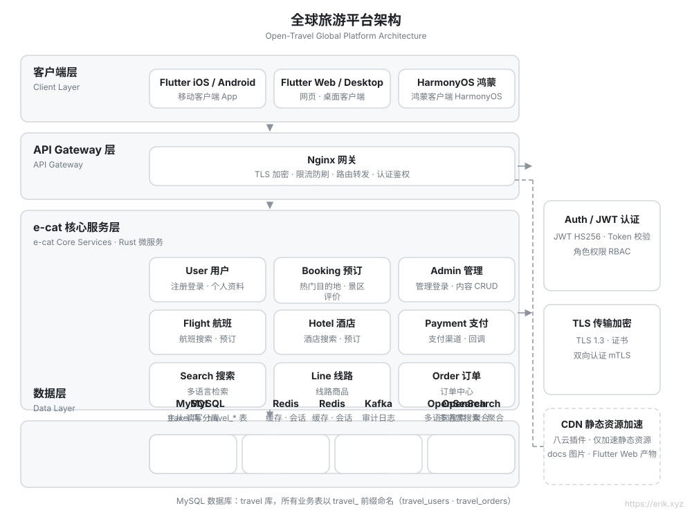
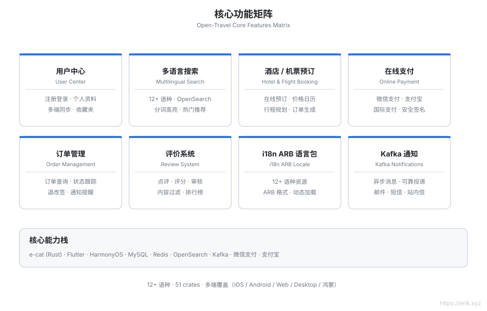
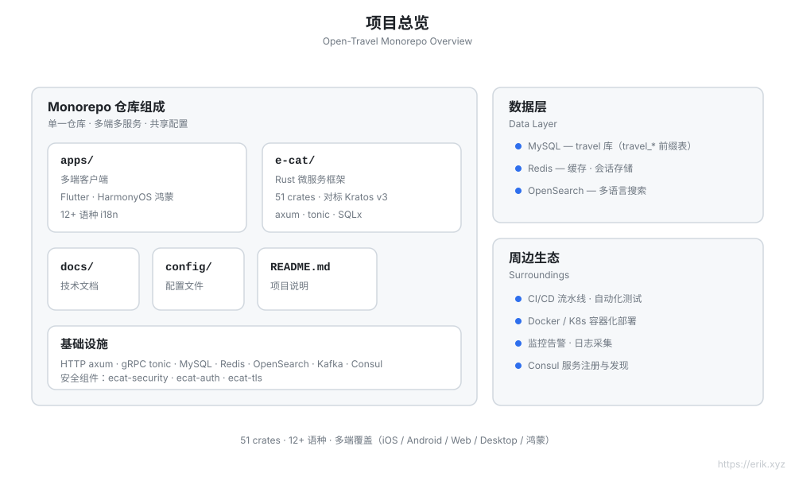
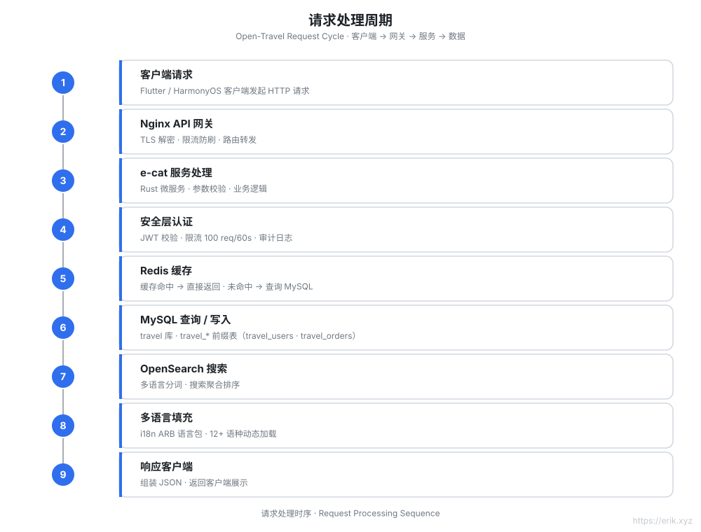
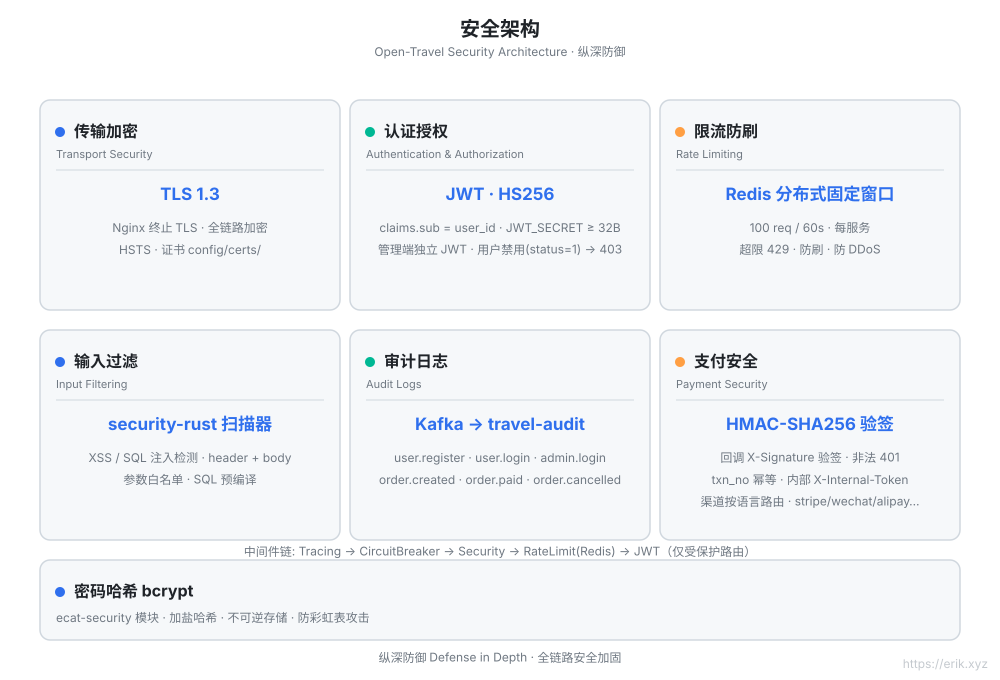
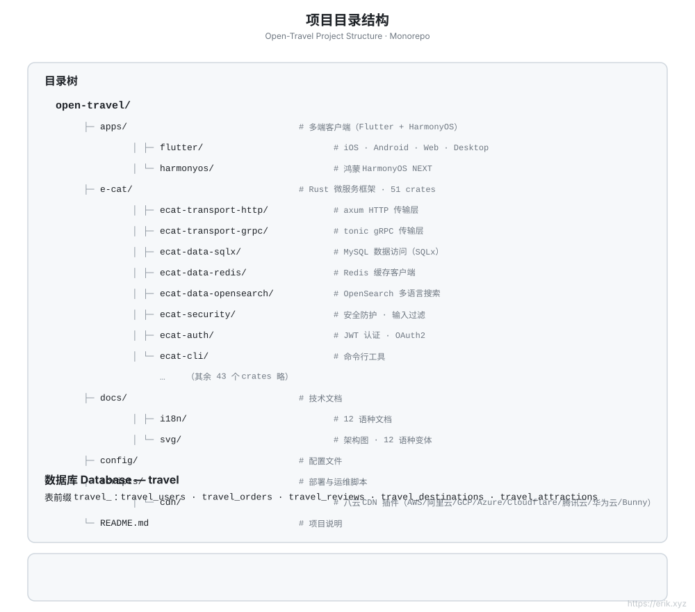

# Open Travel — 全球旅游平台

[English](docs/i18n/en/README.md) | [日本語](docs/i18n/ja/README.md) | [한국어](docs/i18n/ko/README.md) | [Русский](docs/i18n/ru/README.md) | [Deutsch](docs/i18n/de/README.md) | [Français](docs/i18n/fr/README.md) | [Español](docs/i18n/es/README.md) | [Português](docs/i18n/pt/README.md) | [हिन्दी](docs/i18n/hi/README.md) | [العربية](docs/i18n/ar/README.md) | [বাংলা](docs/i18n/bn/README.md) | [Bahasa Indonesia](docs/i18n/id/README.md)

> 一个面向全球用户的旅游预订平台：Rust 微服务后端 + Flutter / HarmonyOS 多端客户端，支持 **12+ 种语言**、国际支付与多语言搜索。

## 项目简介

Open Travel 是一个全球旅游平台 monorepo，采用 **e-cat（一只猫）** —— 对标 [go-kratos/kratos](https://github.com/go-kratos/kratos) v3 的 **Rust 微服务框架**（v3.0.3 · 51 crates）—— 构建高性能后端，配合 Flutter 多端与鸿蒙原生客户端，为全球用户提供统一的旅行预订体验。

| 维度 | 说明 |
| :--- | :--- |
| **后端框架** | e-cat（Rust）：HTTP/axum + gRPC/tonic，51 crates 微服务生态 |
| **多端客户端** | `apps/flutter`（iOS / Android / Web / Desktop）、`apps/harmonyos`（鸿蒙） |
| **数据库** | MySQL（库名 `travel`，表前缀 `travel_`）+ Redis 缓存 + OpenSearch 多语言搜索 |
| **安全** | ecat-security / ecat-auth（JWT）/ ecat-tls：认证、审计、限流、防注入 |
| **国际化** | 12+ 语种 ARB 语言包，RTL 支持，OpenSearch 多语言分词 |
| **支付** | 微信支付、支付宝 |

## 快速开始

> 以下使用说明聚焦后端（Rust 微服务）；客户端（apps/）构建方式见各子目录。

### 环境要求

- Rust 1.85+（stable 工具链，edition 2024）
- Docker + Docker Compose

### 构建与启动

```bash
cd e-cat
cargo check -p user-service -p booking-service   # 编译检查业务服务

docker compose -f config/docker-compose.yml up -d   # 启动数据源 + 服务 + 网关
```

> 不要使用 `--env-file .env` 启动（会报错）。

### 端口

| 服务 | 端口 | 说明 |
|------|------|------|
| user-service | 8001 | 用户资料 / 注册 |
| booking-service | 8002 | 热门目的地日期 |
| Nginx 网关 | 8082→80 | 按 `/api/v1/user/`、`/api/v1/booking/` 前缀分流 |
| MySQL | 3308→3306 | 数据源（宿主端口冲突，临时映射） |
| Redis | 6381→6379 | 缓存 / 限流 |
| OpenSearch | 9201→9200 | 多语言搜索 |

### 验证

```bash
curl http://localhost:8082/health
curl "http://localhost:8082/api/v1/booking/dates?region_id=1"
# {"code":0,"message":"ok","data":[{"region_id":1,"name_en":"placeholder-destination"}]}
```

### 脚本

| 脚本 | 用途 |
|------|------|
| `scripts/opensearch_init.sh` | 幂等创建 OpenSearch 索引（cjk 分析器） |
| `scripts/loadtest.sh` | 压测 |
| `scripts/cdn_setup.sh` / `cdn_upload.sh` | CDN 配置与上传（`--dry-run` 默认） |
| `scripts/release.sh` | 发布流程辅助 |

### 后端文档

- 后端 README（含中间件链、环境变量、版本发布流程）：[e-cat/README.md](e-cat/README.md)
- API 参考（端点、鉴权、限流）：[docs/api.md](docs/api.md)

## 核心特性

- 🏨 目的地 / 酒店 / 机票多语言搜索与预订
- 🌍 12+ 语种独立适配（中、英、日、韩、阿、西、法、德……）
- 💳 国际支付（微信支付 / 支付宝）
- 🔐 安全纵深：TLS 1.3、JWT 认证、审计日志、输入过滤、限流
- 📱 多端一致体验：Flutter（iOS/Android/Web/Desktop）+ 鸿蒙

## 架构图



## 功能图



## 项目图



## 请求周期图



## 安全架构图



## 项目结构图



## 项目结构

```
open-travel/
├── apps/                  # 多端客户端目录
│   ├── flutter/           # Flutter：iOS / Android / Web / Desktop（12+ 语种 i18n）
│   └── harmonyos/         # 鸿蒙原生客户端
├── e-cat/                 # e-cat Rust 微服务框架（51 crates）
├── docs/                  # 项目规划、架构图（SVG）、支付二维码
├── config/                # 环境与部署配置
└── README.md
```

## 数据库

- 数据库名：`travel`
- 表前缀：`travel_`（例如 `travel_users`、`travel_orders`、`travel_reviews`）
- 配套存储：Redis（会话 / 热门缓存）、OpenSearch（多语言搜索索引）

> 详细技术规划见 [docs/travel-project-planning.md](docs/travel-project-planning.md)。

---

## 支持我们

如果这个项目对你有帮助，欢迎请作者喝一杯咖啡 ☕

<p align="center">
  <strong>微信支付（WeChat Pay）</strong> &nbsp;&nbsp;&nbsp;&nbsp;&nbsp;&nbsp;&nbsp;&nbsp;&nbsp;&nbsp;&nbsp;&nbsp;&nbsp;&nbsp;&nbsp;&nbsp;&nbsp;&nbsp; <strong>支付宝（Alipay）</strong><br/>
  
  &nbsp;&nbsp;&nbsp;&nbsp;&nbsp;&nbsp;&nbsp;&nbsp;
  
</p>

### 全球转账打赏（Global Bank Transfer）

**收款人信息**

- 收款人姓名：WANG KEXUN
- 收款账户号码：881015918251

**收款银行**

- ZA Bank SWIFT Code：AABLHKHHXXX
- 银行名称：ZA Bank Limited
- 银行编号：387
- 银行地址：Core F, Cyberport 3, 100 Cyberport Road, Hong Kong

**跨境汇款代理银行（如需）**

请留意，此为跨境汇款代理银行（中转银行）信息，非收款银行信息。请向汇款银行查询是否需要提供跨境汇款代理银行信息。

汇入港元、人民币及美元的代理银行为 **Citibank** ——

- 银行名称：Citibank N.A. Hong Kong
- SWIFT Code：CITIHKHXXXX
- 银行编号：006
- 分行名称：Hong Kong Branch
- 分行编号：391
- 银行地址：Citibank Tower, Citibank Plaza, 3 Garden Road, Central, Hong Kong

汇入其他币种时的代理银行为 **BNY Mellon** ——

- 银行名称：THE BANK OF NEW YORK MELLON
- SWIFT Code：IRVTUS3NXXX
- 银行地址：THE BANK OF NEW YORK MELLON, 240 GREENWICH STREET, NEW YORK, United States
