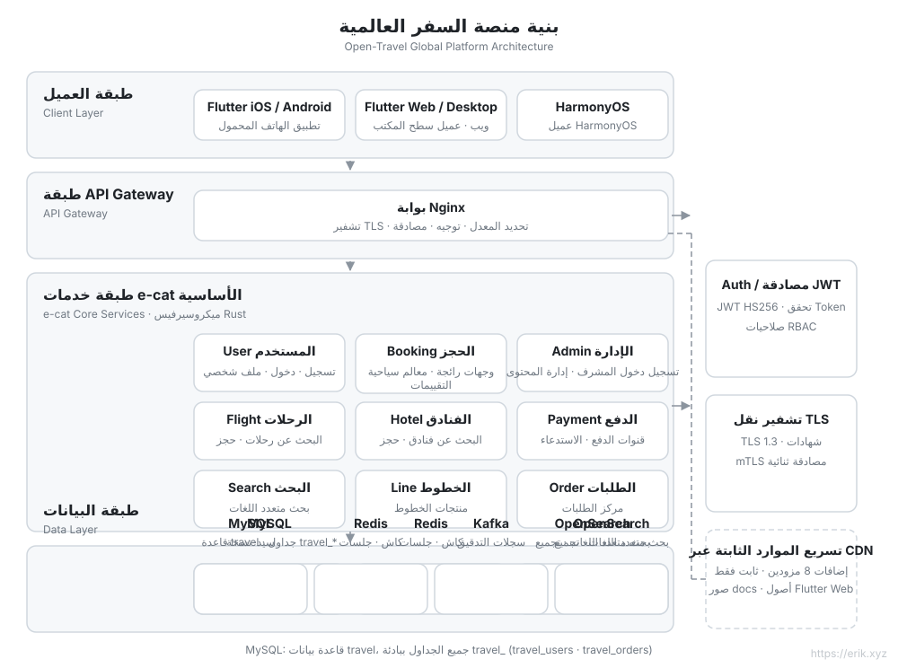
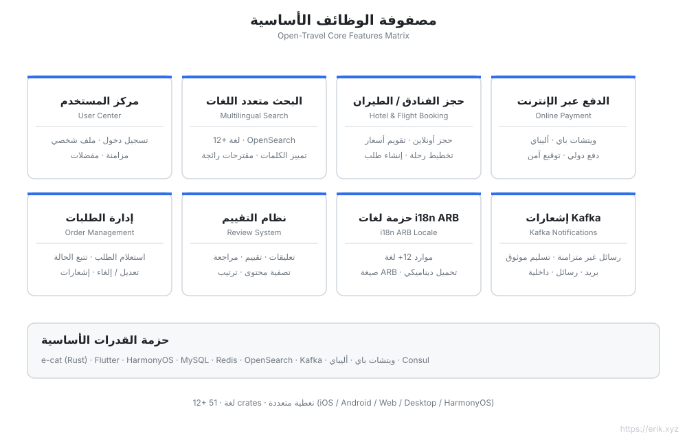
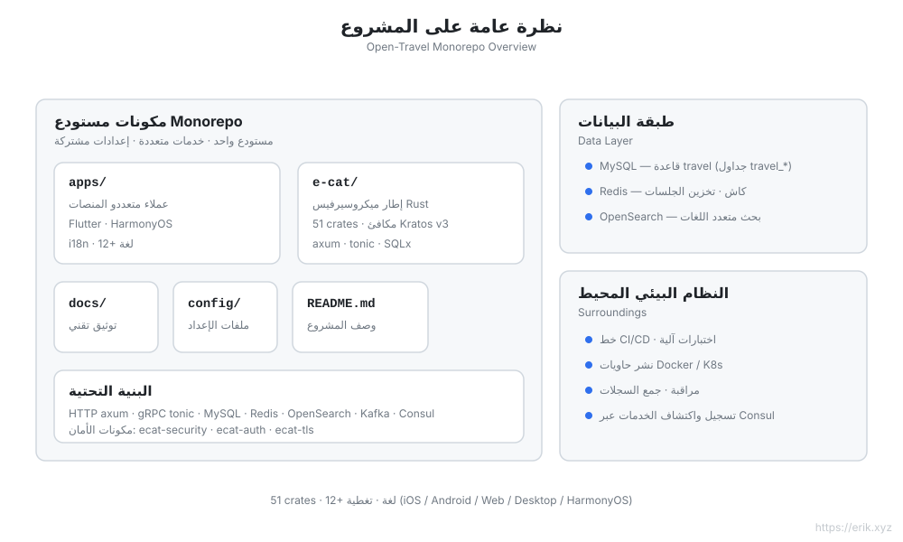
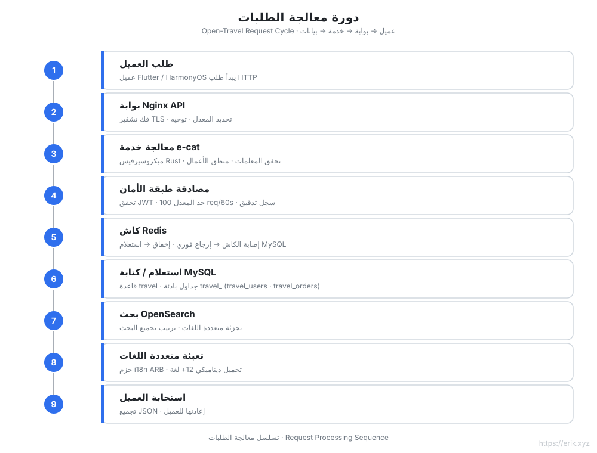
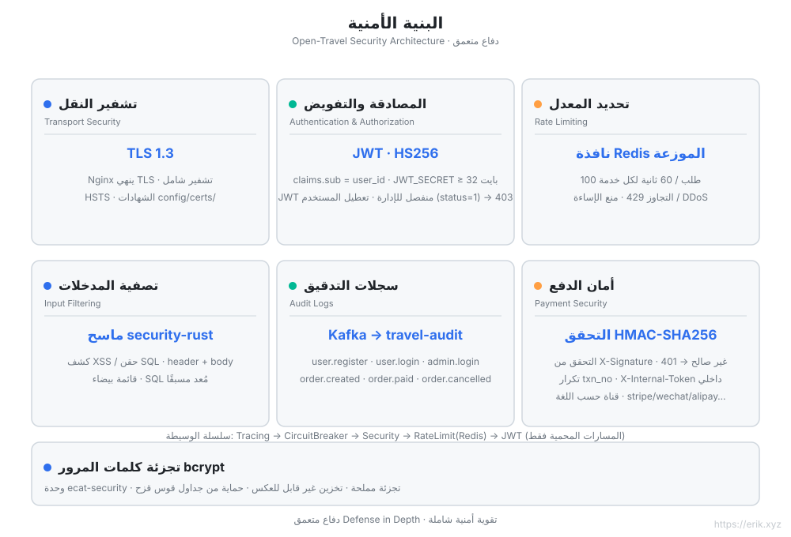
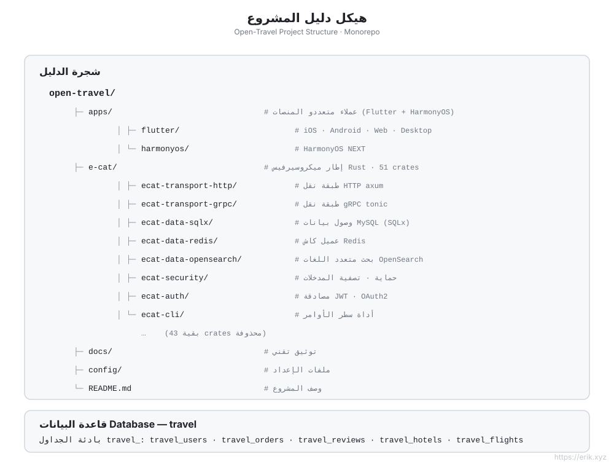

# Open Travel — منصة السفر العالمية

[简体中文](../../README.md) | [English](README.md) | [日本語](ja/README.md) | [한국어](ko/README.md) | [Русский](ru/README.md) | [Deutsch](de/README.md) | [Français](fr/README.md) | [Español](es/README.md) | [Português](pt/README.md) | [हिन्दी](hi/README.md) | [العربية](ar/README.md) | [বাংলা](bn/README.md) | [Bahasa Indonesia](id/README.md)

> منصة حجز سفر موجهة للمستخدمين حول العالم: خلفية ميكروسيرفيس بلغة Rust + عملاء Flutter / HarmonyOS متعددو المنصات، مع دعم **أكثر من 12 لغة**، مدفوعات دولية وبحث متعدد اللغات.

## نبذة عن المشروع

Open Travel هو مستودع مونوريبو لمنصة سفر عالمية، يستخدم **e-cat (قطة)** — **إطار عمل ميكروسيرفيس بلغة Rust** (الإصدار 3.0.2 · 51 crate) مماثل لـ [go-kratos/kratos](https://github.com/go-kratos/kratos) v3 — لبناء خلفية عالية الأداء، مع عملاء Flutter متعددي المنصات وعميل HarmonyOS الأصلي، لتوفير تجربة حجز سفر موحدة للمستخدمين حول العالم.

| البعد | الوصف |
| :--- | :--- |
| **إطار العمل الخلفي** | e-cat (Rust): HTTP/axum + gRPC/tonic، نظام ميكروسيرفيس من 51 crate |
| **العملاء متعددو المنصات** | `apps/flutter` (iOS / Android / Web / Desktop)، `apps/harmonyos` (HarmonyOS) |
| **قاعدة البيانات** | MySQL (قاعدة بيانات `travel`، بادئة الجداول `travel_`) + Redis للتخزين المؤقت + OpenSearch للبحث متعدد اللغات |
| **الأمان** | ecat-security / ecat-auth (JWT) / ecat-tls: مصادقة، تدقيق، تحديد معدل، حماية من الحقن |
| **التدويل** | حزم لغات ARB لأكثر من 12 لغة، دعم RTL، تجزئة متعددة اللغات في OpenSearch |
| **الدفع** | WeChat Pay، Alipay |

## الميزات الأساسية

- 🏨 بحث وحجز متعدد اللغات للوجهات / الفنادق / تذاكر الطيران
- 🌍 تكيف مستقل لأكثر من 12 لغة (الصينية، الإنجليزية، اليابانية، الكورية، العربية، الإسبانية، الفرنسية، الألمانية...)
- 💳 مدفوعات دولية (WeChat Pay / Alipay)
- 🔐 دفاع أمني متعمق: TLS 1.3، مصادقة JWT، سجلات تدقيق، تصفية المدخلات، تحديد معدل
- 📱 تجربة متسقة عبر المنصات: Flutter (iOS/Android/Web/Desktop) + HarmonyOS

## مخطط البنية



## مخطط الميزات



## مخطط المشروع



## مخطط دورة الطلب



## مخطط البنية الأمنية



## مخطط هيكل المشروع



## هيكل المشروع

```
open-travel/
├── apps/                  # دليل العملاء متعددي المنصات
│   ├── flutter/           # Flutter: iOS / Android / Web / Desktop (تدويل لأكثر من 12 لغة)
│   └── harmonyos/         # عميل HarmonyOS الأصلي
├── e-cat/                 # إطار عمل ميكروسيرفيس e-cat بلغة Rust (51 crate)
├── docs/                  # تخطيط المشروع، المخططات (SVG)، رموز QR للدفع
├── config/                # إعدادات البيئة والنشر
└── README.md
```

## قاعدة البيانات

- اسم قاعدة البيانات: `travel`
- بادئة الجداول: `travel_` (مثل `travel_users`، `travel_orders`، `travel_reviews`)
- التخزين المرافق: Redis (الجلسات / التخزين المؤقت للشائع)، OpenSearch (فهرس البحث متعدد اللغات)

> التخطيط الفني التفصيلي في [docs/travel-project-planning.md](../../travel-project-planning.md).

---

## ادعمنا

إذا كان هذا المشروع مفيدًا لك، فمرحبًا بك في أن تكافئ الكاتب بفنجان قهوة ☕

<p align="center">
  <strong>WeChat Pay</strong> &nbsp;&nbsp;&nbsp;&nbsp;&nbsp;&nbsp;&nbsp;&nbsp;&nbsp;&nbsp;&nbsp;&nbsp;&nbsp;&nbsp;&nbsp;&nbsp;&nbsp;&nbsp; <strong>Alipay</strong><br/>
  
  &nbsp;&nbsp;&nbsp;&nbsp;&nbsp;&nbsp;&nbsp;&nbsp;
  
</p>

### تحويل بنكي عالمي للتبرع (Global Bank Transfer)

**معلومات المستلم**

- اسم المستلم: WANG KEXUN
- رقم حساب المستلم: 881015918251

**البنك المستلم**

- رمز SWIFT لبنك ZA Bank: AABLHKHHXXX
- اسم البنك: ZA Bank Limited
- رقم البنك: 387
- عنوان البنك: Core F, Cyberport 3, 100 Cyberport Road, Hong Kong

**بنك المراسلة للتحويلات عبر الحدود (إذا لزم الأمر)**

يرجى ملاحظة أن هذه معلومات بنك المراسلة للتحويلات عبر الحدود (البنك الوسيط)، وليست معلومات البنك المستلم. يرجى الاستفسار من البنك المحوِّل عما إذا كان يلزم توفير معلومات بنك المراسلة للتحويلات عبر الحدود.

البنك المراسل لتحويلات الدولار الهونغ كونغي واليوان الصيني والدولار الأمريكي هو **Citibank** —

- اسم البنك: Citibank N.A. Hong Kong
- رمز SWIFT: CITIHKHXXXX
- رقم البنك: 006
- اسم الفرع: Hong Kong Branch
- رقم الفرع: 391
- عنوان البنك: Citibank Tower, Citibank Plaza, 3 Garden Road, Central, Hong Kong

البنك المراسل لتحويلات العملات الأخرى هو **BNY Mellon** —

- اسم البنك: THE BANK OF NEW YORK MELLON
- رمز SWIFT: IRVTUS3NXXX
- عنوان البنك: THE BANK OF NEW YORK MELLON, 240 GREENWICH STREET, NEW YORK, United States
