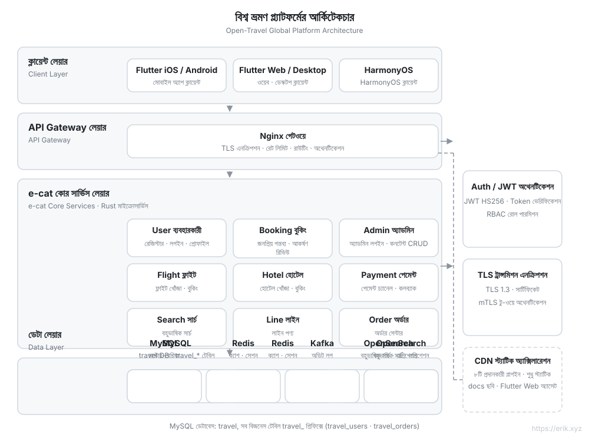
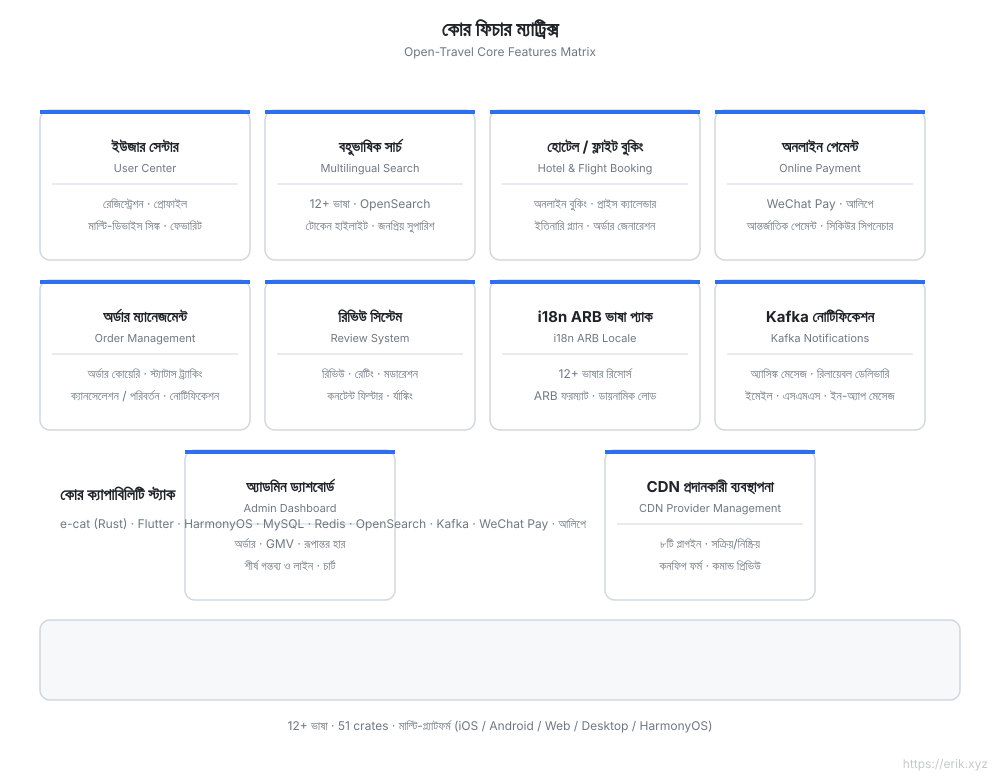
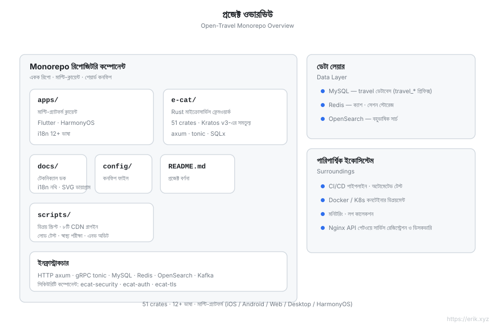
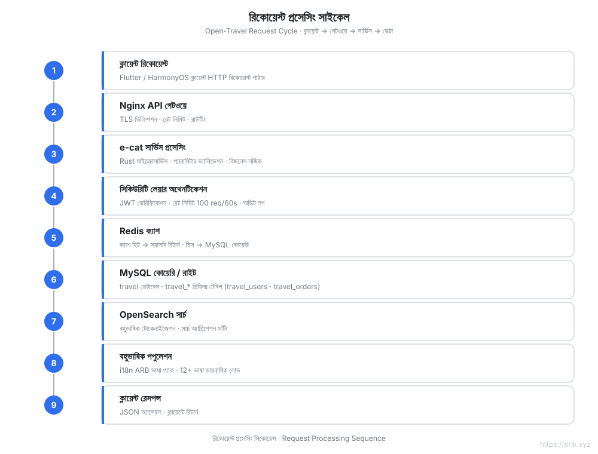
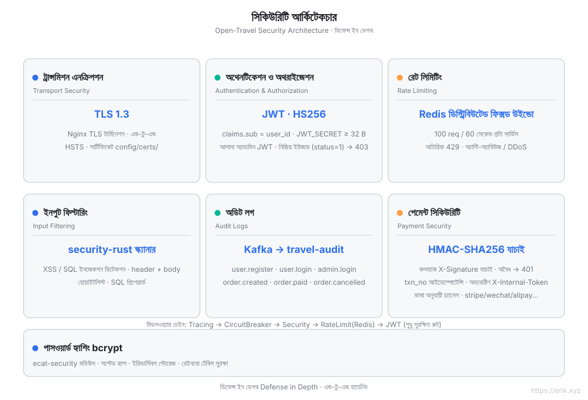

# Open Travel — বৈশ্বিক ভ্রমণ প্ল্যাটফর্ম

<p align="center"></p>


[简体中文](../../README.md) | [English](README.md) | [日本語](ja/README.md) | [한국어](ko/README.md) | [Русский](ru/README.md) | [Deutsch](de/README.md) | [Français](fr/README.md) | [Español](es/README.md) | [Português](pt/README.md) | [हिन्दी](hi/README.md) | [العربية](ar/README.md) | [বাংলা](bn/README.md) | [Bahasa Indonesia](id/README.md)

> একটি বৈশ্বিক ভ্রমণ বুকিং প্ল্যাটফর্ম: Rust মাইক্রোসার্ভিস ব্যাকএন্ড + Flutter / HarmonyOS মাল্টি-প্ল্যাটফর্ম ক্লায়েন্ট, **12+ ভাষা**, আন্তর্জাতিক পেমেন্ট এবং বহুভাষিক অনুসন্ধান সমর্থন করে।

## প্রকল্প পরিচিতি

Open Travel একটি বৈশ্বিক ভ্রমণ প্ল্যাটফর্ম মনোরেপো, যা **e-cat (একটি বিড়াল)** — [go-kratos/kratos](https://github.com/go-kratos/kratos) v3-এর সমতুল্য **Rust মাইক্রোসার্ভিস ফ্রেমওয়ার্ক** (v3.0.3 · 52 crates) — দিয়ে উচ্চ-পারফরম্যান্স ব্যাকএন্ড তৈরি করে, সাথে Flutter মাল্টি-প্ল্যাটফর্ম এবং HarmonyOS নেটিভ ক্লায়েন্ট, বিশ্বব্যাপী ব্যবহারকারীদের জন্য একীভূত ভ্রমণ বুকিং অভিজ্ঞতা প্রদান করে।

| মাত্রা | বিবরণ |
| :--- | :--- |
| **ব্যাকএন্ড ফ্রেমওয়ার্ক** | e-cat (Rust): HTTP/axum + gRPC/tonic, 52 crates মাইক্রোসার্ভিস ইকোসিস্টেম |
| **মাল্টি-প্ল্যাটফর্ম ক্লায়েন্ট** | `apps/client/flutter` (iOS / Android / Web / Desktop), `apps/client/harmonyos` (HarmonyOS), `apps/admin` (Flutter Web অ্যাডমিন কনসোল) |
| **ডেটাবেস** | MySQL (ডেটাবেস `travel`, টেবিল প্রিফিক্স `travel_`) + Redis ক্যাশ + OpenSearch বহুভাষিক অনুসন্ধান |
| **নিরাপত্তা** | ecat-security / ecat-auth (JWT) / ecat-tls: অথেনটিকেশন, অডিট, রেট লিমিটিং, ইনজেকশন সুরক্ষা |
| **আন্তর্জাতিককরণ** | 12+ ভাষার ARB ভাষা প্যাক, RTL সাপোর্ট, OpenSearch বহুভাষিক টোকেনাইজেশন |
| **পেমেন্ট** | WeChat Pay, Alipay |

## প্রকল্পের মাসকট «小途»

একটি অ্যাম্বার রঙের ভ্রমণপিপাসু বিড়াল, যার মাথায় অভিযান টুপি, হাতে স্টিকার লাগানো স্যুটকেস, আর সে কাগজের বিমানের পিছু ছোটে — **e-cat (একটি বিড়াল)** ফ্রেমওয়ার্ক থেকে «জন্ম» নিয়েছে। বিড়ালের মুখের ডিজাইন [Twemoji](https://github.com/jdecked/twemoji) 1f431 (CC-BY 4.0) থেকে পরিবর্তিত, আর অভিযান টুপি / স্যুটকেস / কাগজের বিমান সম্পূর্ণ মৌলিক। ভেক্টর সোর্স ও সম্পূর্ণ বিবরণ দেখুন [`docs/mascot.svg`](docs/mascot.svg)।

| অবস্থান | রূপ |
| :--- | :--- |
| `docs/mascot.svg` | **একমাত্র ভেক্টর সোর্স** (পূর্ণ অবয়ব 512×512) |
| `apps/*/web/favicon.svg` | ব্রাউজার ট্যাব আইকন (মুখের ক্লোজ-আপ সংস্করণ, 16px-এও চেনা যায়; পুরনো ব্রাউজারের জন্য `favicon.png` 16px বিকল্প) |
| `apps/*/web/icons/Icon-*.png` | PWA / হোম স্ক্রিন আইকন 192·512 (maskable নিরাপদ এলাকার সংস্করণসহ) |
| `apps/*/assets/mascot.png` | Flutter অ্যাপের ভেতরে প্রদর্শন (অ্যাডমিন লগইন পৃষ্ঠা, ক্লায়েন্ট প্রোফাইল পৃষ্ঠা) |
| `apps/client/harmonyos/.../media/mascot.svg` | HarmonyOS অ্যাপের ভেতরে (`Image` দিয়ে নেটিভ SVG রেন্ডারিং; মোবাইলের জন্য সরলীকৃত সংস্করণ) |
| সব README / crate ডকুমেন্টেশন | পৃষ্ঠার শীর্ষে ব্র্যান্ড স্থান |

> ডিজাইন বদলাতে শুধু `docs/mascot.svg` বদলান, বাকি সবই উদ্ভূত: favicon হলো এর মুখের ক্লোজ-আপ ক্রপ, আর HarmonyOS সংস্করণ `<defs>`/গ্রেডিয়েন্ট বাদ দিয়ে নির্দিষ্ট রঙ ব্যবহার করে যাতে মোবাইল SVG রেন্ডারারে মানায়।

## মূল বৈশিষ্ট্য

- 🏨 গন্তব্য / হোটেল / ফ্লাইট টিকিটের বহুভাষিক অনুসন্ধান ও বুকিং
- 🌍 12+ ভাষার স্বতন্ত্র অভিযোজন (চীনা, ইংরেজি, জাপানি, কোরিয়ান, আরবি, স্প্যানিশ, ফরাসি, জার্মান...)
- 💳 আন্তর্জাতিক পেমেন্ট (WeChat Pay / Alipay)
- 🔐 গভীর প্রতিরক্ষা: TLS 1.3, JWT অথেনটিকেশন, অডিট লগ, ইনপুট ফিল্টারিং, রেট লিমিটিং, পেমেন্ট কলব্যাক HMAC যাচাই, অভ্যন্তরীণ সার্ভিস অথেনটিকেশন
- 📱 সব প্ল্যাটফর্মে একই রকম অভিজ্ঞতা: Flutter (iOS/Android/Web/Desktop) + HarmonyOS

## আর্কিটেকচার ডিজাইন ডায়াগ্রাম



## ফিচার ডিজাইন ডায়াগ্রাম



## প্রজেক্ট স্ট্রাকচার ডায়াগ্রাম



## রিকোয়েস্ট লাইফসাইকেল ডায়াগ্রাম



## সিকিউরিটি আর্কিটেকচার ডায়াগ্রাম



## প্রজেক্ট স্ট্রাকচার

```
open-travel/
├── apps/                  # মাল্টি-প্ল্যাটফর্ম ক্লায়েন্ট ও অ্যাডমিন প্যানেল
│   ├── client/
│   │   ├── flutter/       # Flutter: iOS / Android / Web / Desktop (12+ ভাষার i18n, web/favicon.svg মাসকট আইকন)
│   │   └── harmonyos/     # HarmonyOS নেটিভ ক্লায়েন্ট
│   └── admin/             # Flutter Web অ্যাডমিন প্যানেল
├── e-cat/                 # e-cat ফ্রেমওয়ার্ক + বিজনেস সার্ভিস (একই Cargo workspace)
│   ├── ecat*/             # 52টি ecat-* ফ্রেমওয়ার্ক ক্রেট
│   ├── ecat/              # মূল ফ্রেমওয়ার্ক ক্রেট: ফেকাড + বিজনেস মডিউল (src/business/) + সার্ভিস এন্ট্রি (src/bin/ ৯টি সার্ভিস)
│   ├── config/            # ফ্রেমওয়ার্ক কনফিগারেশন উদাহরণ
│   ├── examples/          # ফ্রেমওয়ার্ক উদাহরণ প্রজেক্ট
│   └── CHANGELOG.md       # ফ্রেমওয়ার্ক + প্রজেক্ট চেঞ্জলগ
├── docs/                  # কারিগরি ডকুমেন্টেশন
│   ├── api.md             # API রেফারেন্স (এন্ডপয়েন্ট, অথেনটিকেশন, রেট লিমিটিং)
│   ├── mascot.svg         # মাসকট «小途» (একমাত্র ভেক্টর সোর্স, favicon ও অন্যান্য আইকন এটি থেকে উদ্ভূত)
│   ├── svg/               # আর্কিটেকচার / ফিচার / লাইফসাইকেল / নিরাপত্তা / স্ট্রাকচার ডায়াগ্রাম (১২ ভাষার অনুবাদসহ)
│   ├── i18n/              # ১২ ভাষায় README
│   └── coin/              # ডোনেশন QR কোড
├── config/                # পরিবেশ ও ডিপ্লয়মেন্ট কনফিগারেশন (nginx.conf, docker-compose.yml, schema.sql)
├── scripts/               # ইনস্টল / ডিপ্লয় / হেলথ চেক / লোড টেস্ট / CDN / সিড ডেটা
├── .github/workflows/     # CI
└── README.md
```

## ডেটাবেস

- ডেটাবেসের নাম: `travel`
- টেবিল প্রিফিক্স: `travel_` (যেমন `travel_users`, `travel_orders`, `travel_reviews`)
- সহযোগী স্টোরেজ: Redis (সেশন / জনপ্রিয় ক্যাশ), OpenSearch (বহুভাষিক সার্চ ইনডেক্স)

> বিস্তারিত প্রযুক্তিগত পরিকল্পনা দেখুন [docs/travel-project-planning.md](../../travel-project-planning.md)।

## ওয়ান-ক্লিক ইনস্টল

প্রয়োজনীয়তা: Docker + Docker Compose (v2)। (Rust টুলচেইন শুধুমাত্র সোর্স থেকে বিল্ড করার সময় প্রয়োজন।)

```bash
git clone <repo-url> && cd open-travel
./scripts/install.sh
```

স্ক্রিপ্টটি স্বয়ংক্রিয়ভাবে: পরিবেশ পরীক্ষা → সব সার্ভিস বিল্ড ও চালু (MySQL / Redis / OpenSearch / Kafka / ৯টি মাইক্রোসার্ভিস / Nginx গেটওয়ে) → সার্চ ইনডেক্স ইনিশিয়ালাইজ → স্বাস্থ্য পরীক্ষা, শেষে অ্যাক্সেস URL ও ডিফল্ট অ্যাডমিন অ্যাকাউন্ট `admin@travel.local` / `Admin@123` প্রিন্ট করে।

## দ্রুত শুরু

```bash
cd e-cat
cargo check -p ecat --bins   # বিজনেস সার্ভিসের কম্পাইল চেক
```

| সার্ভিস | পোর্ট | বিবরণ |
|---|---|---|
| user-service | 8001 | ইউজার নিবন্ধন / লগইন / প্রোফাইল |
| booking-service | 8002 | জনপ্রিয় গন্তব্যের তারিখ + আকর্ষণ তালিকা / বিস্তারিত + রিভিউ |
| admin-service | 8003 | অ্যাডমিন: লগইন + গন্তব্য / আকর্ষণ CRUD |
| search-service | 8004 | বহুভাষিক অনুসন্ধান |
| line-service | 8005 | ভ্রমণ লাইন |
| order-service | 8006 | অর্ডার |
| flight-service | 8007 | ফ্লাইট |
| hotel-service | 8008 | হোটেল |
| payment-service | 8009 | পেমেন্ট |
| Nginx গেটওয়ে | 8082→80 | `/api/user/`, `/api/booking/`, `/api/admin/`, `/api/search`, `/api/lines`, `/api/orders`, `/api/flights`, `/api/hotels`, `/api/payments` প্রিফিক্স রাউটিং |
| MySQL | 3308→3306 | ডেটা সোর্স |
| Redis | 6381→6379 | ক্যাশ / রেট লিমিটিং |
| OpenSearch | 9201→9200 | বহুভাষিক অনুসন্ধান |

অ্যাডমিন Flutter Web অ্যাপ `apps/admin/`-এ রয়েছে; ডেভেলপমেন্টের ডিফল্ট অ্যাডমিন অ্যাকাউন্ট `admin@travel.local` / `Admin@123` (শুধুমাত্র লোকাল ব্যবহার)।

### স্ক্রিপ্ট

| স্ক্রিপ্ট | বিবরণ |
|---|---|
| `scripts/opensearch_init.sh` | OpenSearch ইনডেক্স ইডেম্পোটেন্টভাবে তৈরি (cjk অ্যানালাইজার) |
| `scripts/loadtest.sh` | লোড টেস্টিং |
| `scripts/cdn_setup.sh` / `cdn_upload.sh` | CDN কনফিগারেশন ও আপলোড (`--provider` আট-ক্লাউড প্লাগইন: cloudfront/aliyun/gcp/azure/cloudflare/tencent/huawei/bunny, ডিফল্ট `--dry-run`) |
| `scripts/release.sh` | রিলিজ প্রক্রিয়া সহায়ক |

---

## আমাদের সমর্থন করুন

যদি এই প্রজেক্টটি আপনার কাজে লাগে, লেখককে এক কাপ কফি খাওয়াতে পারেন ☕

<p align="center">
  <strong>WeChat Pay</strong> &nbsp;&nbsp;&nbsp;&nbsp;&nbsp;&nbsp;&nbsp;&nbsp;&nbsp;&nbsp;&nbsp;&nbsp;&nbsp;&nbsp;&nbsp;&nbsp;&nbsp;&nbsp; <strong>Alipay</strong><br/>
  
  &nbsp;&nbsp;&nbsp;&nbsp;&nbsp;&nbsp;&nbsp;&nbsp;
  
</p>

### গ্লোবাল ব্যাংক ট্রান্সফার দান (Global Bank Transfer)

**প্রাপকের তথ্য**

- প্রাপকের নাম: WANG KEXUN
- প্রাপকের অ্যাকাউন্ট নম্বর: 881015918251

**প্রাপক ব্যাংক**

- ZA Bank SWIFT কোড: AABLHKHHXXX
- ব্যাংকের নাম: ZA Bank Limited
- ব্যাংক কোড: 387
- ব্যাংকের ঠিকানা: Core F, Cyberport 3, 100 Cyberport Road, Hong Kong

**ক্রস-বর্ডার রেমিট্যান্স করেসপনডেন্ট ব্যাংক (যদি প্রয়োজন হয়)**

দয়া করে লক্ষ্য করুন, এটি ক্রস-বর্ডার রেমিট্যান্সের জন্য করেসপনডেন্ট (মধ্যস্থ) ব্যাংকের তথ্য, প্রাপক ব্যাংকের তথ্য নয়। রেমিট্যান্স পাঠানোর ব্যাংককে জিজ্ঞাসা করুন যে ক্রস-বর্ডার করেসপনডেন্ট ব্যাংকের তথ্য প্রদান করা প্রয়োজন কি না।

HKD, RMB এবং USD-এর জন্য করেসপনডেন্ট ব্যাংক হল **Citibank** —

- ব্যাংকের নাম: Citibank N.A. Hong Kong
- SWIFT কোড: CITIHKHXXXX
- ব্যাংক কোড: 006
- শাখার নাম: Hong Kong Branch
- শাখা কোড: 391
- ব্যাংকের ঠিকানা: Citibank Tower, Citibank Plaza, 3 Garden Road, Central, Hong Kong

অন্যান্য মুদ্রায় রেমিট্যান্সের জন্য করেসপনডেন্ট ব্যাংক হল **BNY Mellon** —

- ব্যাংকের নাম: THE BANK OF NEW YORK MELLON
- SWIFT কোড: IRVTUS3NXXX
- ব্যাংকের ঠিকানা: THE BANK OF NEW YORK MELLON, 240 GREENWICH STREET, NEW YORK, United States

### ক্রিপ্টো দান (Crypto Donation)

এই প্রকল্পটি আপনার কাজে লাগলে, দান করতে QR কোড স্ক্যান করুন, ধন্যবাদ!

| <br>**BNB Smart Chain (BEP20)**<br>`0x355d429f97511897ccb4e271ec888205f9ab6629` | <br>**Tron (TRC20)**<br>`TEdDHWLajt1XvqtPDWmQctdrJaC3pzZZzz` |
| <br>**Ethereum (ERC20)**<br>`0x355d429f97511897ccb4e271ec888205f9ab6629` | <br>**Aptos**<br>`0x836e3780edfc3f7b2372b39e2a1a3a5d7adfaccd96c726f21cfde1b50dd68030` |
| <br>**Plasma**<br>`0x355d429f97511897ccb4e271ec888205f9ab6629` | <br>**Polygon POS**<br>`0x355d429f97511897ccb4e271ec888205f9ab6629` |
| <br>**Solana**<br>`2hfhboHdmdrYsY25XfQSsEWxq5ip4EQsR7f4AzSRMUyr` | <br>**The Open Network (TON)**<br>`UQB9kFQohzmXUir9QSSZq01iwl9aQZIDdBpNmDklljRtCoGK` |
| <br>**Arbitrum One**<br>`0x355d429f97511897ccb4e271ec888205f9ab6629` | <br>**AVAX C-Chain**<br>`0x355d429f97511897ccb4e271ec888205f9ab6629` |

