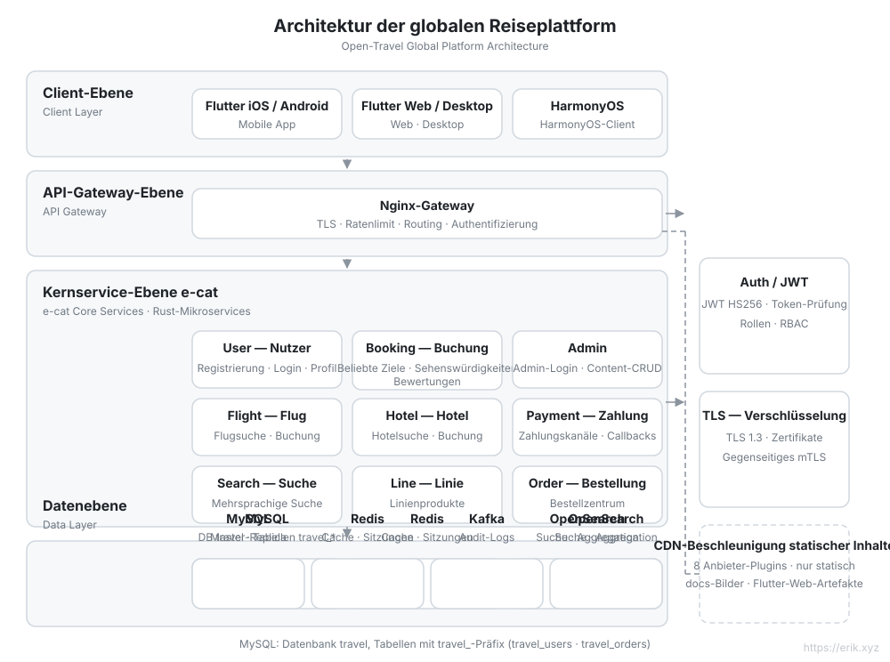
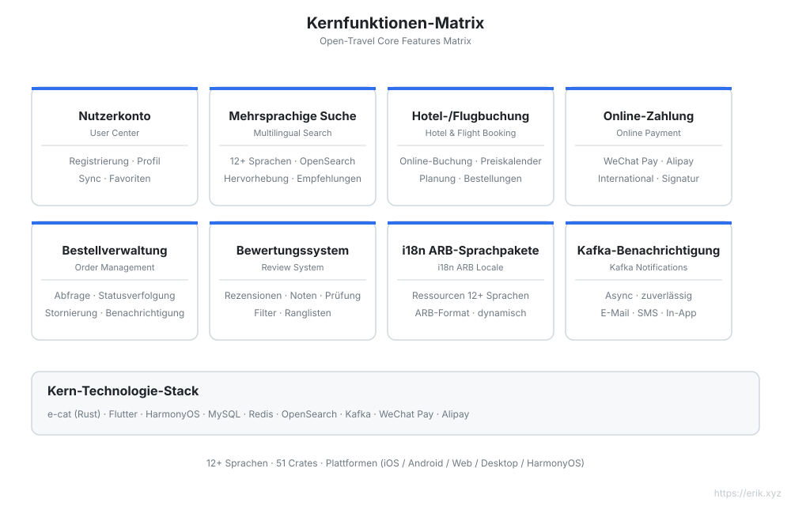
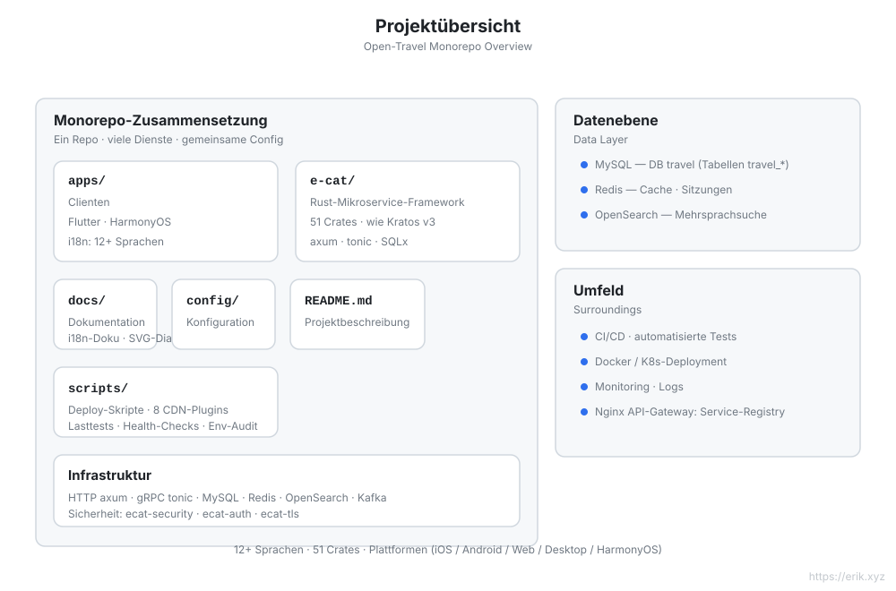
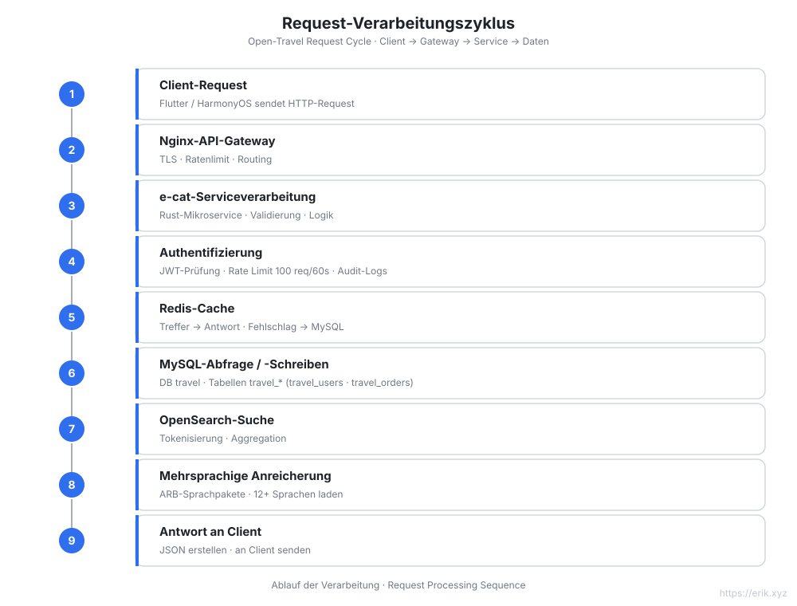
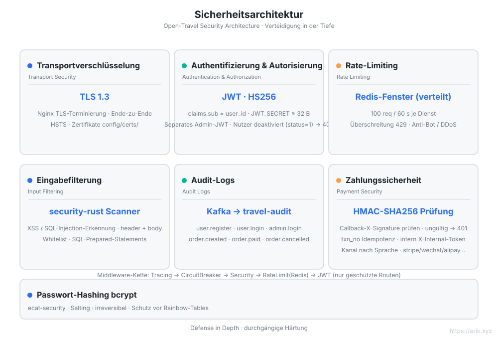

[简体中文](../../README.md) | [English](en/README.md) | [日本語](ja/README.md) | [한국어](ko/README.md) | [Русский](ru/README.md) | [Deutsch](README.md) | [Français](fr/README.md) | [Español](es/README.md) | [Português](pt/README.md) | [हिन्दी](hi/README.md) | [العربية](ar/README.md) | [বাংলা](bn/README.md) | [Bahasa Indonesia](id/README.md)

# Open Travel — Globale Reiseplattform

<p align="center"></p>


> Eine Reisebuchungsplattform für Nutzer weltweit: Rust-Mikroservice-Backend + Flutter / HarmonyOS-Clienten mit Unterstützung für **12+ Sprachen**, internationale Zahlungen und mehrsprachige Suche.

## Projektübersicht

Open Travel ist ein Monorepo einer globalen Reiseplattform, aufgebaut auf **e-cat (eine Katze)** — einem Rust-Mikroservice-Framework auf Augenhöhe mit [go-kratos/kratos](https://github.com/go-kratos/kratos) v3 (v3.0.3 · 52 Crates) — für ein leistungsstarkes Backend, zusammen mit Flutter-Mehrplattform- und nativen HarmonyOS-Clienten, die weltweit ein einheitliches Reisebuchungserlebnis bieten.

| Dimension | Beschreibung |
| :--- | :--- |
| **Backend-Framework** | e-cat (Rust): HTTP/axum + gRPC/tonic, Mikroservice-Ökosystem aus 52 Crates |
| **Mehrplattform-Clienten** | `apps/client/flutter` (iOS / Android / Web / Desktop), `apps/client/harmonyos` (HarmonyOS), `apps/admin` (Flutter-Web-Admin-Konsole) |
| **Datenbank** | MySQL (Datenbank `travel`, Tabellenpräfix `travel_`) + Redis-Cache + OpenSearch-Mehrsprachsuche |
| **Sicherheit** | ecat-security / ecat-auth (JWT) / ecat-tls: Authentifizierung, Audit, Rate-Limiting, Schutz vor Injektionen |
| **Internationalisierung** | 12+ Sprachen als ARB-Sprachpakete, RTL-Unterstützung, mehrsprachige OpenSearch-Tokenisierung |
| **Zahlungen** | WeChat Pay, Alipay |

## Das Projektmaskottchen „Nannan 南南“

Ein Kompassgeist: Das runde Zifferblatt ist sein Körper, auf dem Ziffernring stehen **12 Markierungen = 12+ Sprachen**, auf dem Kopf steht ein Zeiger, die rechte Hand hält eine Lupe zum Suchen des Reiseziels, und oben links zieht ein Papierflieger eine Flugroute hinter sich her. Flache geometrische Form (reine Farbflächen + feine Konturen, keine Verläufe, keine Transparenz); Vektorquelle und vollständige Charte siehe [`docs/mascot.svg`](../../mascot.svg).

| Einsatzort | Form |
| :--- | :--- |
| `docs/mascot.svg` | **Einzige Vektorquelle** (Ganzkörperdarstellung 512×512) |
| `apps/*/web/favicon.svg` | Browser-Tab-Icon (Zifferblatt-Nahaufnahme, noch bei 16px erkennbar; `favicon.png` mit 16px als Fallback für ältere Browser) |
| `apps/*/web/icons/Icon-*.png` | PWA-/Homescreen-Icons 192·512 (inkl. maskable-Variante mit Sicherheitsbereich) |
| `apps/*/assets/mascot.png` | Anzeige innerhalb der Flutter-Apps (Admin-Loginseite, Profilseite des Clients) |
| `apps/client/harmonyos/.../media/mascot.svg` | Innerhalb der HarmonyOS-App (`Image` rendert SVG nativ; Mobilvariante ohne `opacity`) |
| Alle READMEs / Crate-Dokumentation | Markenplatz im Kopfbereich |

> Für Änderungen am Design nur `docs/mascot.svg` anpassen, alles andere ist abgeleitet: Das favicon ist eine Nahaufnahme seines Zifferblatts (ohne Arme / Lupe / Füße / Flugroute und andere Striche, die bei kleiner Größe verschwimmen), die HarmonyOS-Variante rechnet halbtransparente Farben zu Volltonfarben vor und entfernt sämtliches `opacity`, um den SVG-Renderer auf Mobilgeräten zu unterstützen. Alle Grafiken sind original, ohne Abhängigkeit von Material Dritter.

## Kernfunktionen

- 🏨 Mehrsprachige Suche und Buchung von Reisezielen / Hotels / Flügen
- 🌍 Eigenständige Anpassung für 12+ Sprachen (Chinesisch, Englisch, Japanisch, Koreanisch, Arabisch, Spanisch, Französisch, Deutsch …)
- 💳 Internationale Zahlungen (WeChat Pay / Alipay)
- 🔐 Verteidigung in der Tiefe: TLS 1.3, JWT-Authentifizierung, Audit-Logs, Eingabefilterung, Rate-Limiting, HMAC-Verifizierung von Zahlungs-Callbacks, interne Service-Authentifizierung
- 📱 Konsistentes Erlebnis auf allen Plattformen: Flutter (iOS/Android/Web/Desktop) + HarmonyOS

## Architektur-Designdiagramm



## Funktions-Designdiagramm



## Projektstrukturdiagramm



## Request-Lebenszyklusdiagramm



## Sicherheitsarchitektur-Diagramm



## Projektstruktur

```
open-travel/
├── apps/                  # Clients für alle Plattformen und Admin-Oberfläche
│   ├── client/
│   │   ├── flutter/       # Flutter: iOS / Android / Web / Desktop (i18n in 12+ Sprachen, web/favicon.svg ist das „Nannan 南南“-Icon)
│   │   └── harmonyos/     # Nativer HarmonyOS-Client
│   └── admin/             # Flutter-Web-Admin-Oberfläche
├── e-cat/                 # e-cat-Framework + Geschäftsdienste (ein Cargo-Workspace)
│   ├── ecat*/             # 52 ecat-*-Framework-Crates
│   ├── ecat/              # Haupt-Framework-Crate: Fassade + Geschäftsmodule (src/business/) + Service-Einstiege (src/bin/, 9 Dienste)
│   ├── config/            # Framework-Konfigurationsbeispiele
│   ├── examples/          # Framework-Beispielprojekte
│   └── CHANGELOG.md       # Änderungsprotokoll für Framework + Projektversionen (die Versionsnummer ist die Projektversion, siehe Tags)
├── docs/                  # Technische Dokumentation
│   ├── api.md             # API-Referenz (Endpunkte, Authentifizierung, Rate-Limiting)
│   ├── mascot.svg         # Maskottchen „Nannan 南南“ (einzige Vektorquelle, favicon und App-Icons werden daraus abgeleitet)
│   ├── svg/               # Architektur- / Funktions- / Lebenszyklus- / Sicherheits- / Strukturdiagramme (mit Übersetzungen in 12 Sprachen)
│   ├── i18n/              # READMEs in 12 Sprachen
│   └── coin/              # QR-Codes für Spenden
├── config/                # Umgebungs- und Deployment-Konfiguration (nginx.conf, docker-compose.yml, schema.sql)
├── scripts/               # Installation / Deployment / Health-Check / Lasttest / CDN / Seed-Daten
├── .github/workflows/     # CI
└── README.md
```

## Datenbank

- Datenbankname: `travel`
- Tabellenpräfix: `travel_` (z. B. `travel_users`, `travel_orders`, `travel_reviews`)
- Zusätzliche Speicher: Redis (Sitzungen / Beliebtheits-Cache), OpenSearch (mehrsprachige Suchindizes)

> Detaillierte technische Planung: [docs/travel-project-planning.md](../../travel-project-planning.md).

## Ein-Klick-Installation

Voraussetzungen: Docker + Docker Compose (v2). (Die Rust-Toolchain wird nur für das Erstellen aus dem Quellcode benötigt.)

```bash
git clone <repo-url> && cd open-travel
./scripts/install.sh
```

Das Skript automatisiert: Umgebung prüfen → alle Dienste bauen und starten (MySQL / Redis / OpenSearch / Kafka / 9 Microservices / Nginx-Gateway) → Suchindizes initialisieren → Health-Check, danach werden Zugriffs-URL und Standard-Admin-Konto `admin@travel.local` / `Admin@123` ausgegeben.

## Schnellstart

```bash
cd e-cat
cargo check -p ecat --bins   # Kompilierprüfung der Geschäftsdienste
```

| Dienst | Port | Beschreibung |
|---|---|---|
| user-service | 8001 | Benutzerregistrierung / Anmeldung / Profil |
| booking-service | 8002 | Datumsangaben beliebter Reiseziele + Sehenswürdigkeiten-Liste / -Detail + Bewertungen |
| admin-service | 8003 | Admin: Anmeldung + CRUD für Reiseziele / Sehenswürdigkeiten |
| search-service | 8004 | Mehrsprachige Suche |
| line-service | 8005 | Reiselinien |
| order-service | 8006 | Bestellungen |
| flight-service | 8007 | Flüge |
| hotel-service | 8008 | Hotels |
| payment-service | 8009 | Zahlungen |
| Nginx-Gateway | 8082→80 | Routing nach Präfixen `/api/user/`, `/api/booking/`, `/api/admin/`, `/api/search`, `/api/lines`, `/api/orders`, `/api/flights`, `/api/hotels`, `/api/payments` |
| MySQL | 3308→3306 | Datenquelle |
| Redis | 6381→6379 | Cache / Rate-Limiting |
| OpenSearch | 9201→9200 | Mehrsprachige Suche |

Die Admin-Flutter-Web-App liegt unter `apps/admin/`; das Standard-Admin-Konto für die Entwicklung ist `admin@travel.local` / `Admin@123` (nur lokal).

### Skripte

| Skript | Beschreibung |
|---|---|
| `scripts/opensearch_init.sh` | Erstellt den OpenSearch-Index idempotent (cjk-Analysator) |
| `scripts/loadtest.sh` | Lasttest |
| `scripts/cdn_setup.sh` / `cdn_upload.sh` | CDN-Konfiguration und -Upload (`--provider` Acht-Cloud-Plugin: cloudfront/aliyun/gcp/azure/cloudflare/tencent/huawei/bunny, standardmäßig `--dry-run`) |
| `scripts/release.sh` | Unterstützung für den Release-Prozess |

---

## Unterstützen Sie uns

Wenn Ihnen dieses Projekt geholfen hat, laden Sie den Autor gern auf einen Kaffee ein ☕

<p align="center">
  <strong>WeChat Pay</strong> &nbsp;&nbsp;&nbsp;&nbsp;&nbsp;&nbsp;&nbsp;&nbsp;&nbsp;&nbsp;&nbsp;&nbsp;&nbsp;&nbsp;&nbsp;&nbsp;&nbsp;&nbsp; <strong>Alipay</strong><br/>
  
  &nbsp;&nbsp;&nbsp;&nbsp;&nbsp;&nbsp;&nbsp;&nbsp;
  
</p>

### Globale Überweisung (Global Bank Transfer)

**Empfängerinformationen**

- Empfängername: WANG KEXUN
- Empfängerkontonummer: 881015918251

**Empfängerbank**

- SWIFT-Code ZA Bank: AABLHKHHXXX
- Bankname: ZA Bank Limited
- Bankleitzahl: 387
- Bankadresse: Core F, Cyberport 3, 100 Cyberport Road, Hong Kong

**Korrespondenzbank für internationale Überweisungen (falls erforderlich)**

Bitte beachten Sie: Dies sind die Angaben der Korrespondenzbank (Zwischenbank) für internationale Überweisungen, nicht der Empfängerbank. Fragen Sie bei Ihrer überweisenden Bank nach, ob Angaben zur Korrespondenzbank erforderlich sind.

Für Überweisungen in Hongkong-Dollar, Renminbi und US-Dollar ist die Korrespondenzbank **Citibank** —

- Bankname: Citibank N.A. Hong Kong
- SWIFT-Code: CITIHKHXXXX
- Bankleitzahl: 006
- Filialname: Hong Kong Branch
- Filialnummer: 391
- Bankadresse: Citibank Tower, Citibank Plaza, 3 Garden Road, Central, Hong Kong

Für Überweisungen in anderen Währungen ist die Korrespondenzbank **BNY Mellon** —

- Bankname: THE BANK OF NEW YORK MELLON
- SWIFT-Code: IRVTUS3NXXX
- Bankadresse: THE BANK OF NEW YORK MELLON, 240 GREENWICH STREET, NEW YORK, United States

### Krypto-Spenden (Crypto Donation)

Wenn dieses Projekt Ihnen hilft, scannen Sie gerne den QR-Code, um zu spenden. Vielen Dank!

| <br>**BNB Smart Chain (BEP20)**<br>`0x355d429f97511897ccb4e271ec888205f9ab6629` | <br>**Tron (TRC20)**<br>`TEdDHWLajt1XvqtPDWmQctdrJaC3pzZZzz` |
| <br>**Ethereum (ERC20)**<br>`0x355d429f97511897ccb4e271ec888205f9ab6629` | <br>**Aptos**<br>`0x836e3780edfc3f7b2372b39e2a1a3a5d7adfaccd96c726f21cfde1b50dd68030` |
| <br>**Plasma**<br>`0x355d429f97511897ccb4e271ec888205f9ab6629` | <br>**Polygon POS**<br>`0x355d429f97511897ccb4e271ec888205f9ab6629` |
| <br>**Solana**<br>`2hfhboHdmdrYsY25XfQSsEWxq5ip4EQsR7f4AzSRMUyr` | <br>**The Open Network (TON)**<br>`UQB9kFQohzmXUir9QSSZq01iwl9aQZIDdBpNmDklljRtCoGK` |
| <br>**Arbitrum One**<br>`0x355d429f97511897ccb4e271ec888205f9ab6629` | <br>**AVAX C-Chain**<br>`0x355d429f97511897ccb4e271ec888205f9ab6629` |

