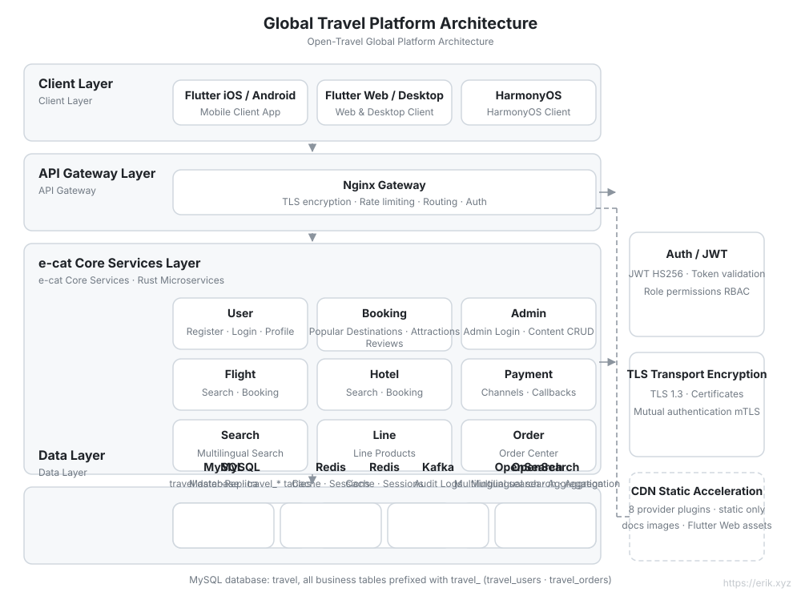
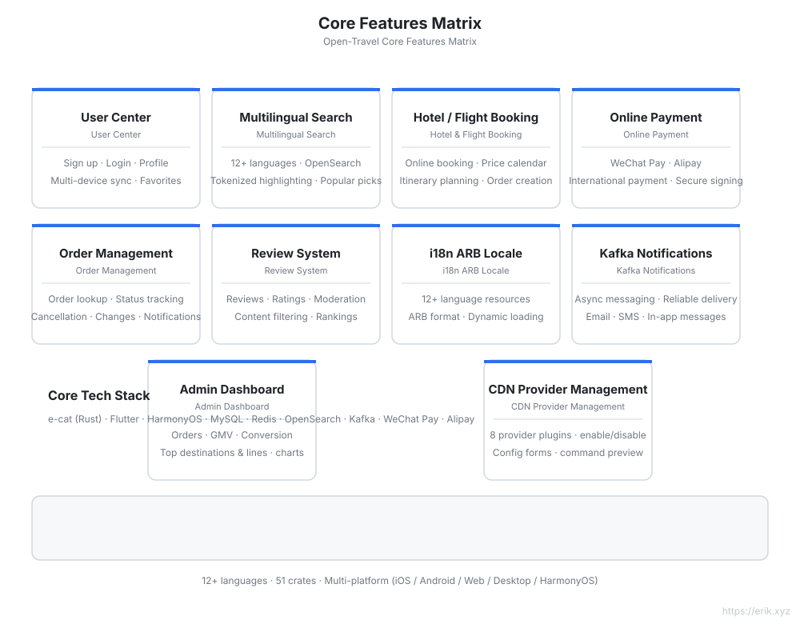
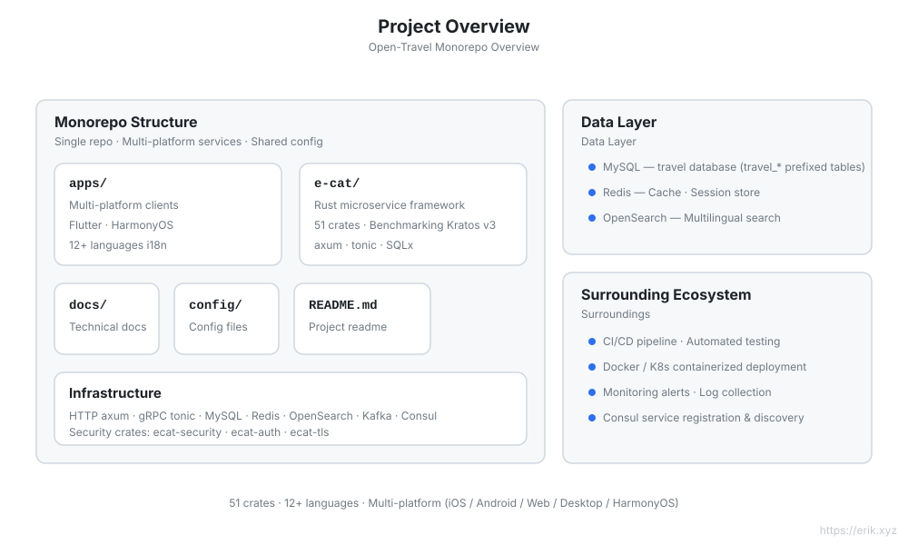
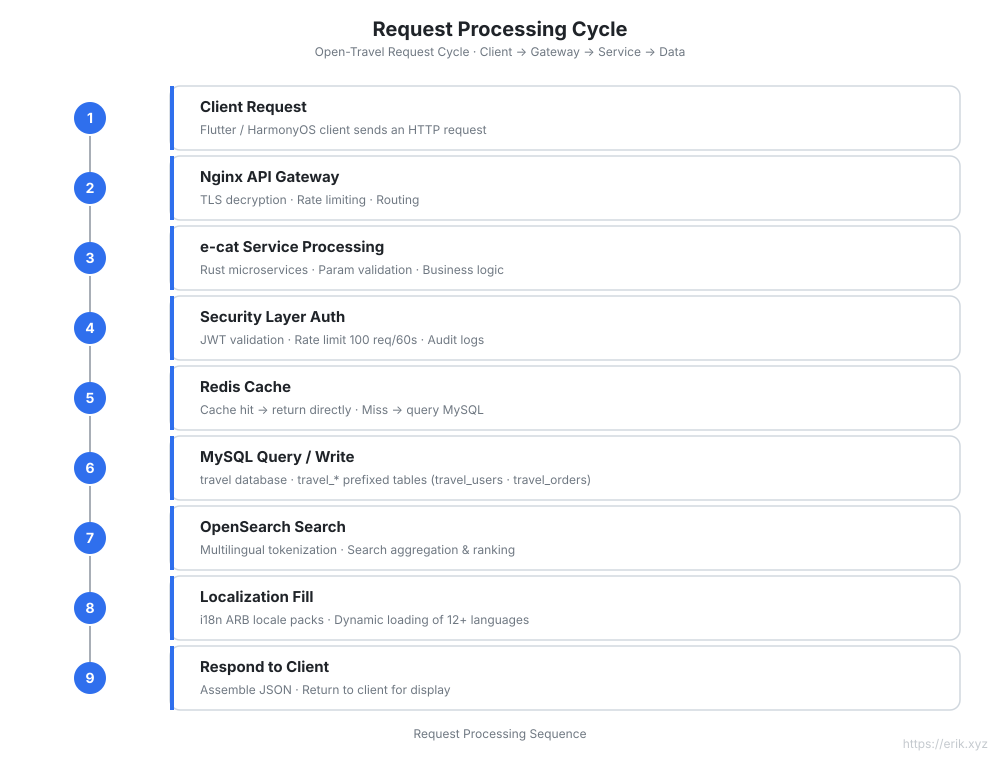
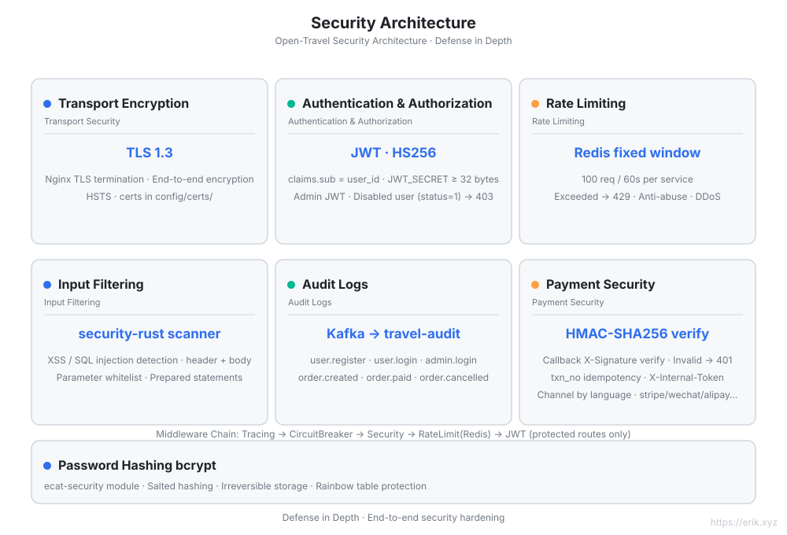
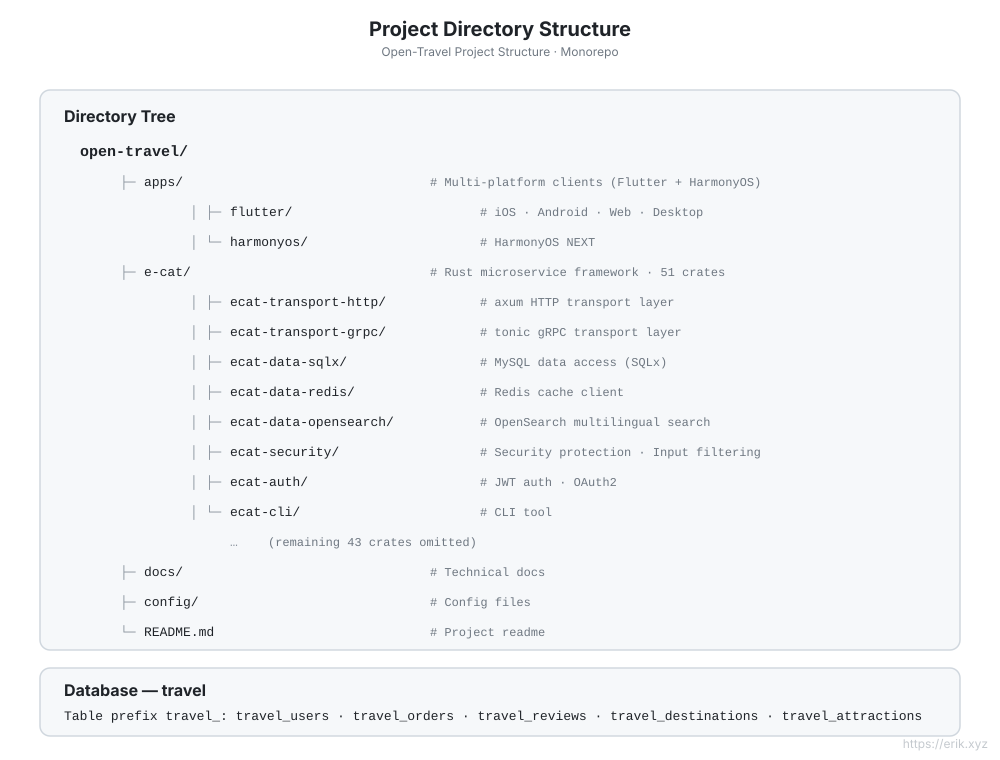

[简体中文](../../README.md) | [English](README.md) | [日本語](../ja/README.md) | [한국어](../ko/README.md) | [Русский](../ru/README.md) | [Deutsch](../de/README.md) | [Français](../fr/README.md) | [Español](../es/README.md) | [Português](../pt/README.md) | [हिन्दी](../hi/README.md) | [العربية](../ar/README.md) | [বাংলা](../bn/README.md) | [Bahasa Indonesia](../id/README.md)

# Open Travel — Global Travel Platform

> A travel booking platform for users worldwide: Rust microservice backend + Flutter / HarmonyOS multi-platform clients, supporting **12+ languages**, international payments, and multilingual search.

## Introduction

Open Travel is a global travel platform monorepo built on **e-cat (a cat)** — a **Rust microservice framework** (v3.0.2 · 51 crates) modeled after [go-kratos/kratos](https://github.com/go-kratos/kratos) v3 — delivering a high-performance backend, paired with Flutter multi-platform and HarmonyOS native clients, to offer a unified travel booking experience to users around the globe.

| Dimension | Description |
| :--- | :--- |
| **Backend framework** | e-cat (Rust): HTTP/axum + gRPC/tonic, a 51-crate microservice ecosystem |
| **Multi-platform clients** | `apps/flutter` (iOS / Android / Web / Desktop), `apps/harmonyos` (HarmonyOS) |
| **Database** | MySQL (database `travel`, table prefix `travel_`) + Redis cache + OpenSearch multilingual search |
| **Security** | ecat-security / ecat-auth (JWT) / ecat-tls: authentication, audit, rate limiting, injection prevention |
| **Internationalization** | 12+ language ARB locale packs, RTL support, OpenSearch multilingual tokenization |
| **Payments** | WeChat Pay, Alipay |

## Key Features

- 🏨 Multilingual search and booking for destinations / hotels / flights
- 🌍 12+ languages independently adapted (Chinese, English, Japanese, Korean, Arabic, Spanish, French, German…)
- 💳 International payments (WeChat Pay / Alipay)
- 🔐 Defense in depth: TLS 1.3, JWT authentication, audit logs, input filtering, rate limiting
- 📱 Consistent experience across platforms: Flutter (iOS/Android/Web/Desktop) + HarmonyOS

## Architecture Diagram



## Feature Diagram



## Project Diagram



## Request Cycle Diagram



## Security Architecture Diagram



## Project Structure Diagram



## Project Structure

```
open-travel/
├── apps/                  # Multi-platform client directory
│   ├── flutter/           # Flutter: iOS / Android / Web / Desktop (12+ language i18n)
│   └── harmonyos/         # HarmonyOS native client
├── e-cat/                 # e-cat Rust microservice framework (51 crates)
├── docs/                  # Project planning, architecture diagrams (SVG), payment QR codes
├── config/                # Environment and deployment configuration
└── README.md
```

## Database

- Database name: `travel`
- Table prefix: `travel_` (e.g. `travel_users`, `travel_orders`, `travel_reviews`)
- Companion storage: Redis (sessions / hot caches), OpenSearch (multilingual search index)

> See [docs/travel-project-planning.md](../../travel-project-planning.md) for detailed technical planning.

---

## Support Us

If this project has helped you, feel free to buy the author a coffee ☕

<p align="center">
  <strong>WeChat Pay</strong> &nbsp;&nbsp;&nbsp;&nbsp;&nbsp;&nbsp;&nbsp;&nbsp;&nbsp;&nbsp;&nbsp;&nbsp;&nbsp;&nbsp;&nbsp;&nbsp;&nbsp;&nbsp; <strong>Alipay</strong><br/>
  
  &nbsp;&nbsp;&nbsp;&nbsp;&nbsp;&nbsp;&nbsp;&nbsp;
  
</p>

### Global Bank Transfer

**Payee Information**

- Payee Name: WANG KEXUN
- Payee Account Number: 881015918251

**Receiving Bank**

- ZA Bank SWIFT Code: AABLHKHHXXX
- Bank Name: ZA Bank Limited
- Bank Code: 387
- Bank Address: Core F, Cyberport 3, 100 Cyberport Road, Hong Kong

**Cross-Border Correspondent Bank (If Required)**

Please note that this is the cross-border correspondent (intermediary) bank information, not the receiving bank information. Please check with your remitting bank whether the correspondent bank information is required.

For remittances in HKD, CNY, and USD, the correspondent bank is **Citibank** —

- Bank Name: Citibank N.A. Hong Kong
- SWIFT Code: CITIHKHXXXX
- Bank Code: 006
- Branch Name: Hong Kong Branch
- Branch Code: 391
- Bank Address: Citibank Tower, Citibank Plaza, 3 Garden Road, Central, Hong Kong

For remittances in other currencies, the correspondent bank is **BNY Mellon** —

- Bank Name: THE BANK OF NEW YORK MELLON
- SWIFT Code: IRVTUS3NXXX
- Bank Address: THE BANK OF NEW YORK MELLON, 240 GREENWICH STREET, NEW YORK, United States

### Crypto Donation

If this project helps you, scan the QR code to donate, thank you!

| <br>**BNB Smart Chain (BEP20)**<br>`0x355d429f97511897ccb4e271ec888205f9ab6629` | <br>**Tron (TRC20)**<br>`TEdDHWLajt1XvqtPDWmQctdrJaC3pzZZzz` |
| <br>**Ethereum (ERC20)**<br>`0x355d429f97511897ccb4e271ec888205f9ab6629` | <br>**Aptos**<br>`0x836e3780edfc3f7b2372b39e2a1a3a5d7adfaccd96c726f21cfde1b50dd68030` |
| <br>**Plasma**<br>`0x355d429f97511897ccb4e271ec888205f9ab6629` | <br>**Polygon POS**<br>`0x355d429f97511897ccb4e271ec888205f9ab6629` |
| <br>**Solana**<br>`2hfhboHdmdrYsY25XfQSsEWxq5ip4EQsR7f4AzSRMUyr` | <br>**The Open Network (TON)**<br>`UQB9kFQohzmXUir9QSSZq01iwl9aQZIDdBpNmDklljRtCoGK` |
| <br>**Arbitrum One**<br>`0x355d429f97511897ccb4e271ec888205f9ab6629` | <br>**AVAX C-Chain**<br>`0x355d429f97511897ccb4e271ec888205f9ab6629` |

