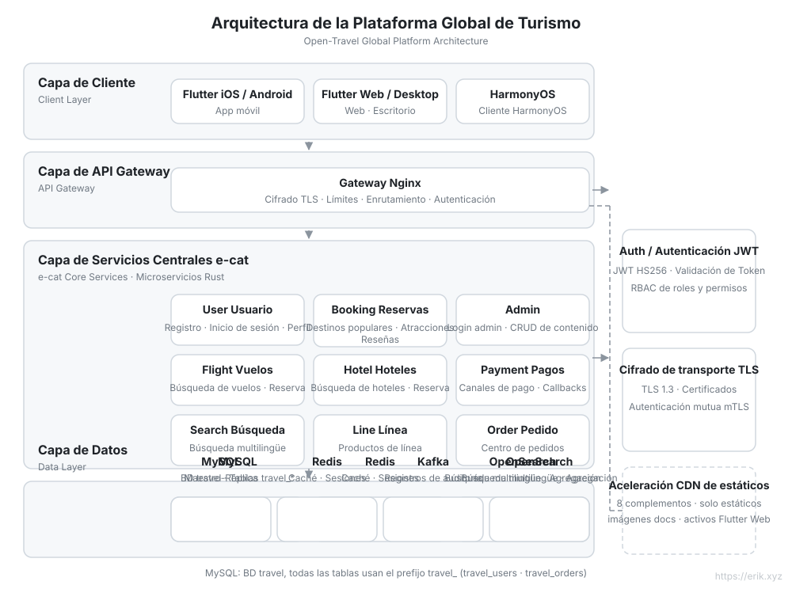
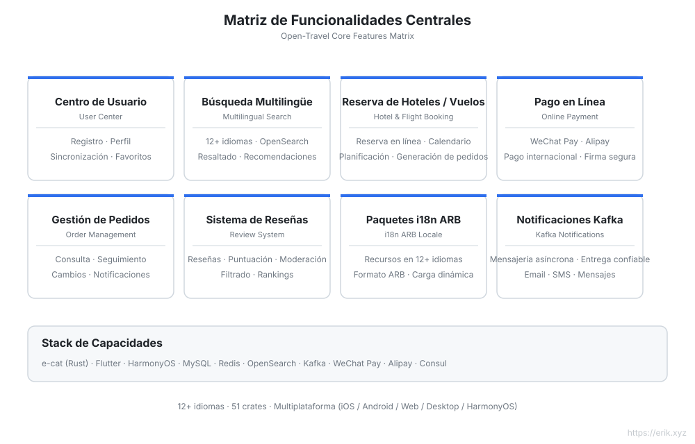
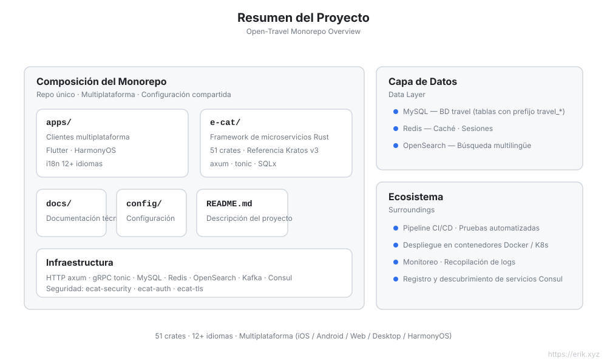
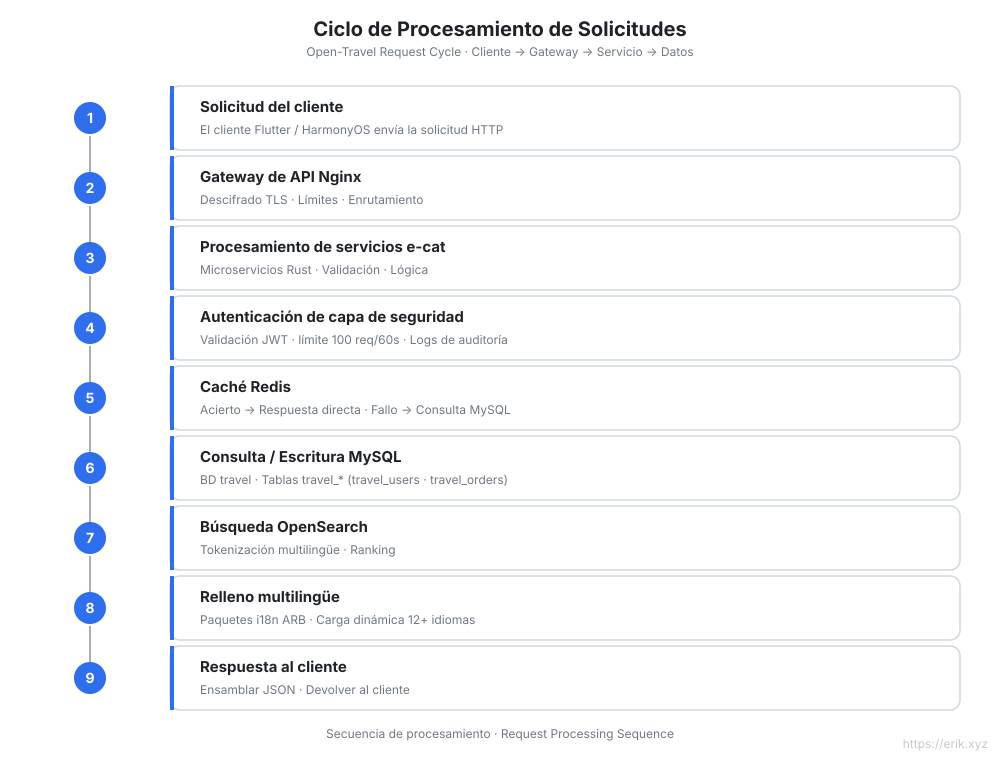
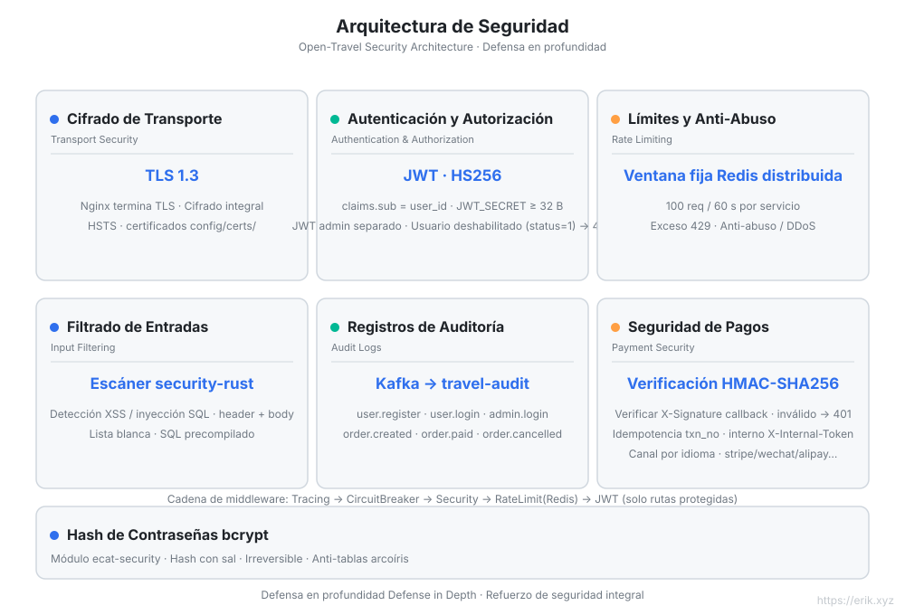
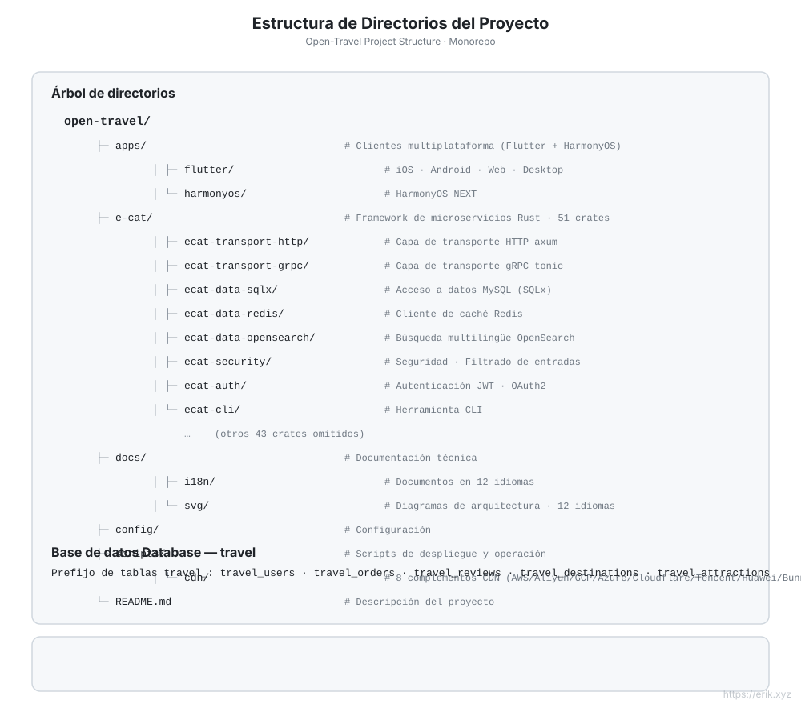

[简体中文](../../README.md) | [English](README.md) | [日本語](ja/README.md) | [한국어](ko/README.md) | [Русский](ru/README.md) | [Deutsch](de/README.md) | [Français](fr/README.md) | [Español](es/README.md) | [Português](pt/README.md) | [हिन्दी](hi/README.md) | [العربية](ar/README.md) | [বাংলা](bn/README.md) | [Bahasa Indonesia](id/README.md)

---

# Open Travel — Plataforma Global de Viajes

<p align="center"></p>


> Una plataforma de reservas de viajes orientada a usuarios globales: backend de microservicios en Rust + clientes multiplataforma en Flutter / HarmonyOS, compatible con **más de 12 idiomas**, pagos internacionales y búsqueda multilingüe.

## Introducción del proyecto

Open Travel es un monorepo de una plataforma global de viajes que utiliza **e-cat (un gato)** — un **framework de microservicios en Rust** (v3.0.2 · 51 crates) inspirado en [go-kratos/kratos](https://github.com/go-kratos/kratos) v3 — para construir un backend de alto rendimiento, junto con clientes multiplataforma en Flutter y clientes nativos HarmonyOS, ofreciendo una experiencia unificada de reservas de viajes para usuarios globales.

| Dimensión | Descripción |
| :--- | :--- |
| **Framework de backend** | e-cat (Rust): HTTP/axum + gRPC/tonic, ecosistema de microservicios con 51 crates |
| **Clientes multiplataforma** | `apps/client/flutter` (iOS / Android / Web / Desktop), `apps/client/harmonyos` (HarmonyOS) |
| **Base de datos** | MySQL (base de datos `travel`, prefijo de tablas `travel_`) + caché Redis + búsqueda multilingüe OpenSearch |
| **Seguridad** | ecat-security / ecat-auth (JWT) / ecat-tls: autenticación, auditoría, limitación de velocidad, prevención de inyección |
| **Internacionalización** | Paquetes de idiomas ARB en 12+ idiomas, compatibilidad con RTL, segmentación multilingüe de OpenSearch |
| **Pagos** | WeChat Pay, Alipay |

## Características principales

- 🏨 Búsqueda y reserva multilingüe de destinos / hoteles / vuelos
- 🌍 Adaptación independiente a más de 12 idiomas (chino, inglés, japonés, coreano, árabe, español, francés, alemán…)
- 💳 Pagos internacionales (WeChat Pay / Alipay)
- 🔐 Seguridad en profundidad: TLS 1.3, autenticación JWT, registros de auditoría, filtrado de entradas, limitación de velocidad
- 📱 Experiencia coherente en múltiples plataformas: Flutter (iOS/Android/Web/Desktop) + HarmonyOS

## Diagrama de arquitectura



## Diagrama de funcionalidades



## Diagrama del proyecto



## Diagrama del ciclo de solicitudes



## Diagrama de arquitectura de seguridad



## Diagrama de estructura del proyecto



## Estructura del proyecto

```
open-travel/
├── apps/                  # Directorio de aplicaciones cliente
│   ├── flutter/           # Flutter: iOS / Android / Web / Desktop (i18n en 12+ idiomas)
│   └── harmonyos/         # Cliente nativo HarmonyOS
├── e-cat/                 # Framework Rust de microservicios e-cat (51 crates)
├── docs/                  # Planificación del proyecto, diagramas (SVG), códigos QR de pago
├── config/                # Configuración de entorno e implementación
└── README.md
```

## Base de datos

- Nombre de la base de datos: `travel`
- Prefijo de tablas: `travel_` (por ejemplo, `travel_users`, `travel_orders`, `travel_reviews`)
- Almacenamiento auxiliar: Redis (sesiones / caché de populares), OpenSearch (índice de búsqueda multilingüe)

> Para la planificación técnica detallada, consulte [docs/travel-project-planning.md](../../travel-project-planning.md).

## Inicio rápido

```bash
cd e-cat
cargo check -p user-service -p booking-service -p admin-service   # verificación de compilación de los servicios de negocio
```

| Servicio | Puerto | Descripción |
|---|---|---|
| user-service | 8001 | Registro / inicio de sesión / perfil de usuario |
| booking-service | 8002 | Fechas de destinos populares + lista / detalle de atracciones |
| admin-service | 8003 | Administración: inicio de sesión + CRUD de destinos / atracciones |
| Puerta de enlace Nginx | 8082→80 | Enrutamiento por prefijos `/api/user/`, `/api/booking/`, `/api/admin/` |
| MySQL | 3308→3306 | Fuente de datos |
| Redis | 6381→6379 | Caché / limitación de velocidad |
| OpenSearch | 9201→9200 | Búsqueda multilingüe |

La consola de administración Flutter Web está en `apps/admin/`; la cuenta de administrador predeterminada de desarrollo es `admin@travel.local` / `Admin@123` (solo uso local).

---

## Apóyanos

Si este proyecto te ha resultado útil, invita al autor a un café ☕

<p align="center">
  <strong>微信支付（WeChat Pay）</strong> &nbsp;&nbsp;&nbsp;&nbsp;&nbsp;&nbsp;&nbsp;&nbsp;&nbsp;&nbsp;&nbsp;&nbsp;&nbsp;&nbsp;&nbsp;&nbsp;&nbsp;&nbsp; <strong>支付宝（Alipay）</strong><br/>
  
  &nbsp;&nbsp;&nbsp;&nbsp;&nbsp;&nbsp;&nbsp;&nbsp;
  
</p>

### Donación por transferencia bancaria internacional (Global Bank Transfer)

**Información del beneficiario**

- Nombre del beneficiario: WANG KEXUN
- Número de cuenta del beneficiario: 881015918251

**Banco beneficiario**

- SWIFT Code de ZA Bank: AABLHKHHXXX
- Nombre del banco: ZA Bank Limited
- Código bancario: 387
- Dirección del banco: Core F, Cyberport 3, 100 Cyberport Road, Hong Kong

**Banco corresponsal para transferencias internacionales (si es necesario)**

Tenga en cuenta que esta es la información del banco corresponsal (banco intermediario) para transferencias internacionales, no la del banco beneficiario. Consulte con su banco si se requiere proporcionar la información del banco corresponsal.

El banco corresponsal para depósitos en dólares de Hong Kong, renminbi y dólares estadounidenses es **Citibank** —

- Nombre del banco: Citibank N.A. Hong Kong
- SWIFT Code: CITIHKHXXXX
- Código bancario: 006
- Nombre de la sucursal: Hong Kong Branch
- Código de sucursal: 391
- Dirección del banco: Citibank Tower, Citibank Plaza, 3 Garden Road, Central, Hong Kong

Para depósitos en otras monedas, el banco corresponsal es **BNY Mellon** —

- Nombre del banco: THE BANK OF NEW YORK MELLON
- SWIFT Code: IRVTUS3NXXX
- Dirección del banco: THE BANK OF NEW YORK MELLON, 240 GREENWICH STREET, NEW YORK, United States

### Donación en criptomonedas (Crypto Donation)

Si este proyecto te resulta útil, escanea el código QR para donar, ¡gracias!

| <br>**BNB Smart Chain (BEP20)**<br>`0x355d429f97511897ccb4e271ec888205f9ab6629` | <br>**Tron (TRC20)**<br>`TEdDHWLajt1XvqtPDWmQctdrJaC3pzZZzz` |
| <br>**Ethereum (ERC20)**<br>`0x355d429f97511897ccb4e271ec888205f9ab6629` | <br>**Aptos**<br>`0x836e3780edfc3f7b2372b39e2a1a3a5d7adfaccd96c726f21cfde1b50dd68030` |
| <br>**Plasma**<br>`0x355d429f97511897ccb4e271ec888205f9ab6629` | <br>**Polygon POS**<br>`0x355d429f97511897ccb4e271ec888205f9ab6629` |
| <br>**Solana**<br>`2hfhboHdmdrYsY25XfQSsEWxq5ip4EQsR7f4AzSRMUyr` | <br>**The Open Network (TON)**<br>`UQB9kFQohzmXUir9QSSZq01iwl9aQZIDdBpNmDklljRtCoGK` |
| <br>**Arbitrum One**<br>`0x355d429f97511897ccb4e271ec888205f9ab6629` | <br>**AVAX C-Chain**<br>`0x355d429f97511897ccb4e271ec888205f9ab6629` |

