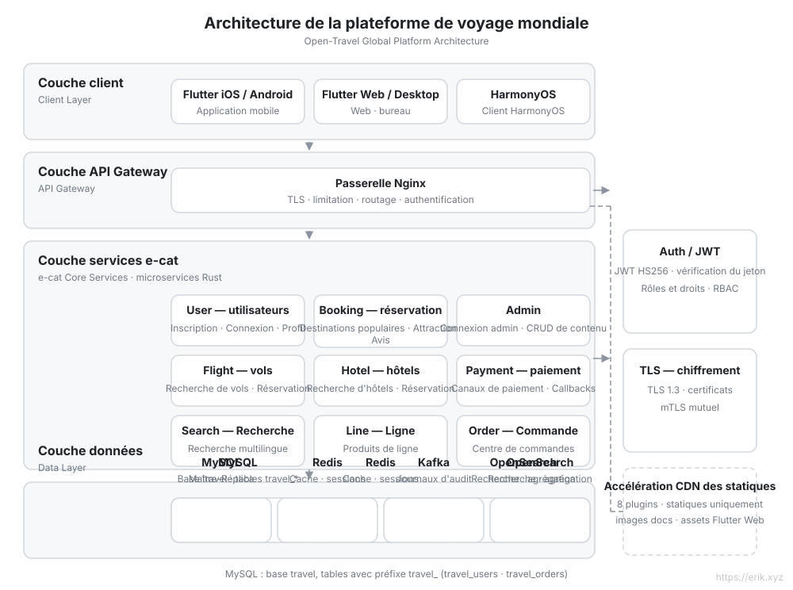
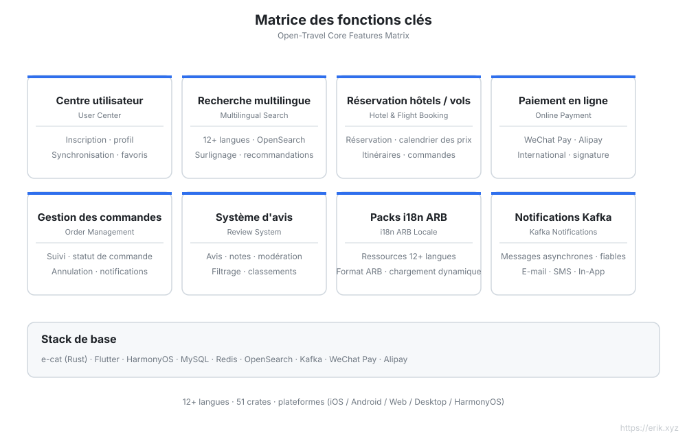
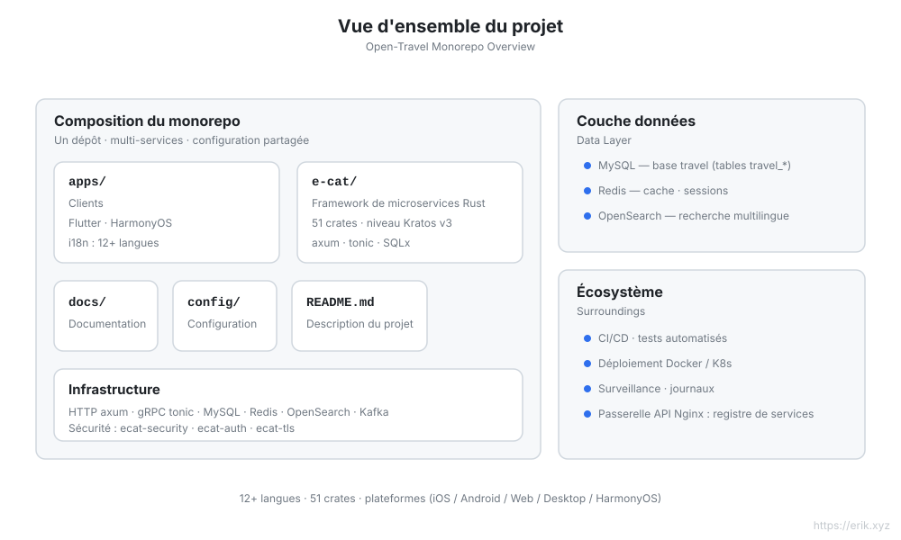
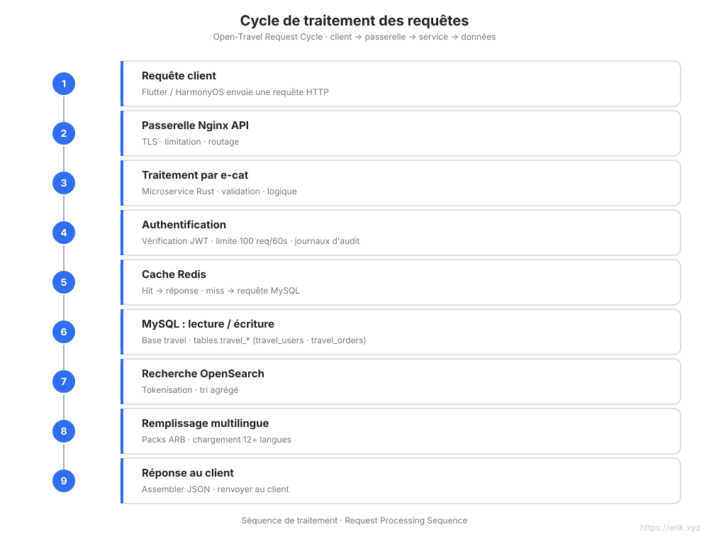
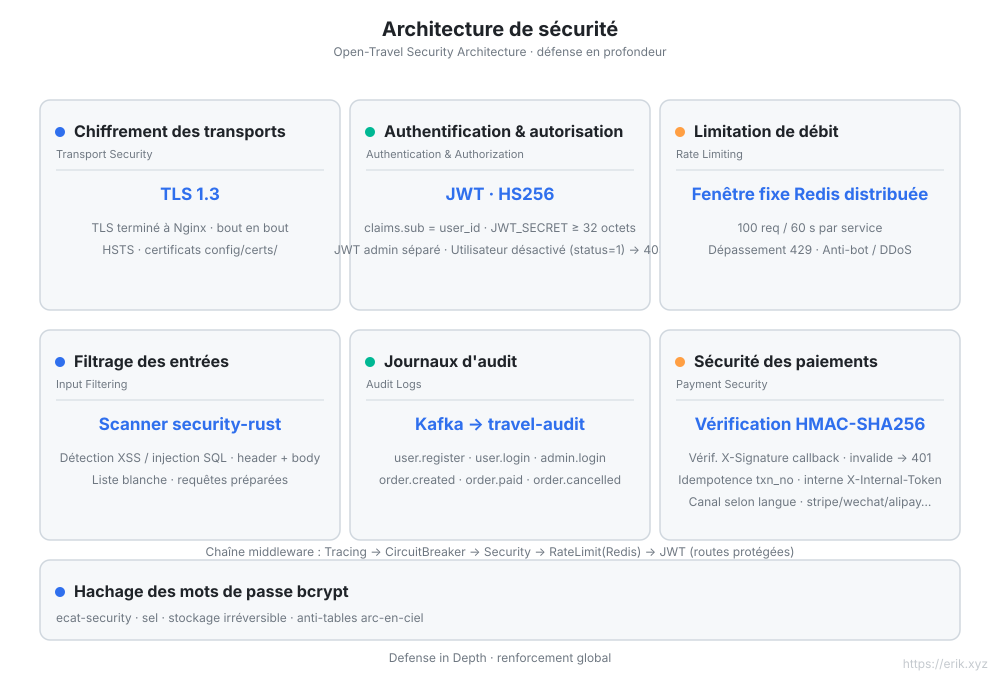

[简体中文](../../README.md) | [English](en/README.md) | [日本語](ja/README.md) | [한국어](ko/README.md) | [Русский](ru/README.md) | [Deutsch](de/README.md) | [Français](README.md) | [Español](es/README.md) | [Português](pt/README.md) | [हिन्दी](hi/README.md) | [العربية](ar/README.md) | [বাংলা](bn/README.md) | [Bahasa Indonesia](id/README.md)

# Open Travel — Plateforme mondiale de voyage

<p align="center"></p>


> Une plateforme de réservation de voyages destinée aux utilisateurs du monde entier : backend de microservices en Rust + clients multiplateformes Flutter / HarmonyOS, avec prise en charge de **12+ langues**, de paiements internationaux et d'une recherche multilingue.

## Présentation du projet

Open Travel est un monorepo de plateforme de voyage mondiale, construit sur **e-cat (un chat)** — un framework de microservices Rust comparable à [go-kratos/kratos](https://github.com/go-kratos/kratos) v3 (v3.0.3 · 52 crates) — pour un backend haute performance, avec des clients Flutter multiplateforme et un client natif HarmonyOS, offrant une expérience de réservation unifiée aux utilisateurs du monde entier.

| Dimension | Description |
| :--- | :--- |
| **Framework backend** | e-cat (Rust) : HTTP/axum + gRPC/tonic, écosystème de 52 crates de microservices |
| **Clients multiplateformes** | `apps/client/flutter` (iOS / Android / Web / Desktop), `apps/client/harmonyos` (HarmonyOS), `apps/admin` (console d'administration Flutter Web) |
| **Base de données** | MySQL (base `travel`, préfixe des tables `travel_`) + cache Redis + recherche multilingue OpenSearch |
| **Sécurité** | ecat-security / ecat-auth (JWT) / ecat-tls : authentification, audit, limitation de débit, protection contre les injections |
| **Internationalisation** | 12+ langues en packs ARB, prise en charge RTL, tokenisation multilingue OpenSearch |
| **Paiements** | WeChat Pay, Alipay |

## La mascotte du projet « Nannan 南南 »

Un esprit boussole : le cadran rond lui sert de corps, la lunette porte **12 graduations = 12+ langues**, une aiguille se dresse au-dessus de sa tête, la main droite tient une loupe pour chercher la destination et, en haut à gauche, un avion en papier tire une trace de vol. Style géométrique plat (aplats de couleur + contours fins, sans dégradés ni transparence) ; la source vectorielle et la charte complète se trouvent dans [`docs/mascot.svg`](../../mascot.svg).

| Emplacement | Forme |
| :--- | :--- |
| `docs/mascot.svg` | **Source vectorielle unique** (vue en pied 512×512) |
| `apps/*/web/favicon.svg` | Icône d'onglet de navigateur (gros plan du cadran, encore lisible en 16px ; `favicon.png` en 16px pour les anciens navigateurs) |
| `apps/*/web/icons/Icon-*.png` | Icônes PWA / écran d'accueil 192·512 (dont la variante maskable avec zone de sécurité) |
| `apps/*/assets/mascot.png` | Affichage dans les applications Flutter (page de connexion de l'admin, page de profil du client) |
| `apps/client/harmonyos/.../media/mascot.svg` | Dans l'application HarmonyOS (`Image` rend le SVG nativement ; variante mobile sans `opacity`) |
| Tous les README / documentations de crate | Emplacement de marque en tête de page |

> Pour modifier le design, ne changer que `docs/mascot.svg` ; tout le reste en dérive : le favicon est un gros plan de son cadran (sans bras / loupe / pieds / trace de vol et autres traits qui se brouillent en petite taille), et la variante HarmonyOS prémultiplie les couleurs semi-transparentes en couleurs pleines et supprime tout `opacity` pour s'adapter au moteur de rendu SVG mobile. Tous les graphismes sont originaux, sans dépendance à des ressources tierces.

## Fonctionnalités clés

- 🏨 Recherche et réservation multilingues de destinations / hôtels / billets d'avion
- 🌍 Adaptation indépendante pour 12+ langues (chinois, anglais, japonais, coréen, arabe, espagnol, français, allemand…)
- 💳 Paiements internationaux (WeChat Pay / Alipay)
- 🔐 Sécurité en profondeur : TLS 1.3, authentification JWT, journaux d'audit, filtrage des entrées, limitation de débit, vérification HMAC des callbacks de paiement, authentification des services internes
- 📱 Expérience cohérente sur toutes les plateformes : Flutter (iOS/Android/Web/Desktop) + HarmonyOS

## Diagramme de conception de l'architecture



## Diagramme de conception des fonctionnalités



## Diagramme de structure du projet



## Diagramme du cycle de vie des requêtes



## Diagramme de l'architecture de sécurité



## Structure du projet

```
open-travel/
├── apps/                  # Clients multiplateformes et console d'administration
│   ├── client/
│   │   ├── flutter/       # Flutter : iOS / Android / Web / Desktop (i18n en 12+ langues, web/favicon.svg est l'icône « Nannan 南南 »)
│   │   └── harmonyos/     # Client natif HarmonyOS
│   └── admin/             # Console d'administration Flutter Web
├── e-cat/                 # Framework e-cat + services métier (un seul Cargo workspace)
│   ├── ecat*/             # 52 crates du framework ecat-*
│   ├── ecat/              # Crate principal du framework : façade + modules métier (src/business/) + points d'entrée des services (src/bin/, 9 services)
│   ├── config/            # Exemples de configuration du framework
│   ├── examples/          # Projets d'exemple du framework
│   └── CHANGELOG.md       # Journal des versions du framework + du projet (le numéro de version est celui du projet, voir les tags)
├── docs/                  # Documentation technique
│   ├── api.md             # Référence API (points de terminaison, authentification, limitation de débit)
│   ├── mascot.svg         # Mascotte « Nannan 南南 » (source vectorielle unique, le favicon et les icônes des applications en dérivent)
│   ├── svg/               # Diagrammes architecture / fonctionnalités / cycle de vie / sécurité / structure (avec traductions en 12 langues)
│   ├── i18n/              # README en 12 langues
│   └── coin/              # QR codes de don
├── config/                # Configuration d'environnement et de déploiement (nginx.conf, docker-compose.yml, schema.sql)
├── scripts/               # Installation / déploiement / inspection / test de charge / CDN / données de démarrage
├── .github/workflows/     # CI
└── README.md
```

## Base de données

- Nom de la base : `travel`
- Préfixe des tables : `travel_` (par ex. `travel_users`, `travel_orders`, `travel_reviews`)
- Stockages associés : Redis (sessions / cache des contenus populaires), OpenSearch (index de recherche multilingue)

> Planification technique détaillée : [docs/travel-project-planning.md](../../travel-project-planning.md).

## Installation en un clic

Prérequis : Docker + Docker Compose (v2). (La toolchain Rust n'est nécessaire que pour la compilation à partir des sources.)

```bash
git clone <repo-url> && cd open-travel
./scripts/install.sh
```

Le script automatise : vérification de l'environnement → compilation et démarrage de tous les services (MySQL / Redis / OpenSearch / Kafka / 9 microservices / passerelle Nginx) → initialisation des index de recherche → contrôle de santé, puis affiche l'URL d'accès et le compte administrateur par défaut `admin@travel.local` / `Admin@123`.

## Démarrage rapide

```bash
cd e-cat
cargo check -p ecat --bins   # vérification de compilation des services métier
```

| Service | Port | Description |
|---|---|---|
| user-service | 8001 | Inscription / connexion / profil utilisateur |
| booking-service | 8002 | Dates des destinations populaires + liste / détail des attractions + avis |
| admin-service | 8003 | Admin : connexion + CRUD destinations / attractions |
| search-service | 8004 | Recherche multilingue |
| line-service | 8005 | Circuits touristiques |
| order-service | 8006 | Commandes |
| flight-service | 8007 | Vols |
| hotel-service | 8008 | Hôtels |
| payment-service | 8009 | Paiements |
| Passerelle Nginx | 8082→80 | Routage par préfixe `/api/user/`, `/api/booking/`, `/api/admin/`, `/api/search`, `/api/lines`, `/api/orders`, `/api/flights`, `/api/hotels`, `/api/payments` |
| MySQL | 3308→3306 | Source de données |
| Redis | 6381→6379 | Cache / limitation de débit |
| OpenSearch | 9201→9200 | Recherche multilingue |

La console d'administration Flutter Web se trouve dans `apps/admin/` ; le compte admin par défaut pour le développement est `admin@travel.local` / `Admin@123` (usage local uniquement).

### Scripts

| Script | Description |
|---|---|
| `scripts/opensearch_init.sh` | Crée l'index OpenSearch de manière idempotente (analyseur cjk) |
| `scripts/loadtest.sh` | Test de charge |
| `scripts/cdn_setup.sh` / `cdn_upload.sh` | Configuration et upload CDN (plugin `--provider` huit-clouds : cloudfront/aliyun/gcp/azure/cloudflare/tencent/huawei/bunny, `--dry-run` par défaut) |
| `scripts/release.sh` | Aide au processus de publication |

---

## Soutenez-nous

Si ce projet vous a été utile, offrez un café à l'auteur ☕

<p align="center">
  <strong>WeChat Pay</strong> &nbsp;&nbsp;&nbsp;&nbsp;&nbsp;&nbsp;&nbsp;&nbsp;&nbsp;&nbsp;&nbsp;&nbsp;&nbsp;&nbsp;&nbsp;&nbsp;&nbsp;&nbsp; <strong>Alipay</strong><br/>
  
  &nbsp;&nbsp;&nbsp;&nbsp;&nbsp;&nbsp;&nbsp;&nbsp;
  
</p>

### Virement bancaire international (Global Bank Transfer)

**Informations du bénéficiaire**

- Nom du bénéficiaire : WANG KEXUN
- Numéro de compte du bénéficiaire : 881015918251

**Banque du bénéficiaire**

- SWIFT Code de ZA Bank : AABLHKHHXXX
- Nom de la banque : ZA Bank Limited
- Code bancaire : 387
- Adresse de la banque : Core F, Cyberport 3, 100 Cyberport Road, Hong Kong

**Banque correspondante pour virements internationaux (si nécessaire)**

Veuillez noter qu'il s'agit des informations de la banque correspondante (banque intermédiaire) pour les virements internationaux, et non de la banque du bénéficiaire. Renseignez-vous auprès de la banque émettrice pour savoir si ces informations sont requises.

Pour les virements en dollars de Hong Kong, en renminbi et en dollars américains, la banque correspondante est **Citibank** —

- Nom de la banque : Citibank N.A. Hong Kong
- SWIFT Code : CITIHKHXXXX
- Code bancaire : 006
- Nom de l'agence : Hong Kong Branch
- Numéro d'agence : 391
- Adresse de la banque : Citibank Tower, Citibank Plaza, 3 Garden Road, Central, Hong Kong

Pour les virements dans d'autres devises, la banque correspondante est **BNY Mellon** —

- Nom de la banque : THE BANK OF NEW YORK MELLON
- SWIFT Code : IRVTUS3NXXX
- Adresse de la banque : THE BANK OF NEW YORK MELLON, 240 GREENWICH STREET, NEW YORK, United States

### Don en cryptomonnaie (Crypto Donation)

Si ce projet vous est utile, scannez le code QR pour faire un don, merci !

| <br>**BNB Smart Chain (BEP20)**<br>`0x355d429f97511897ccb4e271ec888205f9ab6629` | <br>**Tron (TRC20)**<br>`TEdDHWLajt1XvqtPDWmQctdrJaC3pzZZzz` |
| <br>**Ethereum (ERC20)**<br>`0x355d429f97511897ccb4e271ec888205f9ab6629` | <br>**Aptos**<br>`0x836e3780edfc3f7b2372b39e2a1a3a5d7adfaccd96c726f21cfde1b50dd68030` |
| <br>**Plasma**<br>`0x355d429f97511897ccb4e271ec888205f9ab6629` | <br>**Polygon POS**<br>`0x355d429f97511897ccb4e271ec888205f9ab6629` |
| <br>**Solana**<br>`2hfhboHdmdrYsY25XfQSsEWxq5ip4EQsR7f4AzSRMUyr` | <br>**The Open Network (TON)**<br>`UQB9kFQohzmXUir9QSSZq01iwl9aQZIDdBpNmDklljRtCoGK` |
| <br>**Arbitrum One**<br>`0x355d429f97511897ccb4e271ec888205f9ab6629` | <br>**AVAX C-Chain**<br>`0x355d429f97511897ccb4e271ec888205f9ab6629` |

