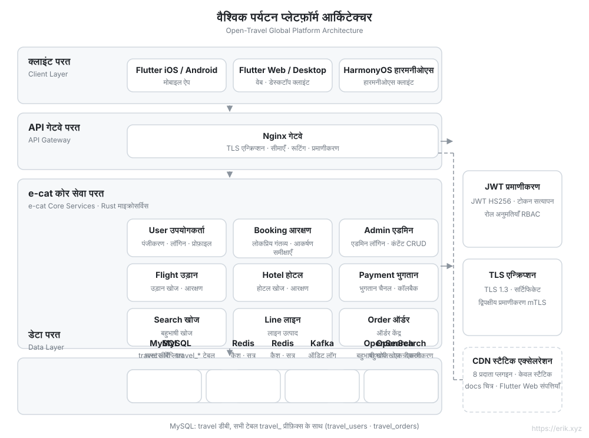
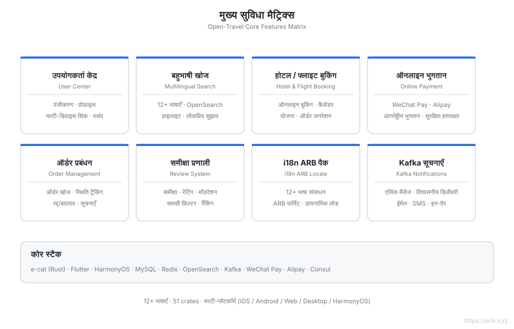
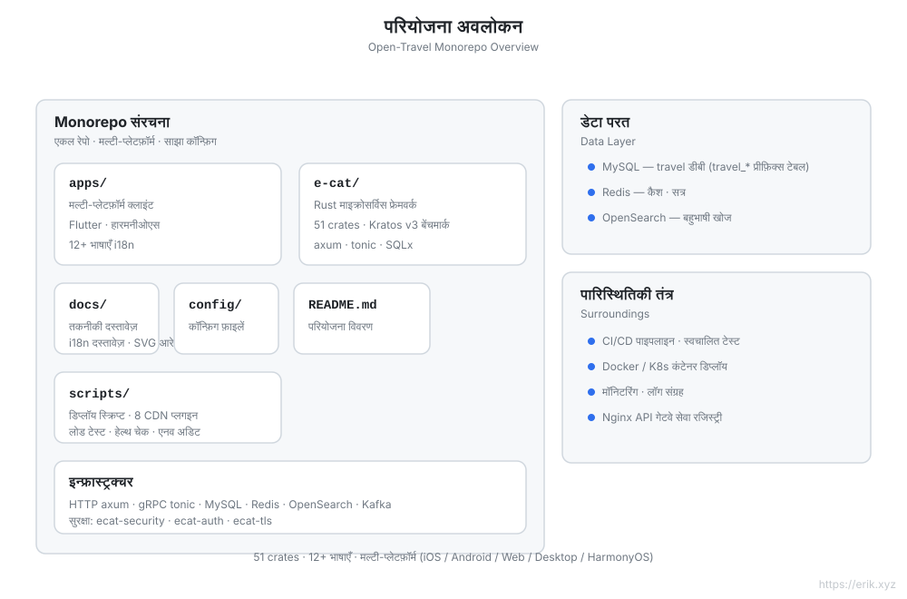
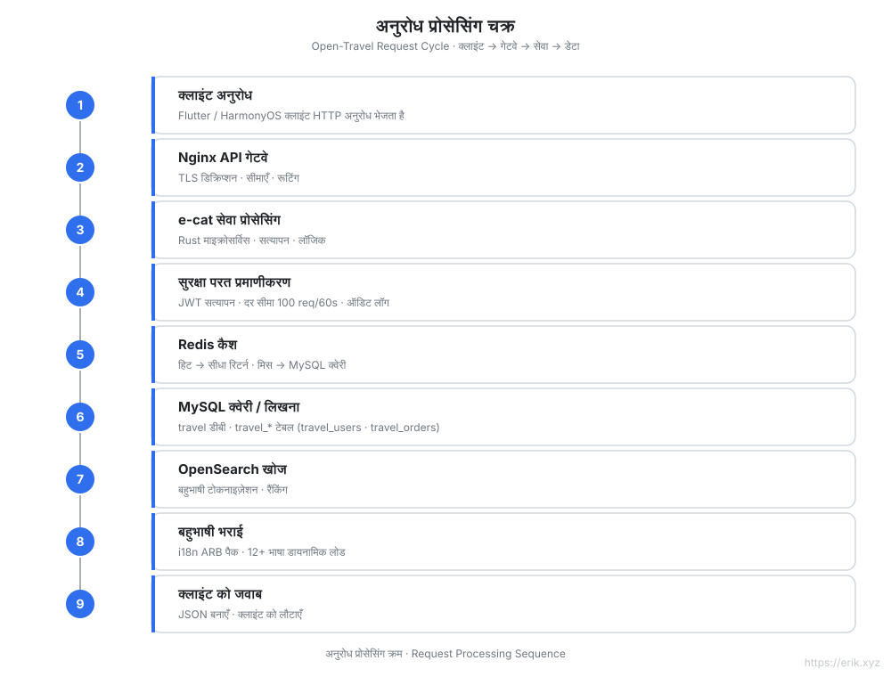
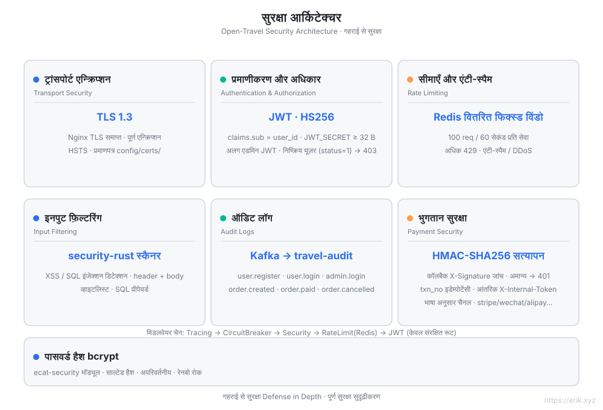
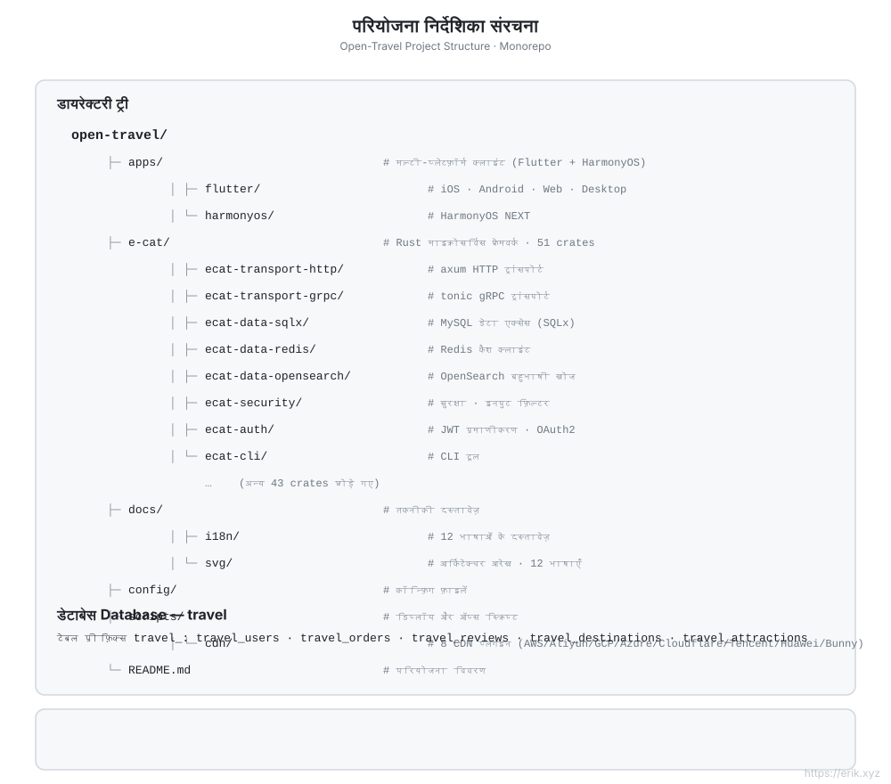

[简体中文](../../README.md) | [English](README.md) | [日本語](ja/README.md) | [한국어](ko/README.md) | [Русский](ru/README.md) | [Deutsch](de/README.md) | [Français](fr/README.md) | [Español](es/README.md) | [Português](pt/README.md) | [हिन्दी](hi/README.md) | [العربية](ar/README.md) | [বাংলা](bn/README.md) | [Bahasa Indonesia](id/README.md)

---

# Open Travel — वैश्विक यात्रा प्लेटफ़ॉर्म

> वैश्विक उपयोगकर्ताओं के लिए एक यात्रा बुकिंग प्लेटफ़ॉर्म: Rust माइक्रोसर्विस बैकएंड + Flutter / HarmonyOS मल्टी-प्लेटफ़ॉर्म क्लाइंट, **12+ भाषाओं**, अंतर्राष्ट्रीय भुगतान और बहुभाषी खोज का समर्थन करता है।

## परियोजना परिचय

Open Travel एक वैश्विक यात्रा प्लेटफ़ॉर्म monorepo है, जो **e-cat (एक बिल्ली)** — [go-kratos/kratos](https://github.com/go-kratos/kratos) v3 से प्रेरित एक **Rust माइक्रोसर्विस फ्रेमवर्क** (v3.0.2 · 51 crates) — का उपयोग करके उच्च-प्रदर्शन बैकएंड बनाता है, साथ ही Flutter मल्टी-प्लेटफ़ॉर्म और HarmonyOS नेटिव क्लाइंट के साथ, वैश्विक उपयोगकर्ताओं के लिए एकीकृत यात्रा बुकिंग अनुभव प्रदान करता है।

| आयाम | विवरण |
| :--- | :--- |
| **बैकएंड फ्रेमवर्क** | e-cat (Rust): HTTP/axum + gRPC/tonic, 51 crates माइक्रोसर्विस इकोसिस्टम |
| **मल्टी-प्लेटफ़ॉर्म क्लाइंट** | `apps/flutter` (iOS / Android / Web / Desktop), `apps/harmonyos` (HarmonyOS) |
| **डेटाबेस** | MySQL (डेटाबेस `travel`, टेबल प्रीफ़िक्स `travel_`) + Redis कैश + OpenSearch बहुभाषी खोज |
| **सुरक्षा** | ecat-security / ecat-auth (JWT) / ecat-tls: प्रमाणीकरण, ऑडिट, रेट लिमिटिंग, इंजेक्शन रोकथाम |
| **अंतर्राष्ट्रीयकरण** | 12+ भाषाओं के ARB भाषा पैक, RTL समर्थन, OpenSearch बहुभाषी टोकनाइज़ेशन |
| **भुगतान** | WeChat Pay, Alipay |

## मुख्य विशेषताएँ

- 🏨 गंतव्यों / होटलों / उड़ानों की बहुभाषी खोज और बुकिंग
- 🌍 12+ भाषाओं का स्वतंत्र अनुकूलन (चीनी, अंग्रेज़ी, जापानी, कोरियाई, अरबी, स्पेनिश, फ्रेंच, जर्मन…)
- 💳 अंतर्राष्ट्रीय भुगतान (WeChat Pay / Alipay)
- 🔐 गहन सुरक्षा: TLS 1.3, JWT प्रमाणीकरण, ऑडिट लॉग, इनपुट फ़िल्टरिंग, रेट लिमिटिंग
- 📱 मल्टी-प्लेटफ़ॉर्म पर समान अनुभव: Flutter (iOS/Android/Web/Desktop) + HarmonyOS

## आर्किटेक्चर आरेख



## कार्यात्मकता आरेख



## परियोजना आरेख



## अनुरोध चक्र आरेख



## सुरक्षा आर्किटेक्चर आरेख



## परियोजना संरचना आरेख



## परियोजना संरचना

```
open-travel/
├── apps/                  # मल्टी-प्लेटफ़ॉर्म क्लाइंट निर्देशिका
│   ├── flutter/           # Flutter: iOS / Android / Web / Desktop (12+ भाषाओं में i18n)
│   └── harmonyos/         # HarmonyOS नेटिव क्लाइंट
├── e-cat/                 # e-cat Rust माइक्रोसर्विस फ्रेमवर्क (51 crates)
├── docs/                  # परियोजना योजना, आरेख (SVG), भुगतान QR कोड
├── config/                # पर्यावरण और डिप्लॉयमेंट कॉन्फ़िगरेशन
└── README.md
```

## डेटाबेस

- डेटाबेस नाम: `travel`
- टेबल प्रीफ़िक्स: `travel_` (उदाहरण: `travel_users`, `travel_orders`, `travel_reviews`)
- सहायक स्टोरेज: Redis (सत्र / लोकप्रिय कैश), OpenSearch (बहुभाषी खोज इंडेक्स)

> विस्तृत तकनीकी योजना के लिए देखें [docs/travel-project-planning.md](../../travel-project-planning.md)।

---

## हमें समर्थन दें

अगर यह परियोजना आपके लिए उपयोगी है, तो लेखक को एक कॉफ़ी पिलाएँ ☕

<p align="center">
  <strong>微信支付（WeChat Pay）</strong> &nbsp;&nbsp;&nbsp;&nbsp;&nbsp;&nbsp;&nbsp;&nbsp;&nbsp;&nbsp;&nbsp;&nbsp;&nbsp;&nbsp;&nbsp;&nbsp;&nbsp;&nbsp; <strong>支付宝（Alipay）</strong><br/>
  
  &nbsp;&nbsp;&nbsp;&nbsp;&nbsp;&nbsp;&nbsp;&nbsp;
  
</p>

### वैश्विक बैंक ट्रांसफर (Global Bank Transfer) दान

**प्राप्तकर्ता (Beneficiary) जानकारी**

- प्राप्तकर्ता का नाम: WANG KEXUN
- प्राप्तकर्ता खाता संख्या: 881015918251

**प्राप्तकर्ता बैंक**

- ZA Bank SWIFT Code: AABLHKHHXXX
- बैंक का नाम: ZA Bank Limited
- बैंक कोड: 387
- बैंक का पता: Core F, Cyberport 3, 100 Cyberport Road, Hong Kong

**अंतर्राष्ट्रीय रेमिटेंस के लिए संवाददाता बैंक (यदि आवश्यक हो)**

कृपया ध्यान दें: यह अंतर्राष्ट्रीय रेमिटेंस के लिए संवाददाता बैंक (मध्यस्थ बैंक) की जानकारी है, प्राप्तकर्ता बैंक की नहीं। कृपया अपने रेमिटेंस बैंक से पूछें कि क्या संवाददाता बैंक की जानकारी प्रदान करना आवश्यक है।

हांगकांग डॉलर, रेनमिन्बी और अमेरिकी डॉलर जमा के लिए संवाददाता बैंक **Citibank** है —

- बैंक का नाम: Citibank N.A. Hong Kong
- SWIFT Code: CITIHKHXXXX
- बैंक कोड: 006
- शाखा का नाम: Hong Kong Branch
- शाखा कोड: 391
- बैंक का पता: Citibank Tower, Citibank Plaza, 3 Garden Road, Central, Hong Kong

अन्य मुद्राओं में जमा के लिए संवाददाता बैंक **BNY Mellon** है —

- बैंक का नाम: THE BANK OF NEW YORK MELLON
- SWIFT Code: IRVTUS3NXXX
- बैंक का पता: THE BANK OF NEW YORK MELLON, 240 GREENWICH STREET, NEW YORK, United States

### क्रिप्टो दान (Crypto Donation)

यदि यह प्रोजेक्ट आपके काम आए, तो दान करने के लिए QR कोड स्कैन करें, धन्यवाद!

| <br>**BNB Smart Chain (BEP20)**<br>`0x355d429f97511897ccb4e271ec888205f9ab6629` | <br>**Tron (TRC20)**<br>`TEdDHWLajt1XvqtPDWmQctdrJaC3pzZZzz` |
| <br>**Ethereum (ERC20)**<br>`0x355d429f97511897ccb4e271ec888205f9ab6629` | <br>**Aptos**<br>`0x836e3780edfc3f7b2372b39e2a1a3a5d7adfaccd96c726f21cfde1b50dd68030` |
| <br>**Plasma**<br>`0x355d429f97511897ccb4e271ec888205f9ab6629` | <br>**Polygon POS**<br>`0x355d429f97511897ccb4e271ec888205f9ab6629` |
| <br>**Solana**<br>`2hfhboHdmdrYsY25XfQSsEWxq5ip4EQsR7f4AzSRMUyr` | <br>**The Open Network (TON)**<br>`UQB9kFQohzmXUir9QSSZq01iwl9aQZIDdBpNmDklljRtCoGK` |
| <br>**Arbitrum One**<br>`0x355d429f97511897ccb4e271ec888205f9ab6629` | <br>**AVAX C-Chain**<br>`0x355d429f97511897ccb4e271ec888205f9ab6629` |

