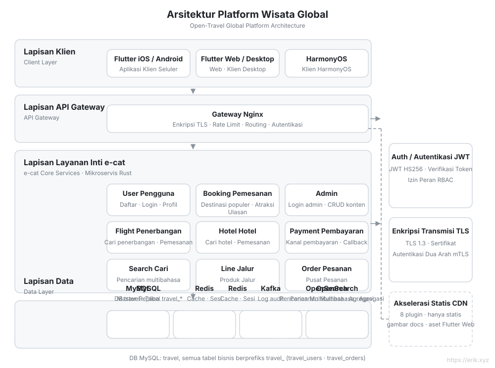
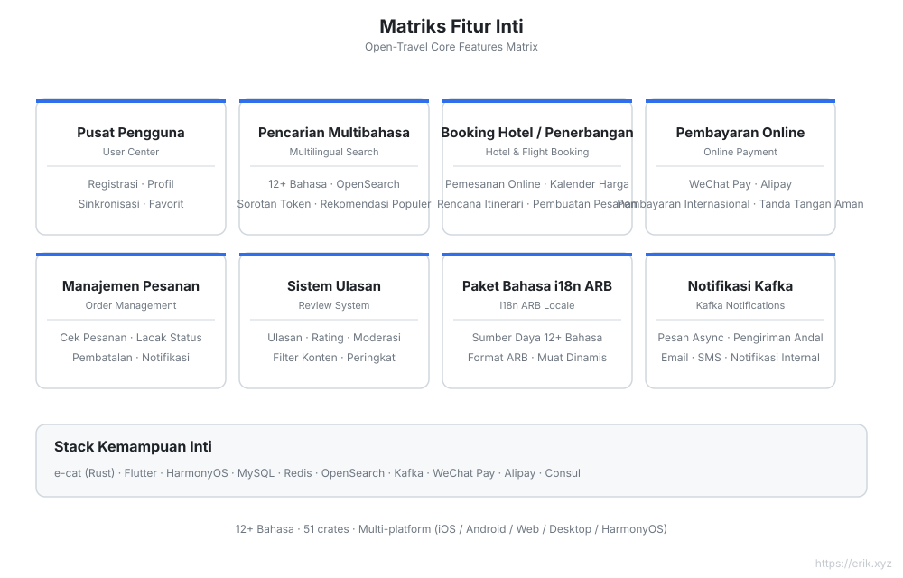
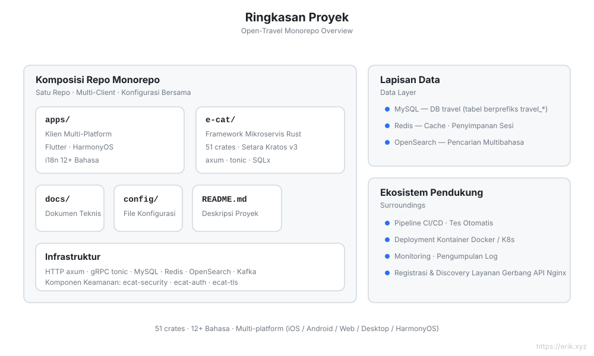
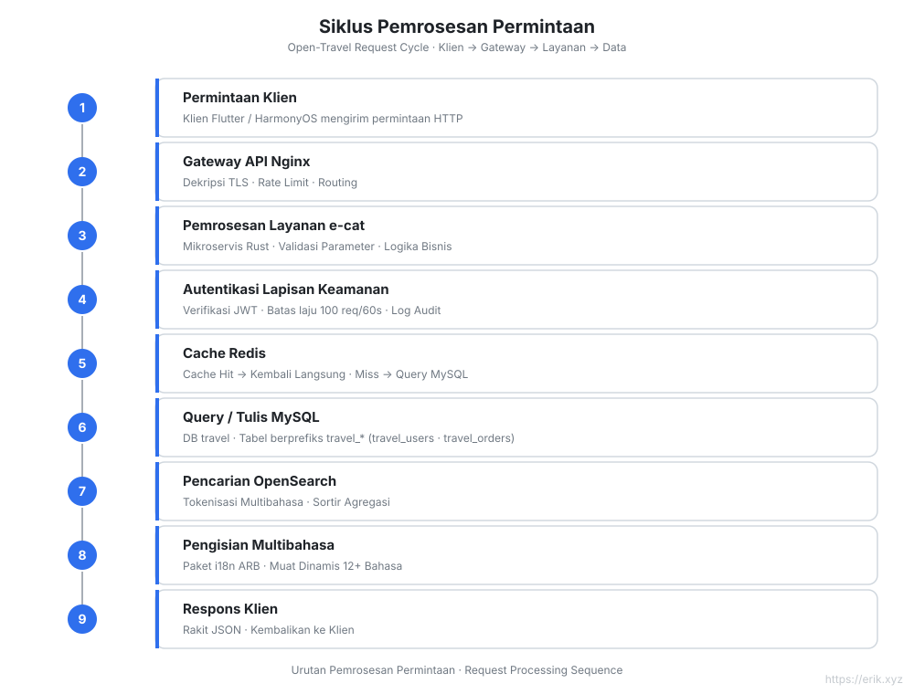
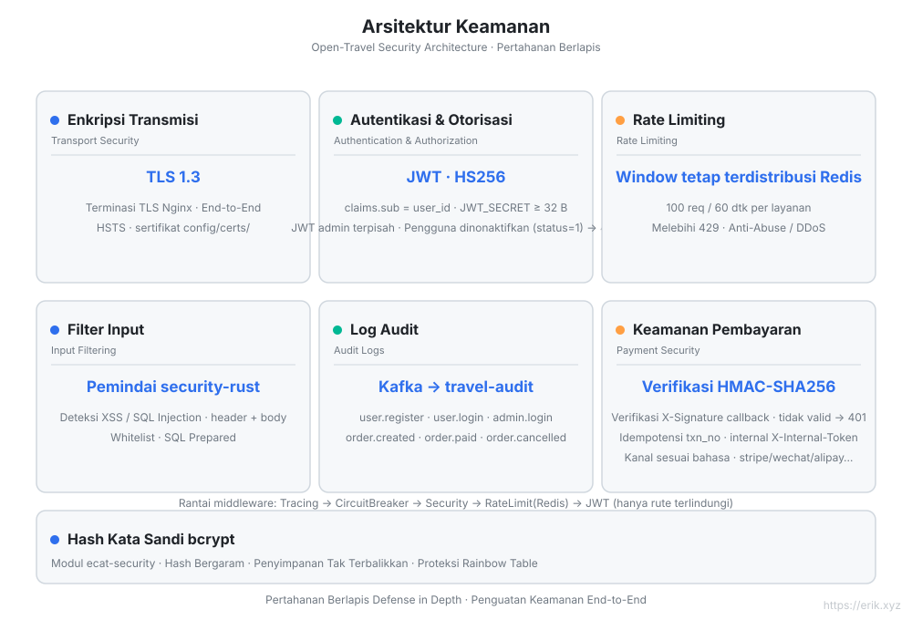
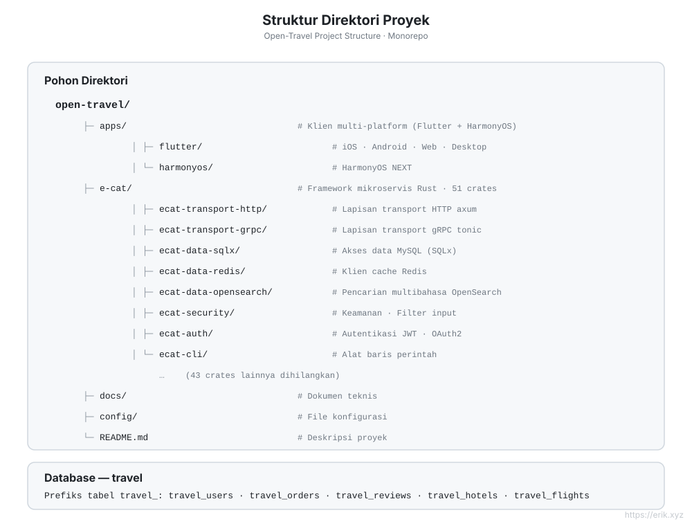

# Open Travel — Platform Wisata Global

<p align="center"></p>


[简体中文](../../README.md) | [English](README.md) | [日本語](ja/README.md) | [한국어](ko/README.md) | [Русский](ru/README.md) | [Deutsch](de/README.md) | [Français](fr/README.md) | [Español](es/README.md) | [Português](pt/README.md) | [हिन्दी](hi/README.md) | [العربية](ar/README.md) | [বাংলা](bn/README.md) | [Bahasa Indonesia](id/README.md)

> Platform pemesanan wisata untuk pengguna global: backend mikroservis Rust + klien multi-platform Flutter / HarmonyOS, mendukung **12+ bahasa**, pembayaran internasional, dan pencarian multibahasa.

## Tentang Proyek

Open Travel adalah monorepo platform wisata global yang menggunakan **e-cat (seekor kucing)** — **framework mikroservis Rust** (v3.0.2 · 51 crates) yang setara dengan [go-kratos/kratos](https://github.com/go-kratos/kratos) v3 — untuk membangun backend berperforma tinggi, dipadukan dengan klien multi-platform Flutter dan klien native HarmonyOS, guna memberikan pengalaman pemesanan wisata yang seragam bagi pengguna global.

| Aspek | Deskripsi |
| :--- | :--- |
| **Backend** | e-cat (Rust): HTTP/axum + gRPC/tonic, ekosistem mikroservis 51 crates |
| **Klien multi-platform** | `apps/client/flutter` (iOS / Android / Web / Desktop), `apps/client/harmonyos` (HarmonyOS) |
| **Database** | MySQL (database `travel`, prefiks tabel `travel_`) + Redis cache + OpenSearch pencarian multibahasa |
| **Keamanan** | ecat-security / ecat-auth (JWT) / ecat-tls: autentikasi, audit, rate limiting, proteksi injeksi |
| **Internasionalisasi** | Paket bahasa ARB 12+ bahasa, dukungan RTL, tokenisasi multibahasa OpenSearch |
| **Pembayaran** | WeChat Pay, Alipay |

## Fitur Utama

- 🏨 Pencarian dan pemesanan multibahasa untuk destinasi / hotel / tiket pesawat
- 🌍 Adaptasi independen 12+ bahasa (Mandarin, Inggris, Jepang, Korea, Arab, Spanyol, Prancis, Jerman...)
- 💳 Pembayaran internasional (WeChat Pay / Alipay)
- 🔐 Pertahanan berlapis: TLS 1.3, autentikasi JWT, log audit, penyaringan input, rate limiting
- 📱 Pengalaman konsisten lintas platform: Flutter (iOS/Android/Web/Desktop) + HarmonyOS

## Diagram Arsitektur



## Diagram Fitur



## Diagram Proyek



## Diagram Siklus Permintaan



## Diagram Arsitektur Keamanan



## Diagram Struktur Proyek



## Struktur Proyek

```
open-travel/
├── apps/                  # Direktori klien multi-platform
│   ├── flutter/           # Flutter: iOS / Android / Web / Desktop (i18n 12+ bahasa)
│   └── harmonyos/         # Klien native HarmonyOS
├── e-cat/                 # Framework mikroservis Rust e-cat (51 crates)
├── docs/                  # Perencanaan proyek, diagram (SVG), QR code pembayaran
├── config/                # Konfigurasi lingkungan dan deployment
└── README.md
```

## Database

- Nama database: `travel`
- Prefiks tabel: `travel_` (misalnya `travel_users`, `travel_orders`, `travel_reviews`)
- Penyimpanan pendukung: Redis (sesi / cache populer), OpenSearch (indeks pencarian multibahasa)

> Lihat perencanaan teknis terperinci di [docs/travel-project-planning.md](../../travel-project-planning.md).

## Mulai Cepat

```bash
cd e-cat
cargo check -p user-service -p booking-service -p admin-service   # pemeriksaan kompilasi layanan bisnis
```

| Layanan | Port | Deskripsi |
|---|---|---|
| user-service | 8001 | Pendaftaran / login / profil pengguna |
| booking-service | 8002 | Tanggal destinasi populer + daftar / detail atraksi |
| admin-service | 8003 | Admin: login + CRUD destinasi / atraksi |
| Gateway Nginx | 8082→80 | Routing prefiks `/api/user/`, `/api/booking/`, `/api/admin/` |
| MySQL | 3308→3306 | Sumber data |
| Redis | 6381→6379 | Cache / pembatasan kecepatan |
| OpenSearch | 9201→9200 | Pencarian multibahasa |

Konsol admin Flutter Web ada di `apps/admin/`; akun admin default pengembangan adalah `admin@travel.local` / `Admin@123` (hanya untuk penggunaan lokal).

---

## Dukung Kami

Jika proyek ini bermanfaat bagi Anda, silakan traktir penulis secangkir kopi ☕

<p align="center">
  <strong>WeChat Pay</strong> &nbsp;&nbsp;&nbsp;&nbsp;&nbsp;&nbsp;&nbsp;&nbsp;&nbsp;&nbsp;&nbsp;&nbsp;&nbsp;&nbsp;&nbsp;&nbsp;&nbsp;&nbsp; <strong>Alipay</strong><br/>
  
  &nbsp;&nbsp;&nbsp;&nbsp;&nbsp;&nbsp;&nbsp;&nbsp;
  
</p>

### Donasi Transfer Bank Global (Global Bank Transfer)

**Informasi Penerima**

- Nama penerima: WANG KEXUN
- Nomor rekening penerima: 881015918251

**Bank Penerima**

- Kode SWIFT ZA Bank: AABLHKHHXXX
- Nama bank: ZA Bank Limited
- Kode bank: 387
- Alamat bank: Core F, Cyberport 3, 100 Cyberport Road, Hong Kong

**Bank Koresponden Transfer Lintas Batas (jika diperlukan)**

Perlu diperhatikan, ini adalah informasi bank koresponden (bank perantara) untuk transfer lintas batas, bukan informasi bank penerima. Silakan tanyakan kepada bank pengirim apakah perlu menyediakan informasi bank koresponden lintas batas.

Bank koresponden untuk transfer dalam HKD, RMB, dan USD adalah **Citibank** —

- Nama bank: Citibank N.A. Hong Kong
- Kode SWIFT: CITIHKHXXXX
- Kode bank: 006
- Nama cabang: Hong Kong Branch
- Kode cabang: 391
- Alamat bank: Citibank Tower, Citibank Plaza, 3 Garden Road, Central, Hong Kong

Bank koresponden untuk transfer mata uang lainnya adalah **BNY Mellon** —

- Nama bank: THE BANK OF NEW YORK MELLON
- Kode SWIFT: IRVTUS3NXXX
- Alamat bank: THE BANK OF NEW YORK MELLON, 240 GREENWICH STREET, NEW YORK, United States

### Donasi Kripto (Crypto Donation)

Jika proyek ini membantu Anda, silakan pindai kode QR untuk berdonasi, terima kasih!

| <br>**BNB Smart Chain (BEP20)**<br>`0x355d429f97511897ccb4e271ec888205f9ab6629` | <br>**Tron (TRC20)**<br>`TEdDHWLajt1XvqtPDWmQctdrJaC3pzZZzz` |
| <br>**Ethereum (ERC20)**<br>`0x355d429f97511897ccb4e271ec888205f9ab6629` | <br>**Aptos**<br>`0x836e3780edfc3f7b2372b39e2a1a3a5d7adfaccd96c726f21cfde1b50dd68030` |
| <br>**Plasma**<br>`0x355d429f97511897ccb4e271ec888205f9ab6629` | <br>**Polygon POS**<br>`0x355d429f97511897ccb4e271ec888205f9ab6629` |
| <br>**Solana**<br>`2hfhboHdmdrYsY25XfQSsEWxq5ip4EQsR7f4AzSRMUyr` | <br>**The Open Network (TON)**<br>`UQB9kFQohzmXUir9QSSZq01iwl9aQZIDdBpNmDklljRtCoGK` |
| <br>**Arbitrum One**<br>`0x355d429f97511897ccb4e271ec888205f9ab6629` | <br>**AVAX C-Chain**<br>`0x355d429f97511897ccb4e271ec888205f9ab6629` |

