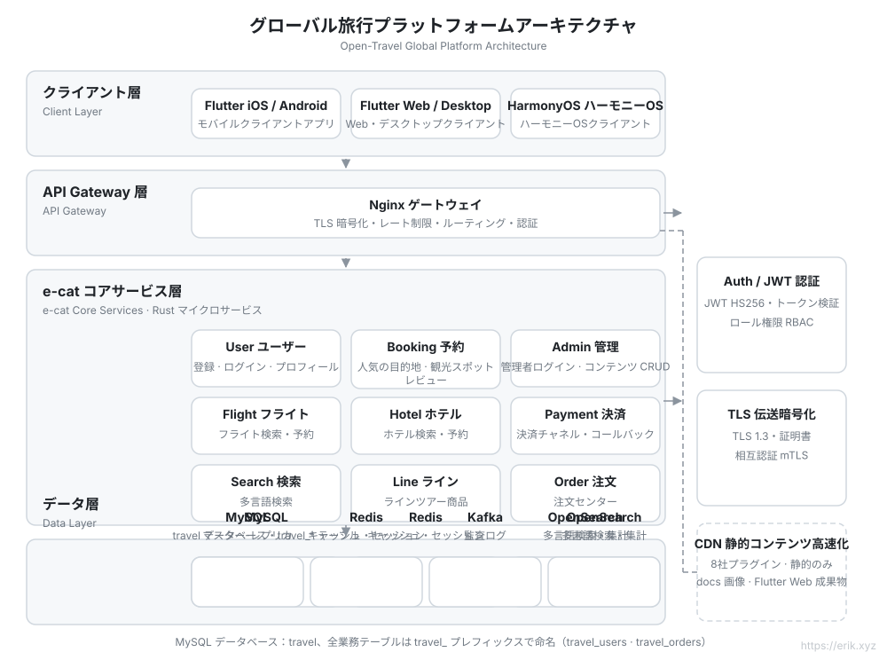
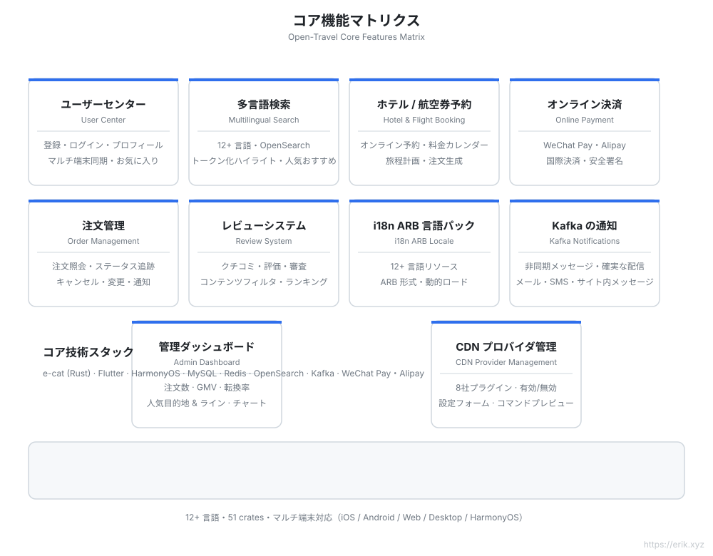
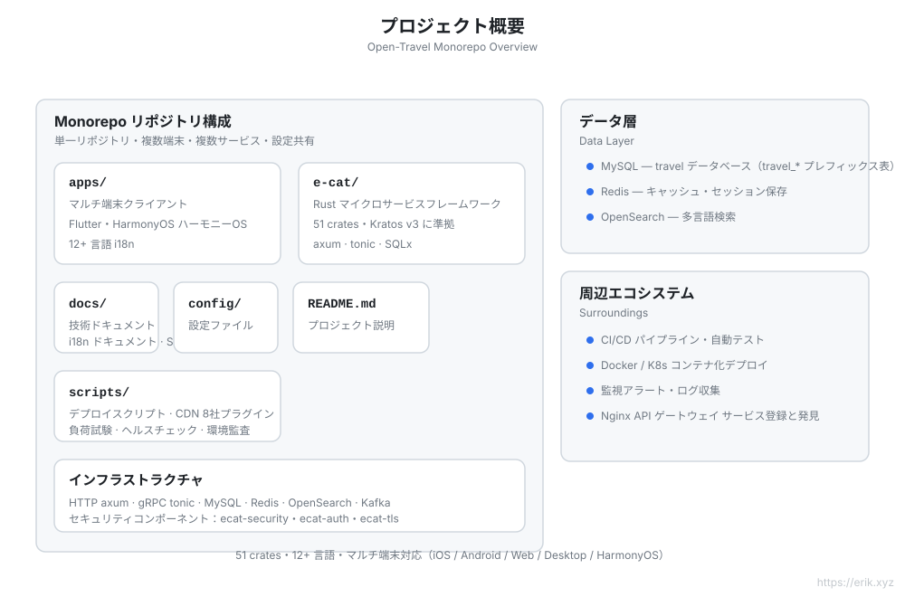
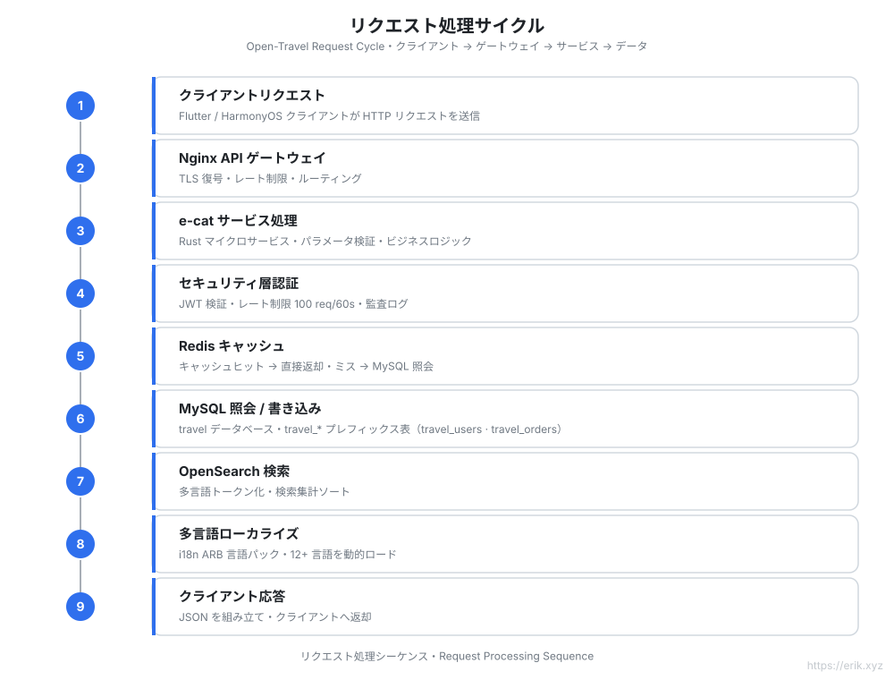
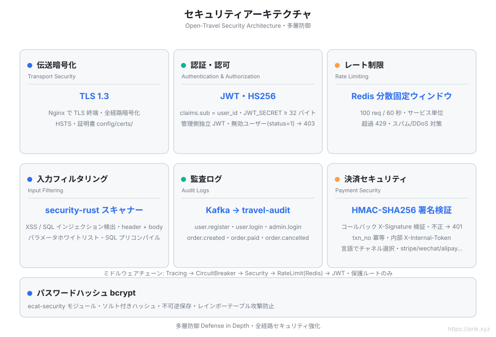
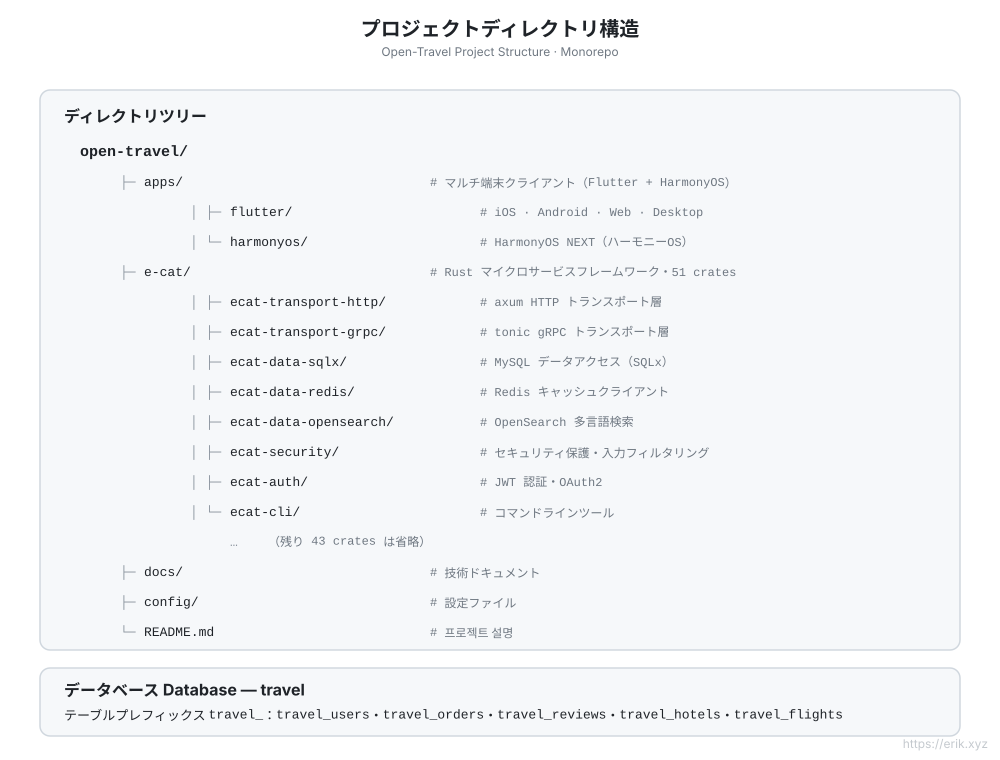

[简体中文](../../README.md) | [English](../en/README.md) | [日本語](README.md) | [한국어](../ko/README.md) | [Русский](../ru/README.md) | [Deutsch](../de/README.md) | [Français](../fr/README.md) | [Español](../es/README.md) | [Português](../pt/README.md) | [हिन्दी](../hi/README.md) | [العربية](../ar/README.md) | [বাংলা](../bn/README.md) | [Bahasa Indonesia](../id/README.md)

# Open Travel — グローバル旅行プラットフォーム

> 世界中のユーザーのための旅行予約プラットフォーム：Rust マイクロサービスバックエンド + Flutter / HarmonyOS マルチプラットフォームクライアント、**12+ 言語**対応、国際決済、多言語検索をサポート。

## プロジェクト概要

Open Travel は、[go-kratos/kratos](https://github.com/go-kratos/kratos) v3 に範をとった **Rust マイクロサービスフレームワーク**（v3.0.2 · 51 crates）である **e-cat（一匹の猫）** を採用した、グローバル旅行プラットフォームの monorepo です。高性能なバックエンドと Flutter マルチプラットフォーム・鸿蒙（HarmonyOS）ネイティブクライアントを組み合わせ、世界中のユーザーに統一された旅行予約体験を提供します。

| 項目 | 説明 |
| :--- | :--- |
| **バックエンドフレームワーク** | e-cat（Rust）：HTTP/axum + gRPC/tonic、51 crates のマイクロサービスエコシステム |
| **マルチプラットフォームクライアント** | `apps/client/flutter`（iOS / Android / Web / Desktop）、`apps/client/harmonyos`（HarmonyOS） |
| **データベース** | MySQL（DB 名 `travel`、テーブルプレフィックス `travel_`）+ Redis キャッシュ + OpenSearch 多言語検索 |
| **セキュリティ** | ecat-security / ecat-auth（JWT）/ ecat-tls：認証、監査、レート制限、インジェクション対策 |
| **国際化** | 12+ 言語の ARB ロケールパック、RTL サポート、OpenSearch 多言語トークン化 |
| **決済** | WeChat Pay、Alipay |

## 主な特徴

- 🏨 目的地 / ホテル / 航空券の多言語検索と予約
- 🌍 12+ 言語に個別対応（中国語、英語、日本語、韓国語、アラビア語、スペイン語、フランス語、ドイツ語…）
- 💳 国際決済（WeChat Pay / Alipay）
- 🔐 多層防御：TLS 1.3、JWT 認証、監査ログ、入力フィルタリング、レート制限
- 📱 マルチプラットフォームで一貫した体験：Flutter（iOS/Android/Web/Desktop）+ HarmonyOS

## アーキテクチャ図



## 機能図



## プロジェクト図



## リクエストサイクル図



## セキュリティアーキテクチャ図



## プロジェクト構造図



## プロジェクト構造

```
open-travel/
├── apps/                  # マルチプラットフォームクライアントディレクトリ
│   ├── flutter/           # Flutter：iOS / Android / Web / Desktop（12+ 言語 i18n）
│   └── harmonyos/         # HarmonyOS ネイティブクライアント
├── e-cat/                 # e-cat Rust マイクロサービスフレームワーク（51 crates）
├── docs/                  # プロジェクト計画、アーキテクチャ図（SVG）、決済用 QR コード
├── config/                # 環境設定とデプロイ設定
└── README.md
```

## データベース

- データベース名：`travel`
- テーブルプレフィックス：`travel_`（例：`travel_users`、`travel_orders`、`travel_reviews`）
- 併用ストレージ：Redis（セッション / 人気キャッシュ）、OpenSearch（多言語検索インデックス）

> 詳細な技術計画は [docs/travel-project-planning.md](../../travel-project-planning.md) を参照してください。

## クイックスタート

```bash
cd e-cat
cargo check -p user-service -p booking-service -p admin-service   # 業務サービスのコンパイルチェック
```

| サービス | ポート | 説明 |
|---|---|---|
| user-service | 8001 | ユーザー登録 / ログイン / プロフィール |
| booking-service | 8002 | 人気目的地の日付 + 観光スポット一覧 / 詳細 |
| admin-service | 8003 | 管理：ログイン + 目的地 / 観光スポット CRUD |
| Nginx ゲートウェイ | 8082→80 | `/api/user/`、`/api/booking/`、`/api/admin/` プレフィックスで振り分け |
| MySQL | 3308→3306 | データソース |
| Redis | 6381→6379 | キャッシュ / レート制限 |
| OpenSearch | 9201→9200 | 多言語検索 |

管理端 Flutter Web は `apps/admin/`、開発環境のデフォルト管理者アカウントは `admin@travel.local` / `Admin@123`（ローカルのみ）。

---

## サポート

このプロジェクトがお役に立ったなら、ぜひ作者にコーヒーを一杯ごちそうしてください ☕

<p align="center">
  <strong>微信支付（WeChat Pay）</strong> &nbsp;&nbsp;&nbsp;&nbsp;&nbsp;&nbsp;&nbsp;&nbsp;&nbsp;&nbsp;&nbsp;&nbsp;&nbsp;&nbsp;&nbsp;&nbsp;&nbsp;&nbsp; <strong>支付宝（Alipay）</strong><br/>
  
  &nbsp;&nbsp;&nbsp;&nbsp;&nbsp;&nbsp;&nbsp;&nbsp;
  
</p>

### グローバル銀行振込（Global Bank Transfer）

**受取人情報**

- 受取人名：WANG KEXUN
- 受取口座番号：881015918251

**受取銀行**

- ZA Bank SWIFT コード：AABLHKHHXXX
- 銀行名：ZA Bank Limited
- 銀行コード：387
- 銀行住所：Core F, Cyberport 3, 100 Cyberport Road, Hong Kong

**クロスボーダー送金の代理銀行（必要な場合）**

これはクロスボーダー送金の代理銀行（中間銀行）情報であり、受取銀行の情報ではありません。送金銀行に代理銀行情報の提供が必要かどうかをご確認ください。

香港ドル・人民元・米ドルの入金時の代理銀行は **Citibank** です —

- 銀行名：Citibank N.A. Hong Kong
- SWIFT コード：CITIHKHXXXX
- 銀行コード：006
- 支店名：Hong Kong Branch
- 支店コード：391
- 銀行住所：Citibank Tower, Citibank Plaza, 3 Garden Road, Central, Hong Kong

その他の通貨の入金時の代理銀行は **BNY Mellon** です —

- 銀行名：THE BANK OF NEW YORK MELLON
- SWIFT コード：IRVTUS3NXXX
- 銀行住所：THE BANK OF NEW YORK MELLON, 240 GREENWICH STREET, NEW YORK, United States

### 仮想通貨の寄付 (Crypto Donation)

このプロジェクトがお役に立ったら、QRコードをスキャンして寄付してください。ありがとうございます！

| <br>**BNB Smart Chain (BEP20)**<br>`0x355d429f97511897ccb4e271ec888205f9ab6629` | <br>**Tron (TRC20)**<br>`TEdDHWLajt1XvqtPDWmQctdrJaC3pzZZzz` |
| <br>**Ethereum (ERC20)**<br>`0x355d429f97511897ccb4e271ec888205f9ab6629` | <br>**Aptos**<br>`0x836e3780edfc3f7b2372b39e2a1a3a5d7adfaccd96c726f21cfde1b50dd68030` |
| <br>**Plasma**<br>`0x355d429f97511897ccb4e271ec888205f9ab6629` | <br>**Polygon POS**<br>`0x355d429f97511897ccb4e271ec888205f9ab6629` |
| <br>**Solana**<br>`2hfhboHdmdrYsY25XfQSsEWxq5ip4EQsR7f4AzSRMUyr` | <br>**The Open Network (TON)**<br>`UQB9kFQohzmXUir9QSSZq01iwl9aQZIDdBpNmDklljRtCoGK` |
| <br>**Arbitrum One**<br>`0x355d429f97511897ccb4e271ec888205f9ab6629` | <br>**AVAX C-Chain**<br>`0x355d429f97511897ccb4e271ec888205f9ab6629` |

