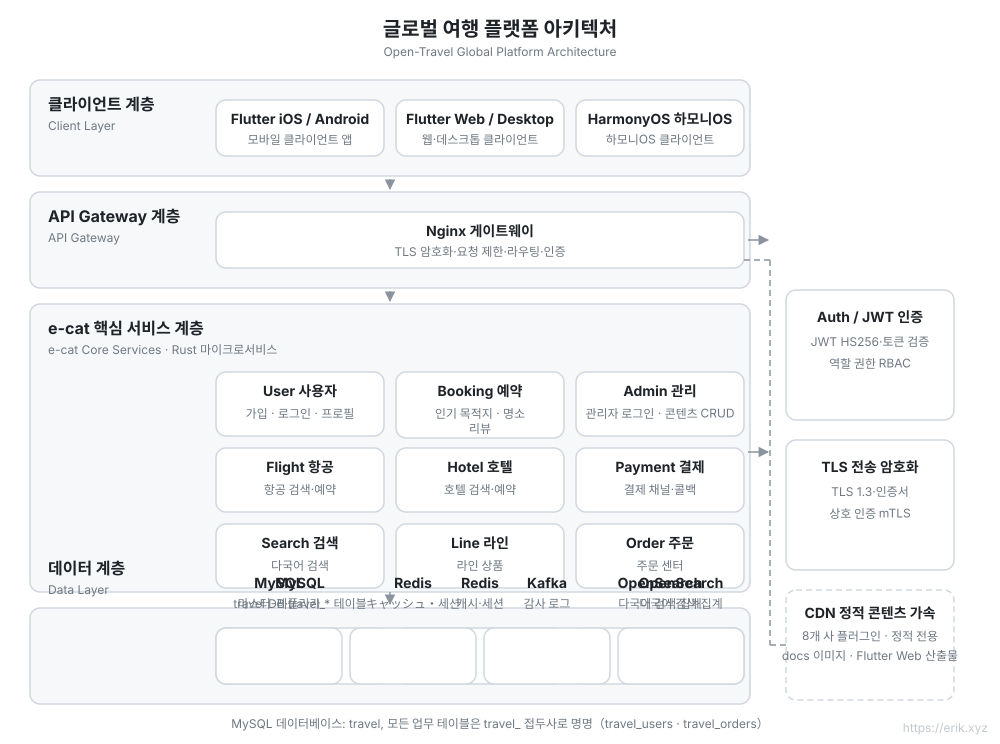
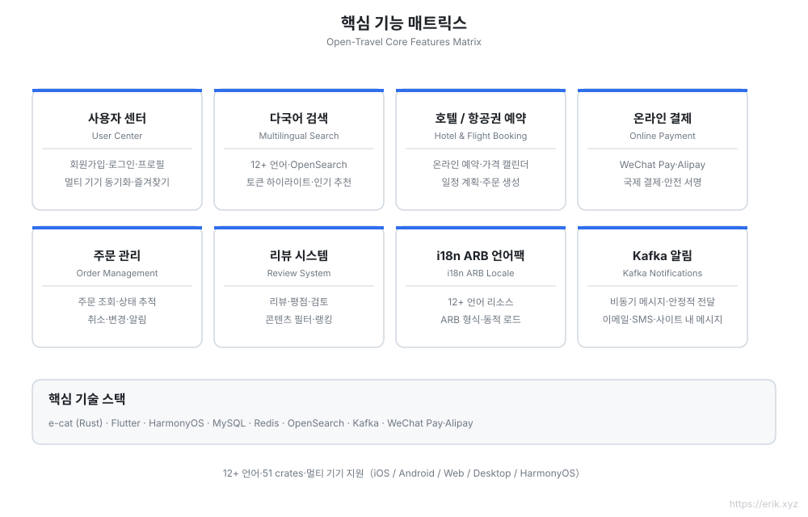
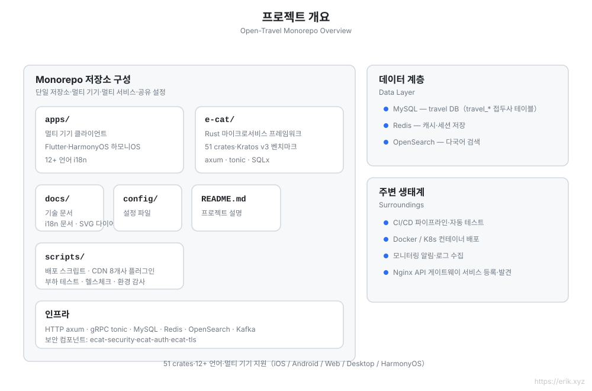
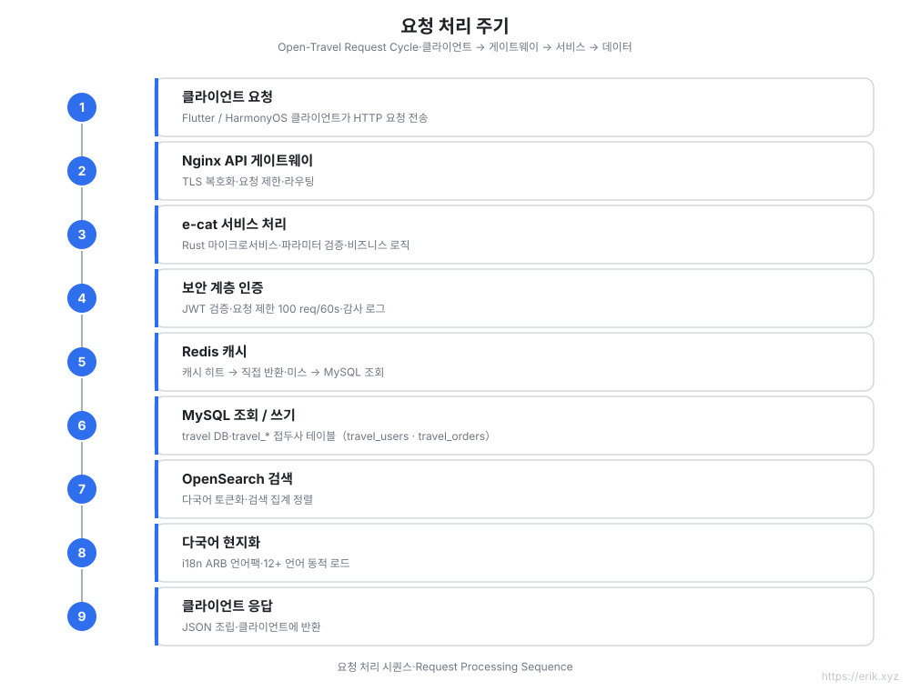
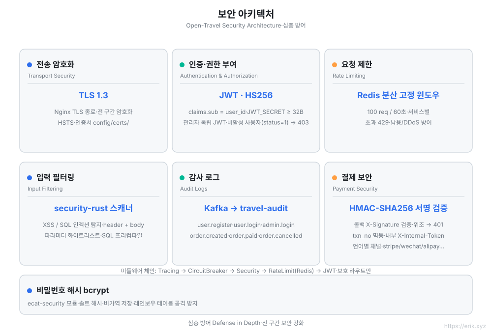

[简体中文](../../README.md) | [English](../en/README.md) | [日本語](../ja/README.md) | [한국어](README.md) | [Русский](../ru/README.md) | [Deutsch](../de/README.md) | [Français](../fr/README.md) | [Español](../es/README.md) | [Português](../pt/README.md) | [हिन्दी](../hi/README.md) | [العربية](../ar/README.md) | [বাংলা](../bn/README.md) | [Bahasa Indonesia](../id/README.md)

# Open Travel — 글로벌 여행 플랫폼

<p align="center"></p>


> 전 세계 사용자를 위한 여행 예약 플랫폼: Rust 마이크로서비스 백엔드 + Flutter / HarmonyOS 멀티 플랫폼 클라이언트, **12+ 언어** 지원, 국제 결제 및 다국어 검색.

## 프로젝트 소개

Open Travel은 [go-kratos/kratos](https://github.com/go-kratos/kratos) v3를 벤치마킹한 **Rust 마이크로서비스 프레임워크**(v3.0.3 · 52 crates)인 **e-cat(고양이 한 마리)** 을 사용해 고성능 백엔드를 구축하고, Flutter 멀티 플랫폼 및 HarmonyOS 네이티브 클라이언트를 결합하여 전 세계 사용자에게 통일된 여행 예약 경험을 제공하는 글로벌 여행 플랫폼 monorepo입니다.

| 항목 | 설명 |
| :--- | :--- |
| **백엔드 프레임워크** | e-cat(Rust): HTTP/axum + gRPC/tonic, 52 crates 마이크로서비스 생태계 |
| **멀티 플랫폼 클라이언트** | `apps/client/flutter`(iOS / Android / Web / Desktop), `apps/client/harmonyos`(HarmonyOS), `apps/admin` (Flutter Web 관리 콘솔) |
| **데이터베이스** | MySQL(DB명 `travel`, 테이블 접두사 `travel_`) + Redis 캐시 + OpenSearch 다국어 검색 |
| **보안** | ecat-security / ecat-auth(JWT) / ecat-tls: 인증, 감사, 속도 제한, 주입 방지 |
| **국제화** | 12+ 언어 ARB 로케일 팩, RTL 지원, OpenSearch 다국어 토큰화 |
| **결제** | WeChat Pay, Alipay |

## 프로젝트 마스코트 「小途」

탐험 모자를 쓰고 스티커가 붙은 여행 가방을 끌며 종이비행기를 쫓는 호박색 여행 고양이로, **e-cat(고양이 한 마리)** 프레임워크가 “낳은” 캐릭터입니다. 고양이 얼굴은 [Twemoji](https://github.com/jdecked/twemoji) 1f431(CC-BY 4.0)을 수정한 것이며, 탐험 모자 / 여행 가방 / 종이비행기는 창작물입니다. 벡터 원본과 전체 설정은 [`docs/mascot.svg`](docs/mascot.svg)를 참고하세요.

| 적용 위치 | 형태 |
| :--- | :--- |
| `docs/mascot.svg` | **벡터 단일 원본**(전신 512×512) |
| `apps/*/web/favicon.svg` | 브라우저 탭 아이콘(얼굴 클로즈업 버전, 16px에서도 식별 가능, `favicon.png` 16px는 구형 브라우저용 대체) |
| `apps/*/web/icons/Icon-*.png` | PWA / 홈 화면 아이콘 192·512(maskable 안전 영역 버전 포함) |
| `apps/*/assets/mascot.png` | Flutter 앱 내 표시(관리자 로그인 페이지, 클라이언트 프로필 페이지) |
| `apps/client/harmonyos/.../media/mascot.svg` | HarmonyOS 앱 내(`Image`가 SVG를 네이티브 렌더링, 모바일용 단순화 변형) |
| 각 README / crate 문서 | 페이지 상단 브랜드 영역 |

> 디자인을 바꿀 때는 `docs/mascot.svg`만 수정하면 되고 나머지는 모두 파생물입니다. favicon은 얼굴 클로즈업을 잘라낸 것(수염 / 이마 무늬 / 가방 등 작은 크기에서 뭉개지는 획을 제거)이고, HarmonyOS 변형은 `<defs>` / 그라디언트를 제거하고 단색 배경으로 바꿔 모바일 SVG 렌더러에 맞춘습니다.

## 핵심 기능

- 🏨 목적지 / 호텔 / 항공권 다국어 검색 및 예약
- 🌍 12+ 언어 개별 지원(중국어, 영어, 일본어, 한국어, 아랍어, 스페인어, 프랑스어, 독일어…)
- 💳 국제 결제(WeChat Pay / Alipay)
- 🔐 심층 방어: TLS 1.3, JWT 인증, 감사 로그, 입력 필터링, 속도 제한, 결제 콜백 HMAC 검증, 내부 서비스 인증
- 📱 멀티 플랫폼 일관된 경험: Flutter(iOS/Android/Web/Desktop) + HarmonyOS

## 아키텍처 설계 다이어그램



## 기능 설계 다이어그램



## 프로젝트 구조 다이어그램



## 요청 라이프사이클 다이어그램



## 보안 아키텍처 다이어그램



## 프로젝트 구조

```
open-travel/
├── apps/                  # 멀티 플랫폼 클라이언트와 관리자
│   ├── client/
│   │   ├── flutter/       # Flutter: iOS / Android / Web / Desktop(12+ 언어 i18n, web/favicon.svg는 「小途」 아이콘)
│   │   └── harmonyos/     # HarmonyOS 네이티브 클라이언트
│   └── admin/             # Flutter Web 관리자
├── e-cat/                 # e-cat 프레임워크 + 비즈니스 서비스(단일 Cargo workspace)
│   ├── ecat*/             # 52개 ecat-* 프레임워크 crate
│   ├── ecat/              # 메인 프레임워크 crate: 파사드 + 비즈니스 모듈(src/business/) + 서비스 엔트리(src/bin/ 9개 서비스)
│   ├── config/            # 프레임워크 설정 예제
│   ├── examples/          # 프레임워크 예제 프로젝트
│   └── CHANGELOG.md       # 프레임워크 + 프로젝트 버전 변경 로그(버전 번호가 곧 프로젝트 버전, tags 참조)
├── docs/                  # 기술 문서
│   ├── api.md             # API 레퍼런스(엔드포인트, 인증, 속도 제한)
│   ├── mascot.svg         # 마스코트 「小途」(벡터 단일 원본, favicon과 각 플랫폼 아이콘은 여기서 파생)
│   ├── svg/               # 아키텍처 / 기능 / 라이프사이클 / 보안 / 구조 다이어그램(12개 언어 번역본 포함)
│   ├── i18n/              # 12개 언어 README
│   └── coin/              # 후원 QR 코드
├── config/                # 환경 및 배포 구성(nginx.conf, docker-compose.yml, schema.sql)
├── scripts/               # 설치 / 배포 / 점검 / 부하 테스트 / CDN / 시드 데이터
├── .github/workflows/     # CI
└── README.md
```

## 데이터베이스

- 데이터베이스 이름: `travel`
- 테이블 접두사: `travel_`(예: `travel_users`, `travel_orders`, `travel_reviews`)
- 보조 스토리지: Redis(세션 / 인기 캐시), OpenSearch(다국어 검색 인덱스)

> 자세한 기술 계획은 [docs/travel-project-planning.md](../../travel-project-planning.md)를 참조하세요.

## 원클릭 설치

요구 사항: Docker + Docker Compose(v2). (Rust 툴체인은 소스에서 빌드할 때만 필요합니다.)

```bash
git clone <repo-url> && cd open-travel
./scripts/install.sh
```

스크립트는 자동으로: 환경 확인 → 모든 서비스 빌드 및 시작(MySQL / Redis / OpenSearch / Kafka / 9개 마이크로서비스 / Nginx 게이트웨이) → 검색 인덱스 초기화 → 상태 점검을 수행한 후, 접속 URL과 기본 관리자 계정 `admin@travel.local` / `Admin@123`을 출력합니다.

## 빠른 시작

```bash
cd e-cat
cargo check -p ecat --bins   # 비즈니스 서비스 컴파일 확인
```

| 서비스 | 포트 | 설명 |
|---|---|---|
| user-service | 8001 | 사용자 가입 / 로그인 / 프로필 |
| booking-service | 8002 | 인기 목적지 날짜 + 관광지 목록 / 상세 + 리뷰 |
| admin-service | 8003 | 관리자: 로그인 + 목적지 / 관광지 CRUD |
| search-service | 8004 | 다국어 검색 |
| line-service | 8005 | 여행 라인 |
| order-service | 8006 | 주문 |
| flight-service | 8007 | 항공권 |
| hotel-service | 8008 | 호텔 |
| payment-service | 8009 | 결제 |
| Nginx 게이트웨이 | 8082→80 | `/api/user/`, `/api/booking/`, `/api/admin/`, `/api/search`, `/api/lines`, `/api/orders`, `/api/flights`, `/api/hotels`, `/api/payments` 프리픽스 라우팅 |
| MySQL | 3308→3306 | 데이터 소스 |
| Redis | 6381→6379 | 캐시 / 속도 제한 |
| OpenSearch | 9201→9200 | 다국어 검색 |

관리자 Flutter Web은 `apps/admin/`에 있으며, 개발 환경 기본 관리자 계정은 `admin@travel.local` / `Admin@123`(로컬 전용)입니다.

### 스크립트

| 스크립트 | 설명 |
|---|---|
| `scripts/opensearch_init.sh` | OpenSearch 인덱스를 멱등적으로 생성 (cjk 분석기) |
| `scripts/loadtest.sh` | 부하 테스트 |
| `scripts/cdn_setup.sh` / `cdn_upload.sh` | CDN 구성 및 업로드 (`--provider` 8클라우드 플러그인: cloudfront/aliyun/gcp/azure/cloudflare/tencent/huawei/bunny, 기본 `--dry-run`) |
| `scripts/release.sh` | 릴리스 프로세스 보조 |

---

## 후원하기

이 프로젝트가 도움이 되었다면, 작가에게 커피 한 잔을 대접해 주세요 ☕

<p align="center">
  <strong>微信支付(WeChat Pay)</strong> &nbsp;&nbsp;&nbsp;&nbsp;&nbsp;&nbsp;&nbsp;&nbsp;&nbsp;&nbsp;&nbsp;&nbsp;&nbsp;&nbsp;&nbsp;&nbsp;&nbsp;&nbsp; <strong>支付宝(Alipay)</strong><br/>
  
  &nbsp;&nbsp;&nbsp;&nbsp;&nbsp;&nbsp;&nbsp;&nbsp;
  
</p>

### 글로벌 은행 송금(Global Bank Transfer)

**수취인 정보**

- 수취인 이름: WANG KEXUN
- 수취 계좌 번호: 881015918251

**수취 은행**

- ZA Bank SWIFT 코드: AABLHKHHXXX
- 은행 이름: ZA Bank Limited
- 은행 코드: 387
- 은행 주소: Core F, Cyberport 3, 100 Cyberport Road, Hong Kong

**국경 간 송금 중개 은행(필요 시)**

이 정보는 국경 간 송금 중개(중계) 은행 정보이며, 수취 은행 정보가 아닙니다. 송금 은행에 중개 은행 정보 제공이 필요한지 문의하시기 바랍니다.

홍콩 달러, 위안화, 미 달러 입금 시 중개 은행은 **Citibank**입니다 —

- 은행 이름: Citibank N.A. Hong Kong
- SWIFT 코드: CITIHKHXXXX
- 은행 코드: 006
- 지점 이름: Hong Kong Branch
- 지점 코드: 391
- 은행 주소: Citibank Tower, Citibank Plaza, 3 Garden Road, Central, Hong Kong

기타 통화 입금 시 중개 은행은 **BNY Mellon**입니다 —

- 은행 이름: THE BANK OF NEW YORK MELLON
- SWIFT 코드: IRVTUS3NXXX
- 은행 주소: THE BANK OF NEW YORK MELLON, 240 GREENWICH STREET, NEW YORK, United States

### 암호화폐 후원 (Crypto Donation)

이 프로젝트가 도움이 되셨다면, QR 코드를 스캔하여 후원해 주세요. 감사합니다!

| <br>**BNB Smart Chain (BEP20)**<br>`0x355d429f97511897ccb4e271ec888205f9ab6629` | <br>**Tron (TRC20)**<br>`TEdDHWLajt1XvqtPDWmQctdrJaC3pzZZzz` |
| <br>**Ethereum (ERC20)**<br>`0x355d429f97511897ccb4e271ec888205f9ab6629` | <br>**Aptos**<br>`0x836e3780edfc3f7b2372b39e2a1a3a5d7adfaccd96c726f21cfde1b50dd68030` |
| <br>**Plasma**<br>`0x355d429f97511897ccb4e271ec888205f9ab6629` | <br>**Polygon POS**<br>`0x355d429f97511897ccb4e271ec888205f9ab6629` |
| <br>**Solana**<br>`2hfhboHdmdrYsY25XfQSsEWxq5ip4EQsR7f4AzSRMUyr` | <br>**The Open Network (TON)**<br>`UQB9kFQohzmXUir9QSSZq01iwl9aQZIDdBpNmDklljRtCoGK` |
| <br>**Arbitrum One**<br>`0x355d429f97511897ccb4e271ec888205f9ab6629` | <br>**AVAX C-Chain**<br>`0x355d429f97511897ccb4e271ec888205f9ab6629` |

