[简体中文](../../README.md) | [English](README.md) | [日本語](ja/README.md) | [한국어](ko/README.md) | [Русский](ru/README.md) | [Deutsch](de/README.md) | [Français](fr/README.md) | [Español](es/README.md) | [Português](pt/README.md) | [हिन्दी](hi/README.md) | [العربية](ar/README.md) | [বাংলা](bn/README.md) | [Bahasa Indonesia](id/README.md)

---

# Open Travel — Plataforma Global de Viagens

> Uma plataforma de reservas de viagens voltada a usuários globais: backend de microsserviços em Rust + clientes multiplataforma em Flutter / HarmonyOS, com suporte a **mais de 12 idiomas**, pagamentos internacionais e busca multilíngue.

## Introdução do projeto

Open Travel é um monorepo de plataforma global de viagens que usa **e-cat (um gato)** — um **framework Rust de microsserviços** (v3.0.2 · 51 crates) inspirado no [go-kratos/kratos](https://github.com/go-kratos/kratos) v3 — para construir um backend de alto desempenho, junto com clientes multiplataforma em Flutter e clientes nativos HarmonyOS, proporcionando uma experiência unificada de reservas de viagens para usuários globais.

| Dimensão | Descrição |
| :--- | :--- |
| **Framework de backend** | e-cat (Rust): HTTP/axum + gRPC/tonic, ecossistema de microsserviços com 51 crates |
| **Clientes multiplataforma** | `apps/flutter` (iOS / Android / Web / Desktop), `apps/harmonyos` (HarmonyOS) |
| **Banco de dados** | MySQL (banco `travel`, prefixo de tabelas `travel_`) + cache Redis + busca multilíngue OpenSearch |
| **Segurança** | ecat-security / ecat-auth (JWT) / ecat-tls: autenticação, auditoria, limitação de taxa, prevenção de injeção |
| **Internacionalização** | Pacotes de idiomas ARB em 12+ idiomas, suporte a RTL, segmentação multilíngue do OpenSearch |
| **Pagamentos** | WeChat Pay, Alipay |

## Características principais

- 🏨 Busca e reserva multilíngue de destinos / hotéis / voos
- 🌍 Adaptação independente a mais de 12 idiomas (chinês, inglês, japonês, coreano, árabe, espanhol, francês, alemão…)
- 💳 Pagamentos internacionais (WeChat Pay / Alipay)
- 🔐 Segurança em profundidade: TLS 1.3, autenticação JWT, registros de auditoria, filtragem de entradas, limitação de taxa
- 📱 Experiência consistente em múltiplas plataformas: Flutter (iOS/Android/Web/Desktop) + HarmonyOS

## Diagrama de arquitetura

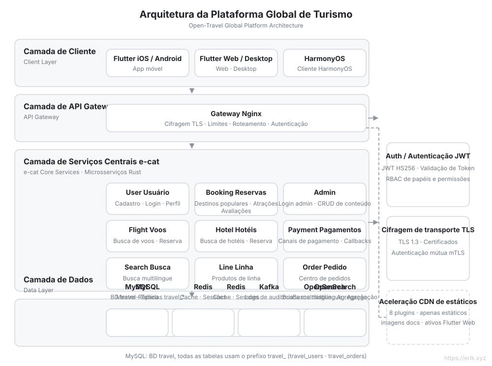

## Diagrama de funcionalidades

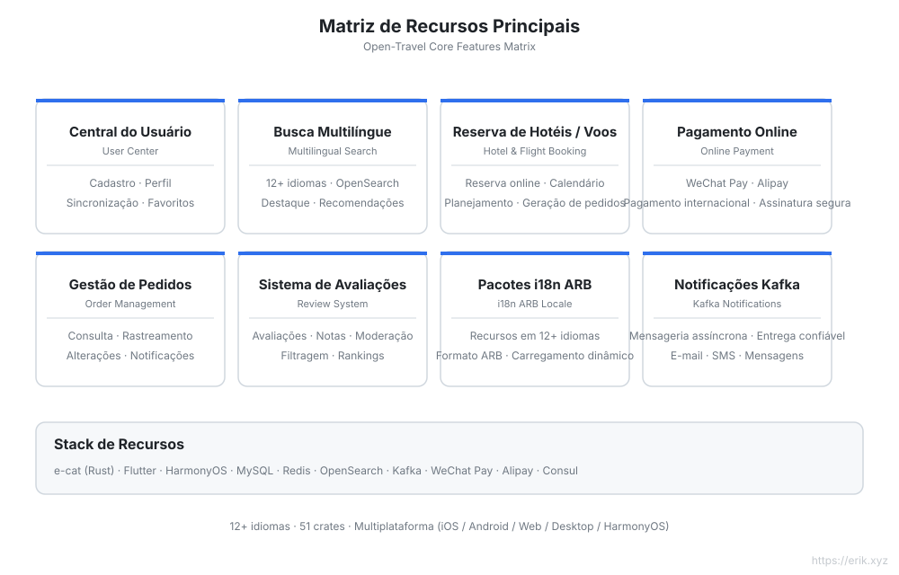

## Diagrama do projeto

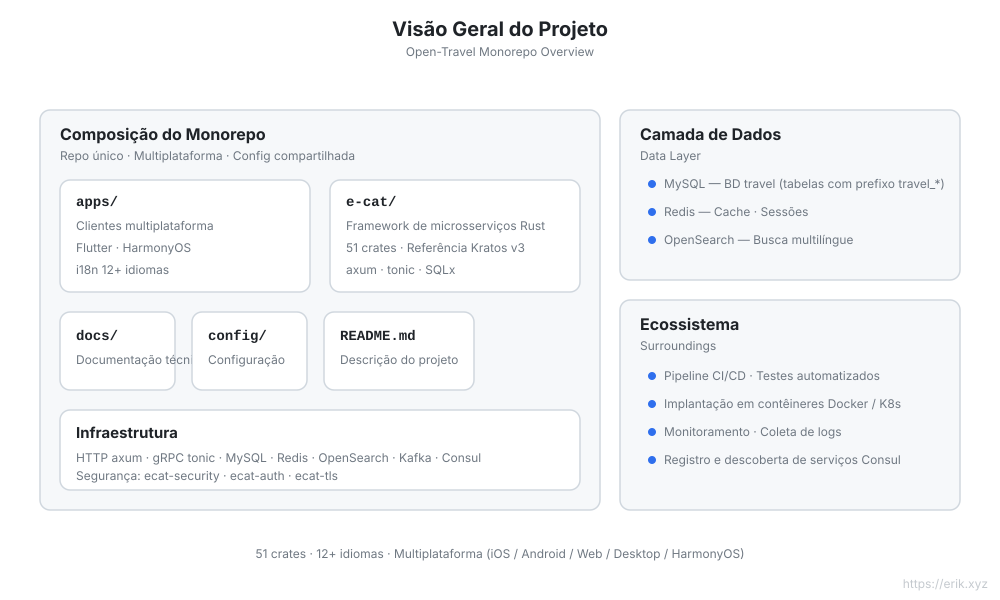

## Diagrama do ciclo de requisições

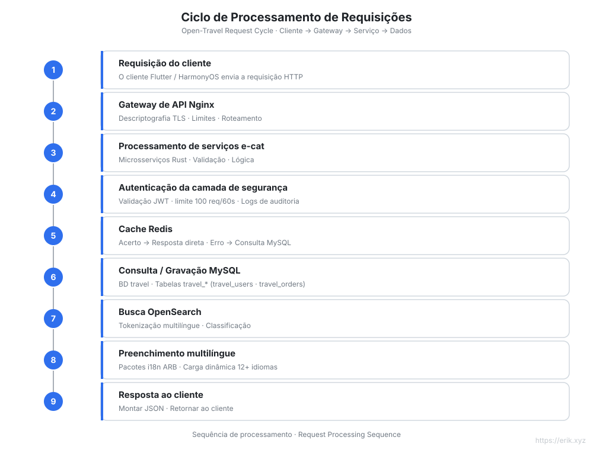

## Diagrama de arquitetura de segurança

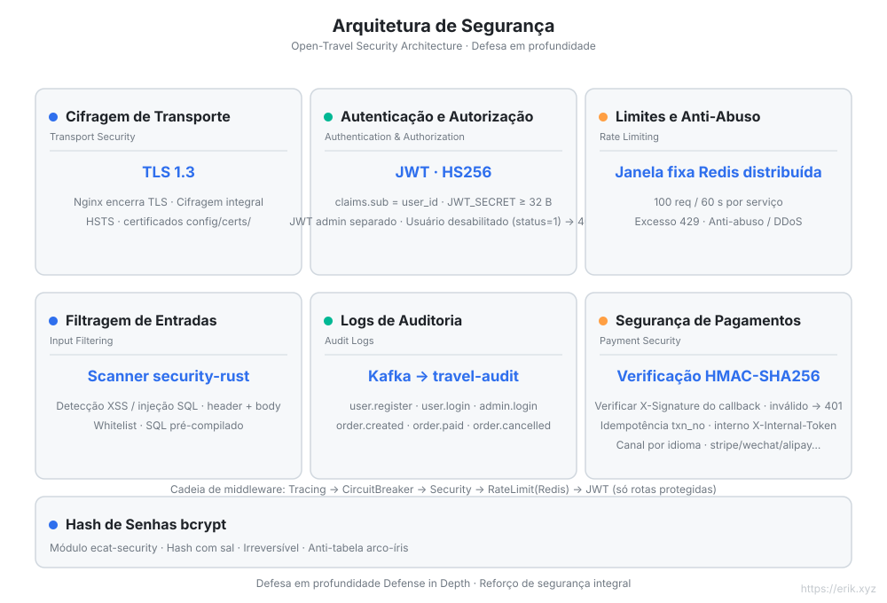

## Diagrama da estrutura do projeto

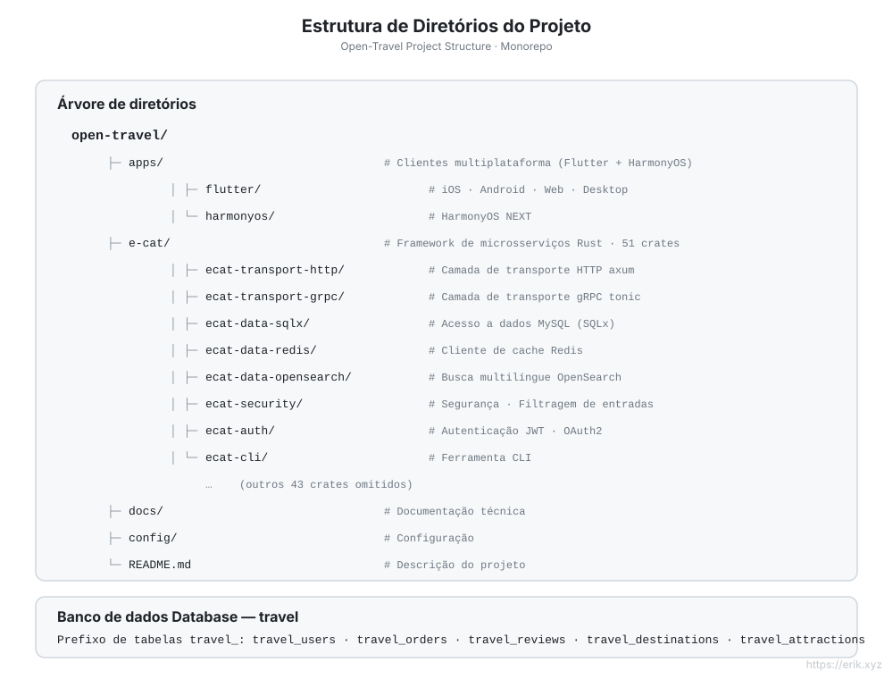

## Estrutura do projeto

```
open-travel/
├── apps/                  # Diretório de aplicativos cliente
│   ├── flutter/           # Flutter: iOS / Android / Web / Desktop (i18n em 12+ idiomas)
│   └── harmonyos/         # Cliente nativo HarmonyOS
├── e-cat/                 # Framework Rust de microsserviços e-cat (51 crates)
├── docs/                  # Planejamento do projeto, diagramas (SVG), códigos QR de pagamento
├── config/                # Configuração de ambiente e implantação
└── README.md
```

## Banco de dados

- Nome do banco de dados: `travel`
- Prefixo de tabelas: `travel_` (por exemplo, `travel_users`, `travel_orders`, `travel_reviews`)
- Armazenamento auxiliar: Redis (sessões / cache de populares), OpenSearch (índice de busca multilíngue)

> Para o planejamento técnico detalhado, consulte [docs/travel-project-planning.md](../../travel-project-planning.md).

---

## Apoie-nos

Se este projeto foi útil para você, convide o autor para um café ☕

<p align="center">
  <strong>微信支付（WeChat Pay）</strong> &nbsp;&nbsp;&nbsp;&nbsp;&nbsp;&nbsp;&nbsp;&nbsp;&nbsp;&nbsp;&nbsp;&nbsp;&nbsp;&nbsp;&nbsp;&nbsp;&nbsp;&nbsp; <strong>支付宝（Alipay）</strong><br/>
  
  &nbsp;&nbsp;&nbsp;&nbsp;&nbsp;&nbsp;&nbsp;&nbsp;
  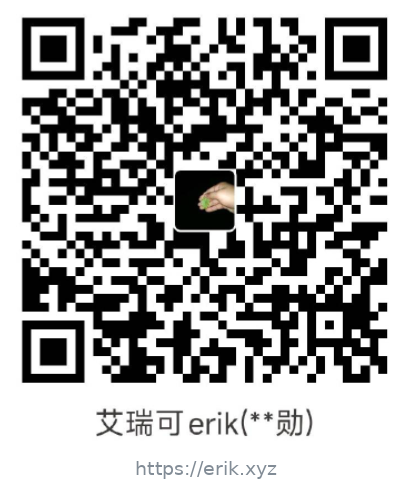
</p>

### Doação por transferência bancária internacional (Global Bank Transfer)

**Informações do beneficiário**

- Nome do beneficiário: WANG KEXUN
- Número da conta do beneficiário: 881015918251

**Banco beneficiário**

- SWIFT Code do ZA Bank: AABLHKHHXXX
- Nome do banco: ZA Bank Limited
- Código bancário: 387
- Endereço do banco: Core F, Cyberport 3, 100 Cyberport Road, Hong Kong

**Banco intermediário para transferências internacionais (se necessário)**

Observe que esta é a informação do banco intermediário (banco correspondente) para transferências internacionais, não a do banco beneficiário. Consulte seu banco para saber se é necessário fornecer a informação do banco intermediário.

O banco intermediário para depósitos em dólares de Hong Kong, renminbi e dólares americanos é o **Citibank** —

- Nome do banco: Citibank N.A. Hong Kong
- SWIFT Code: CITIHKHXXXX
- Código bancário: 006
- Nome da agência: Hong Kong Branch
- Código da agência: 391
- Endereço do banco: Citibank Tower, Citibank Plaza, 3 Garden Road, Central, Hong Kong

Para depósitos em outras moedas, o banco intermediário é o **BNY Mellon** —

- Nome do banco: THE BANK OF NEW YORK MELLON
- SWIFT Code: IRVTUS3NXXX
- Endereço do banco: THE BANK OF NEW YORK MELLON, 240 GREENWICH STREET, NEW YORK, United States

### Doação em criptomoedas (Crypto Donation)

Se este projeto ajudar você, escaneie o código QR para doar, obrigado!

| 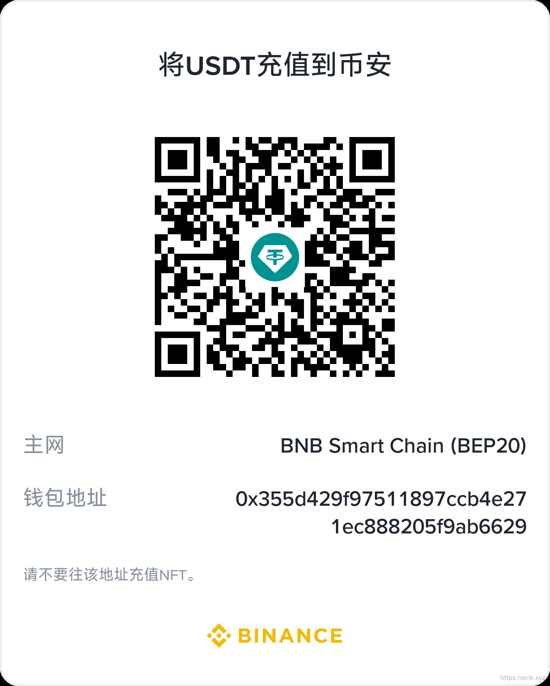<br>**BNB Smart Chain (BEP20)**<br>`0x355d429f97511897ccb4e271ec888205f9ab6629` | 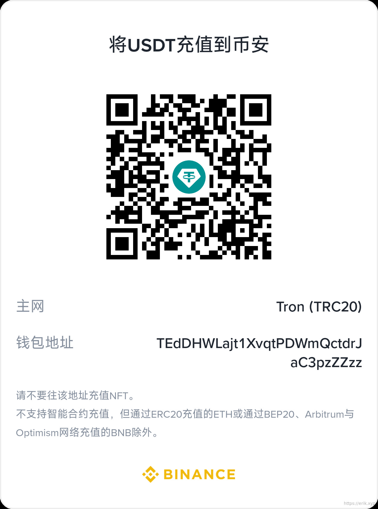<br>**Tron (TRC20)**<br>`TEdDHWLajt1XvqtPDWmQctdrJaC3pzZZzz` |
| <br>**Ethereum (ERC20)**<br>`0x355d429f97511897ccb4e271ec888205f9ab6629` | 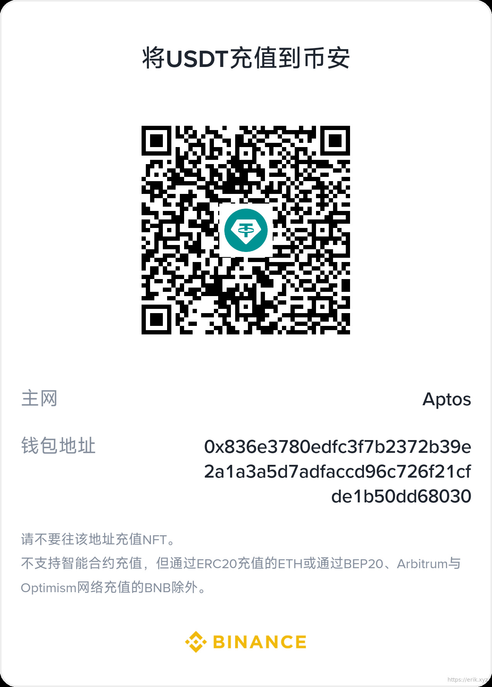<br>**Aptos**<br>`0x836e3780edfc3f7b2372b39e2a1a3a5d7adfaccd96c726f21cfde1b50dd68030` |
| 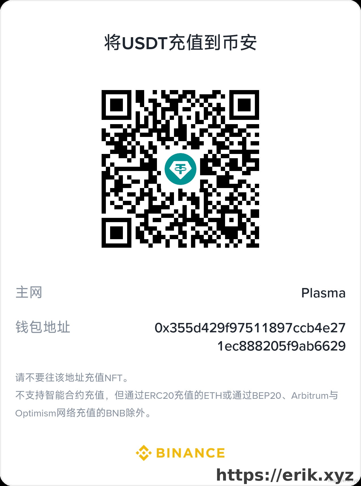<br>**Plasma**<br>`0x355d429f97511897ccb4e271ec888205f9ab6629` | 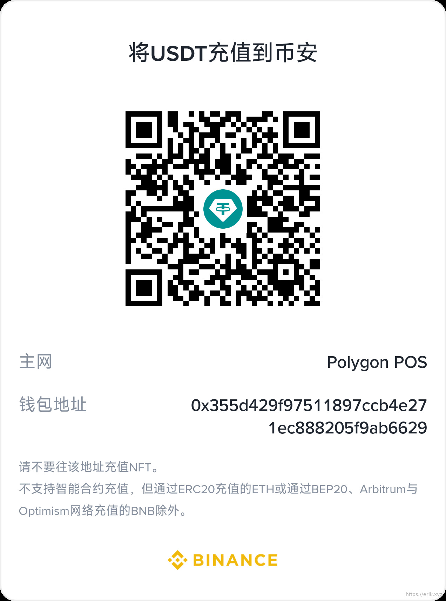<br>**Polygon POS**<br>`0x355d429f97511897ccb4e271ec888205f9ab6629` |
| 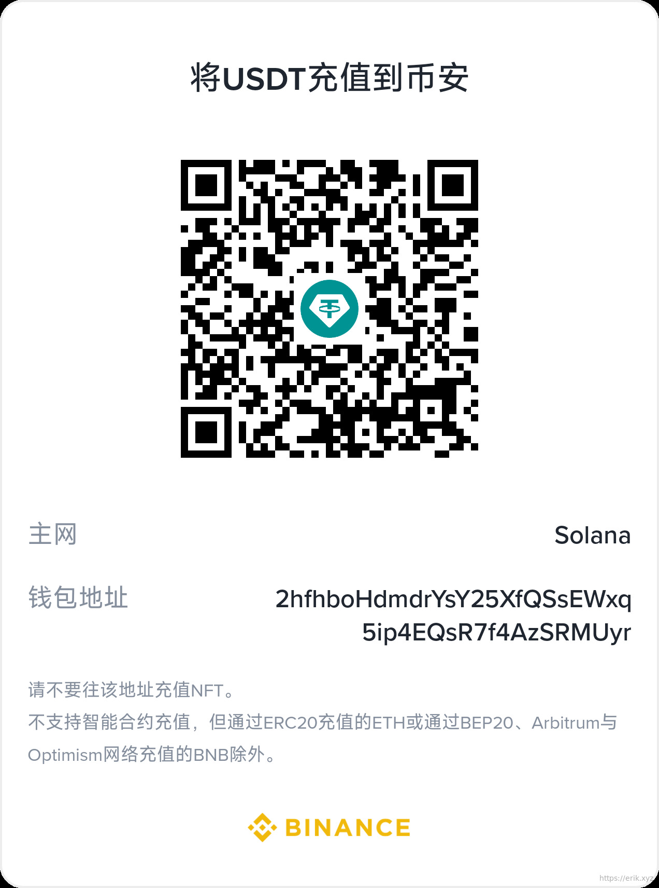<br>**Solana**<br>`2hfhboHdmdrYsY25XfQSsEWxq5ip4EQsR7f4AzSRMUyr` | 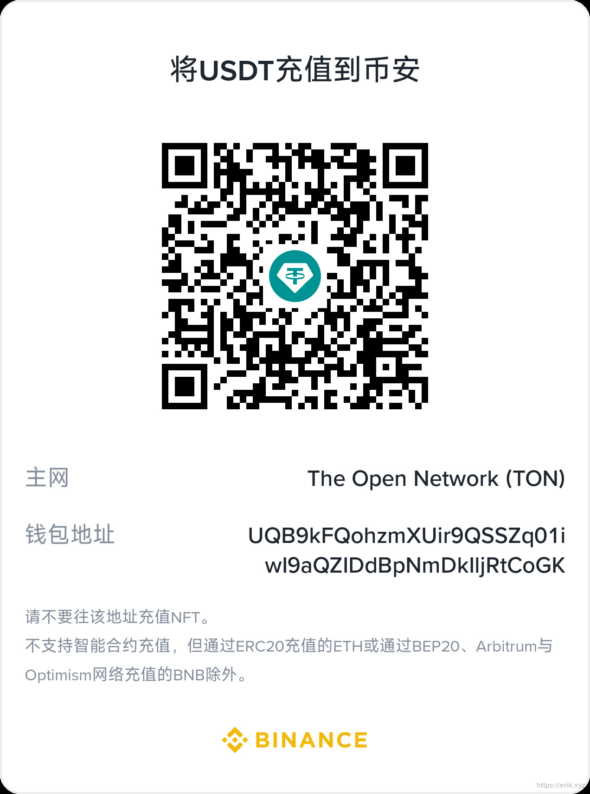<br>**The Open Network (TON)**<br>`UQB9kFQohzmXUir9QSSZq01iwl9aQZIDdBpNmDklljRtCoGK` |
| 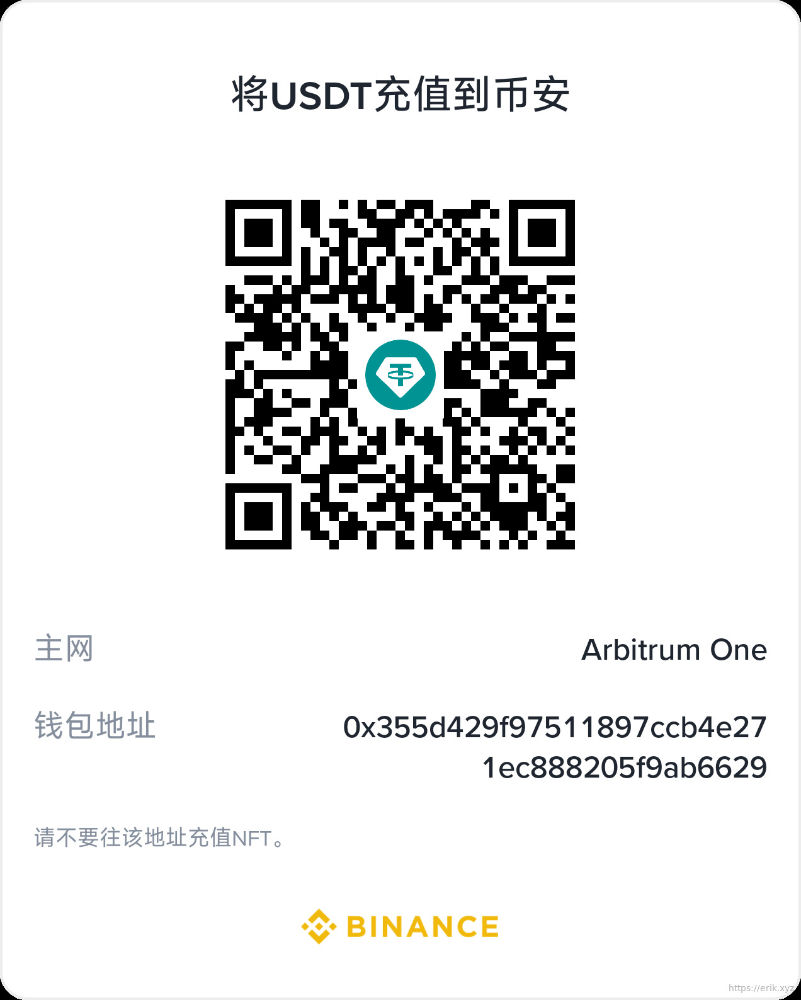<br>**Arbitrum One**<br>`0x355d429f97511897ccb4e271ec888205f9ab6629` | 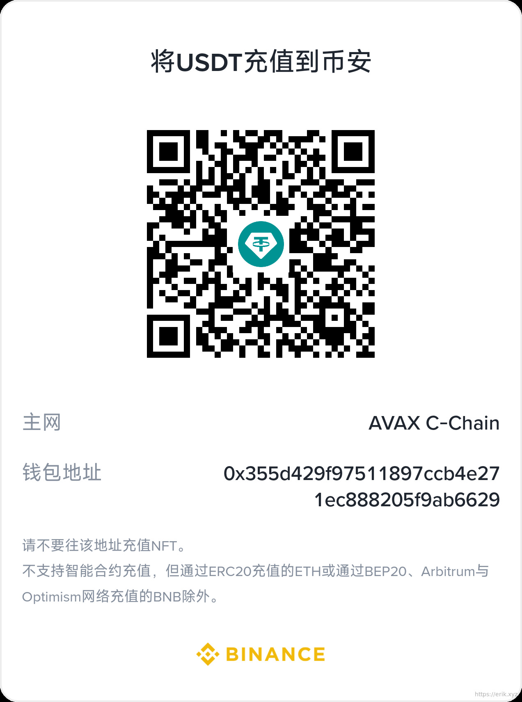<br>**AVAX C-Chain**<br>`0x355d429f97511897ccb4e271ec888205f9ab6629` |

