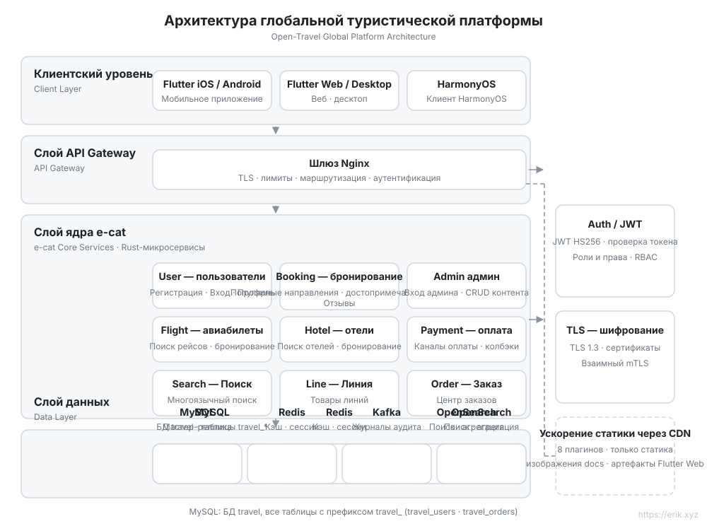
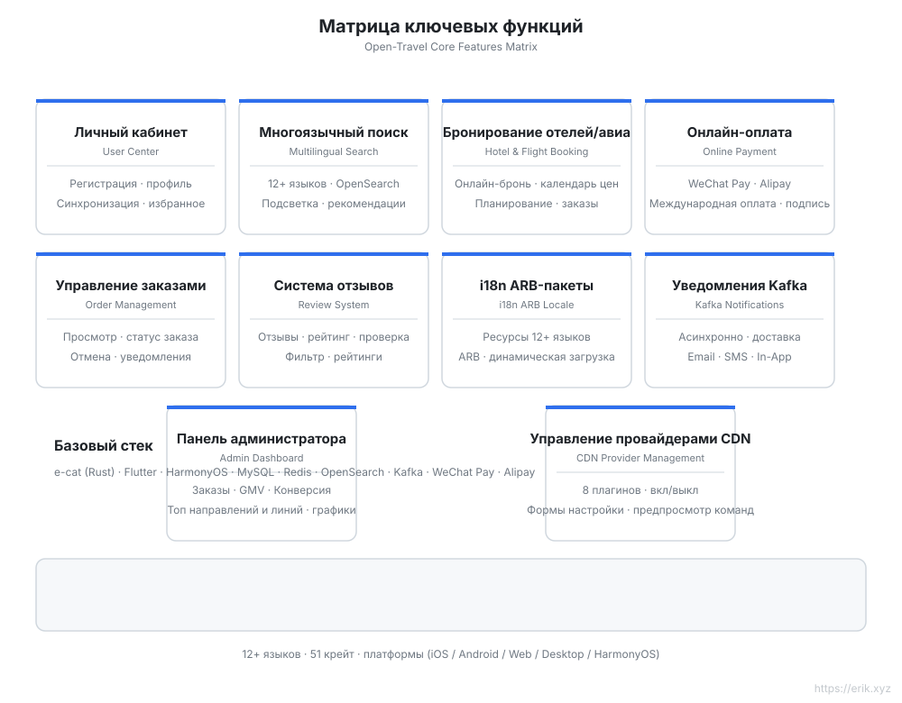
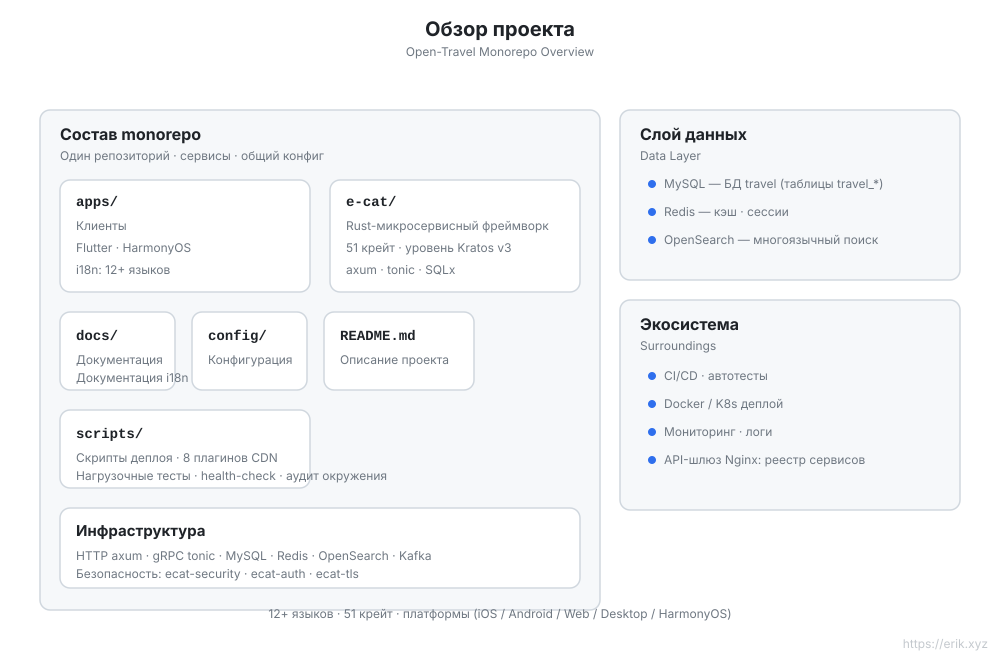
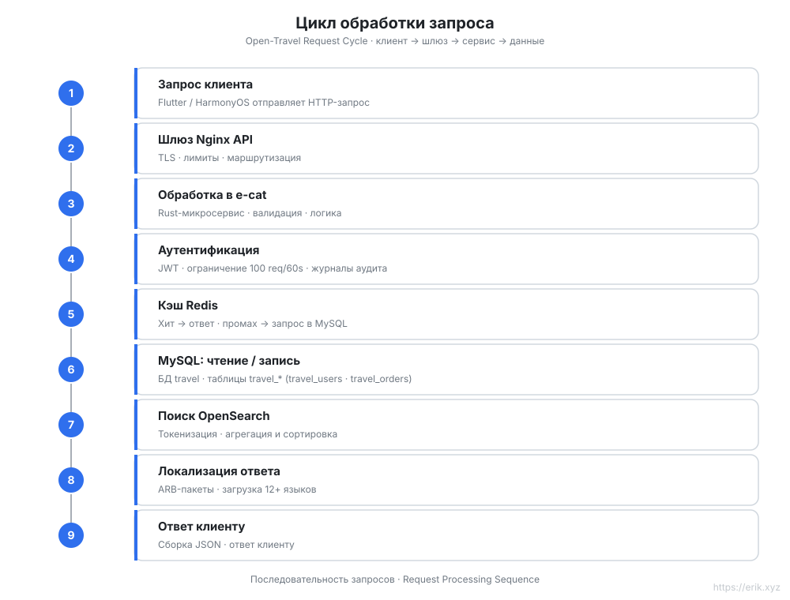
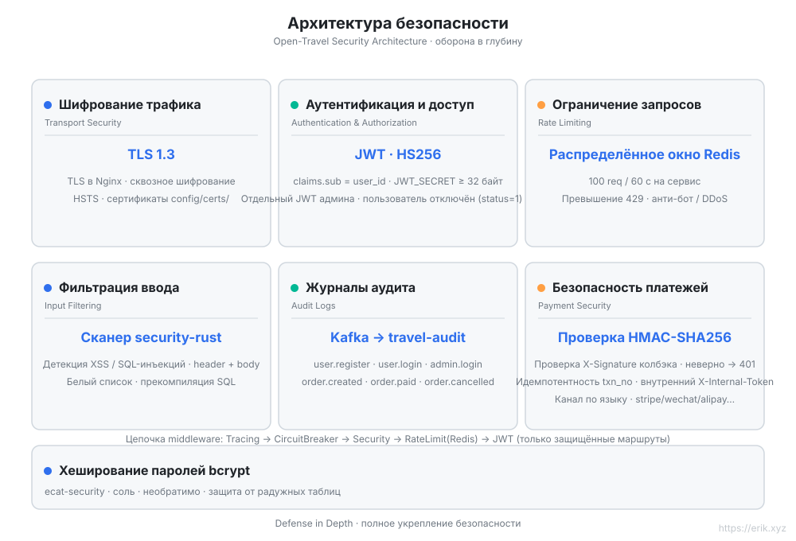
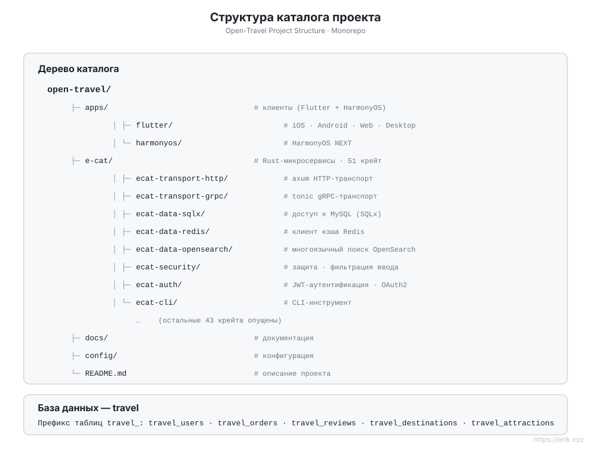

[简体中文](../../README.md) | [English](en/README.md) | [日本語](ja/README.md) | [한국어](ko/README.md) | [Русский](README.md) | [Deutsch](de/README.md) | [Français](fr/README.md) | [Español](es/README.md) | [Português](pt/README.md) | [हिन्दी](hi/README.md) | [العربية](ar/README.md) | [বাংলা](bn/README.md) | [Bahasa Indonesia](id/README.md)

# Open Travel — Глобальная туристическая платформа

<p align="center"></p>


> Платформа бронирования путешествий для пользователей по всему миру: микросервисный бэкенд на Rust + мультиплатформенные клиенты на Flutter / HarmonyOS, с поддержкой **12+ языков**, международных платежей и многоязычного поиска.

## О проекте

Open Travel — это monorepo глобальной туристической платформы, построенной на **e-cat (одна кошка)** — Rust-микросервисном фреймворке уровня [go-kratos/kratos](https://github.com/go-kratos/kratos) v3 (v3.0.3 · 51 крейт) — для высокопроизводительного бэкенда, в сочетании с клиентами на Flutter и нативным клиентом HarmonyOS, обеспечивающими единый опыт бронирования путешествий для пользователей по всему миру.

| Измерение | Описание |
| :--- | :--- |
| **Бэкенд-фреймворк** | e-cat (Rust): HTTP/axum + gRPC/tonic, экосистема из 51 микросервисного крейта |
| **Мультиплатформенные клиенты** | `apps/client/flutter` (iOS / Android / Web / Desktop), `apps/client/harmonyos` (HarmonyOS) |
| **База данных** | MySQL (БД `travel`, префикс таблиц `travel_`) + кэш Redis + многоязычный поиск OpenSearch |
| **Безопасность** | ecat-security / ecat-auth (JWT) / ecat-tls: аутентификация, аудит, ограничение запросов, защита от инъекций |
| **Интернационализация** | 12+ языков в ARB-пакетах, поддержка RTL, многоязычная сегментация OpenSearch |
| **Платежи** | WeChat Pay, Alipay |

## Ключевые возможности

- 🏨 Многоязычный поиск и бронирование направлений / отелей / авиабилетов
- 🌍 Адаптация для 12+ языков (китайский, английский, японский, корейский, арабский, испанский, французский, немецкий…)
- 💳 Международные платежи (WeChat Pay / Alipay)
- 🔐 Безопасность в глубину: TLS 1.3, JWT-аутентификация, журналы аудита, фильтрация ввода, ограничение запросов, HMAC-проверка платежных колбэков, аутентификация внутренних сервисов
- 📱 Единый опыт на всех платформах: Flutter (iOS/Android/Web/Desktop) + HarmonyOS

## Архитектура



## Диаграмма функций



## Диаграмма проекта



## Диаграмма цикла запроса



## Диаграмма архитектуры безопасности



## Диаграмма структуры проекта



## Структура проекта

```
open-travel/
├── apps/                  # Каталог клиентов
│   ├── flutter/           # Flutter: iOS / Android / Web / Desktop (i18n на 12+ языках)
│   └── harmonyos/         # Нативный клиент HarmonyOS
├── e-cat/                 # e-cat фреймворк + бизнес-сервисы (единый Cargo workspace)
│   ├── ecat*/             # 51 ecat-* крейтов фреймворка
│   ├── ecat/              # Основной крейт: фасад + бизнес-модули (src/business/) + входы сервисов (src/bin/)
│   ├── config/            # Примеры конфигурации фреймворка
│   └── examples/          # Примеры проектов фреймворка
├── docs/                  # Планирование проекта, диаграммы (SVG), QR-коды оплаты
├── config/                # Конфигурация окружения и развёртывания
└── README.md
```

## База данных

- Имя базы данных: `travel`
- Префикс таблиц: `travel_` (например, `travel_users`, `travel_orders`, `travel_reviews`)
- Сопутствующие хранилища: Redis (сессии / кэш популярного), OpenSearch (индексы многоязычного поиска)

> Подробное техническое планирование: [docs/travel-project-planning.md](../../travel-project-planning.md).

## Быстрый старт

```bash
cd e-cat
cargo check -p ecat --bins   # проверка компиляции бизнес-сервисов
```

| Сервис | Порт | Описание |
|---|---|---|
| user-service | 8001 | Регистрация / вход / профиль пользователя |
| booking-service | 8002 | Даты популярных направлений + список / детали достопримечательностей + отзывы |
| admin-service | 8003 | Админка: вход + CRUD направлений / достопримечательностей |
| search-service | 8004 | Многоязычный поиск |
| line-service | 8005 | Туристические маршруты |
| order-service | 8006 | Заказы |
| flight-service | 8007 | Авиабилеты |
| hotel-service | 8008 | Отели |
| payment-service | 8009 | Оплата |
| Nginx-шлюз | 8082→80 | Маршрутизация по префиксам `/api/user/`, `/api/booking/`, `/api/admin/`, `/api/search`, `/api/lines`, `/api/orders`, `/api/flights`, `/api/hotels`, `/api/payments` |
| MySQL | 3308→3306 | Источник данных |
| Redis | 6381→6379 | Кэш / ограничение скорости |
| OpenSearch | 9201→9200 | Многоязычный поиск |

Админ-консоль Flutter Web — в `apps/admin/`; учётная запись администратора по умолчанию для разработки: `admin@travel.local` / `Admin@123` (только локально).

### Скрипты

| Скрипт | Описание |
|---|---|
| `scripts/opensearch_init.sh` | Идемпотентное создание индекса OpenSearch (анализатор cjk) |
| `scripts/loadtest.sh` | Нагрузочное тестирование |
| `scripts/cdn_setup.sh` / `cdn_upload.sh` | Настройка и загрузка CDN (плагин `--provider` «восемь облаков»: cloudfront/aliyun/gcp/azure/cloudflare/tencent/huawei/bunny, по умолчанию `--dry-run`) |
| `scripts/release.sh` | Помощник процесса релиза |

---

## Поддержите нас

Если этот проект был вам полезен, пригласите автора на чашку кофе ☕

<p align="center">
  <strong>WeChat Pay</strong> &nbsp;&nbsp;&nbsp;&nbsp;&nbsp;&nbsp;&nbsp;&nbsp;&nbsp;&nbsp;&nbsp;&nbsp;&nbsp;&nbsp;&nbsp;&nbsp;&nbsp;&nbsp; <strong>Alipay</strong><br/>
  
  &nbsp;&nbsp;&nbsp;&nbsp;&nbsp;&nbsp;&nbsp;&nbsp;
  
</p>

### Глобальный банковский перевод (Global Bank Transfer)

**Информация о получателе**

- Имя получателя: WANG KEXUN
- Номер счёта получателя: 881015918251

**Банк получателя**

- SWIFT Code банка ZA: AABLHKHHXXX
- Название банка: ZA Bank Limited
- Код банка: 387
- Адрес банка: Core F, Cyberport 3, 100 Cyberport Road, Hong Kong

**Банк-посредник для международных переводов (при необходимости)**

Обратите внимание: это информация о банке-посреднике (транзитном банке) для международных переводов, а не о банке получателя. Уточните в банке отправителя, требуется ли указывать информацию о банке-посреднике.

Для переводов в гонконгских долларах, юанях и долларах США банком-посредником является **Citibank** —

- Название банка: Citibank N.A. Hong Kong
- SWIFT Code: CITIHKHXXXX
- Код банка: 006
- Название отделения: Hong Kong Branch
- Код отделения: 391
- Адрес банка: Citibank Tower, Citibank Plaza, 3 Garden Road, Central, Hong Kong

Для переводов в других валютах банком-посредником является **BNY Mellon** —

- Название банка: THE BANK OF NEW YORK MELLON
- SWIFT Code: IRVTUS3NXXX
- Адрес банка: THE BANK OF NEW YORK MELLON, 240 GREENWICH STREET, NEW YORK, United States

### Пожертвование в криптовалюте (Crypto Donation)

Если этот проект помог вам, отсканируйте QR-код, чтобы сделать пожертвование, спасибо!

| <br>**BNB Smart Chain (BEP20)**<br>`0x355d429f97511897ccb4e271ec888205f9ab6629` | <br>**Tron (TRC20)**<br>`TEdDHWLajt1XvqtPDWmQctdrJaC3pzZZzz` |
| <br>**Ethereum (ERC20)**<br>`0x355d429f97511897ccb4e271ec888205f9ab6629` | <br>**Aptos**<br>`0x836e3780edfc3f7b2372b39e2a1a3a5d7adfaccd96c726f21cfde1b50dd68030` |
| <br>**Plasma**<br>`0x355d429f97511897ccb4e271ec888205f9ab6629` | <br>**Polygon POS**<br>`0x355d429f97511897ccb4e271ec888205f9ab6629` |
| <br>**Solana**<br>`2hfhboHdmdrYsY25XfQSsEWxq5ip4EQsR7f4AzSRMUyr` | <br>**The Open Network (TON)**<br>`UQB9kFQohzmXUir9QSSZq01iwl9aQZIDdBpNmDklljRtCoGK` |
| <br>**Arbitrum One**<br>`0x355d429f97511897ccb4e271ec888205f9ab6629` | <br>**AVAX C-Chain**<br>`0x355d429f97511897ccb4e271ec888205f9ab6629` |

